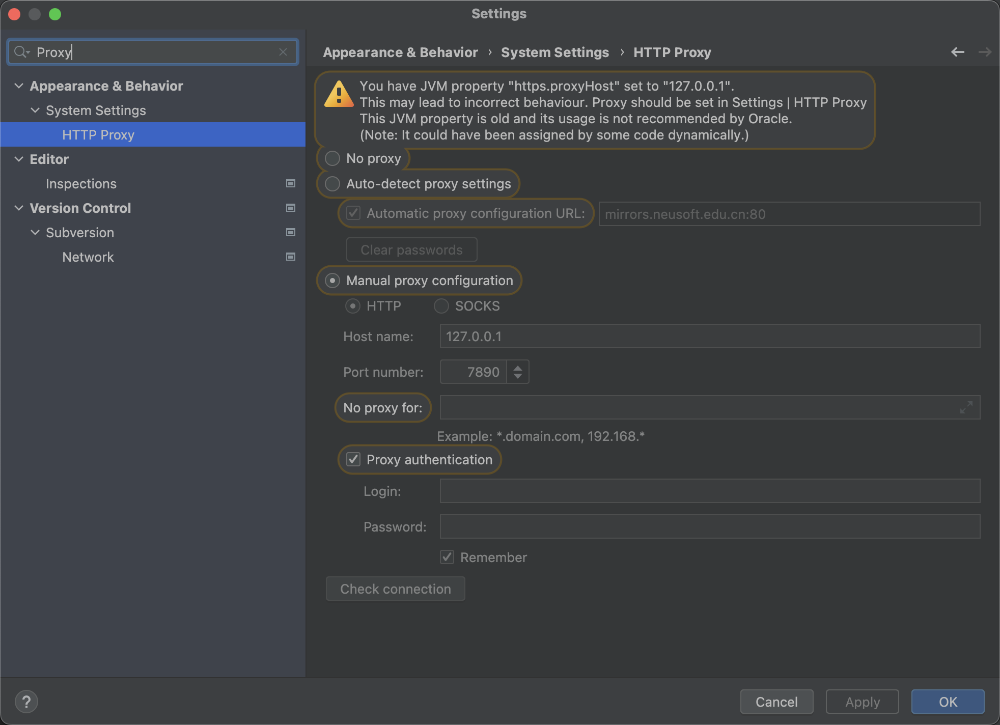
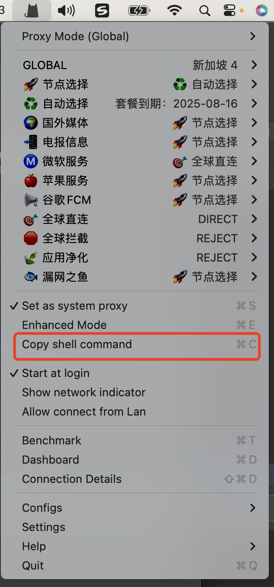

因为在多平台开发，经常会重新拉取代码，或者更新依赖，在`gradle`构建的时候，会出现`read time out`的报错，在中国区有时候挂 VPN 也不好使，这时候可以试试设置阿里云代理，如下：
::: code-group

```kotlin [Kotlin]
pluginManagement {
    repositories {
        maven("https://maven.aliyun.com/repository/google")
        maven("https://maven.aliyun.com/repository/public")
        maven("https://maven.aliyun.com/repository/jcenter")
        google()
        mavenCentral()
        gradlePluginPortal()
        maven("https://www.jitpack.io")

    }
}
dependencyResolutionManagement {
    repositoriesMode.set(RepositoriesMode.FAIL_ON_PROJECT_REPOS)
    repositories {
        maven("https://maven.aliyun.com/repository/google")
        maven("https://maven.aliyun.com/repository/public")
        maven("https://maven.aliyun.com/repository/jcenter")
        google()
        mavenCentral()
        maven("https://www.jitpack.io")

    }
}
```

```groovy [Groovy]
buildscript {
    repositories {
        maven {
            url "https://maven.aliyun.com/repository/google"
        }
        maven {
            url "https://maven.aliyun.com/repository/public"
        }
        maven {
            url "https://maven.aliyun.com/repository/jcenter"
        }
        google()
        mavenCentral()
        gradlePluginPortal()
        maven {
            url "https://www.jitpack.io"
        }
    }
}

allprojects {
    repositories {
        maven {
            url "https://maven.aliyun.com/repository/google"
        }
        maven {
            url "https://maven.aliyun.com/repository/public"
        }
        maven {
            url "https://maven.aliyun.com/repository/jcenter"
        }
        google()
        mavenCentral()
        maven {
            url "https://www.jitpack.io"
        }
    }
}

```

:::

## 配置 Proxy 代理

如果更改了库源还是不行，可以试试配置 Android Studio 的代理设置，打开设置选项，搜索`proxy`，设置如下图：

具体设置的`host`需要根据每个人的 VPN 配置，比如在 MacOS 上，如果是**Clash**，可以点击`Copy shell command`，复制指令到终端查看 IP 端口信息内容：


<!--more-->
