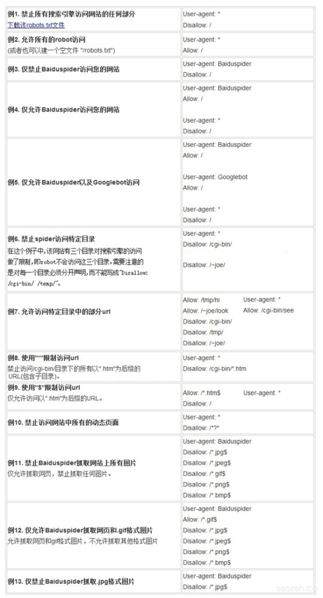

各位站长天天都要跟各大搜索引擎的小兵（爬虫）打交道，对`robots.txt`文件肯定不会陌生，但是对于SEO小白可能都没有听过这个文件，其实这个文件内容很简单，就是和搜索引擎爬虫约好的一些规则，当爬虫来访问网站的时候，第一时间会看看网站根目录有没有robots.txt这个文件，如果有这个文件，会根据这个文件设置的规则来抓取网站的内容。

## robots.txt的作用

robots.txt的作用其实就是告诉爬虫什么文件路径可以爬，什么文件路径不能爬，网站地图**sitemap.xml**文件位置等信息。大概可归纳以下几种作用：

1、告诉爬虫抓取网站上的指定路径文件或内容；

2、网站改版或者URL重写优化时候屏蔽对搜索引擎不友好的链接；

3、屏蔽死链接、404错误页面；

4、屏蔽无内容、无价值页面，像后台管理页面等；

5、屏蔽重复页面，如评论页、搜索结果页；

6、屏蔽任何不想被收录的页面；

7、引导爬虫抓取网站地图；

## robots.txt文件怎么写

只有使用特定的语法和符号编写的**robots.txt**文件才能被正确识别，所以是需要遵循一定的语法规则的，但是不用担心，非常的简单，只有**三个关键词**和**2个通配符**。下面是网上找到一些示例图：



下面是一个简单的例子：
```
User-agent: \*
Allow: /seo/\*.jpg$
Disallow: /seo/\*
```
### User-agent

`User-agent`: \*（定义所有搜索引擎） User-agent: Googlebot （定义谷歌，只允许谷歌蜘蛛爬取） User-agent: Baiduspider （定义百度，只允许百度蜘蛛爬取）

不同的搜索引擎的爬虫有不同的名称，比如谷歌:Googlebot、百度:Baiduspider、MSN:MSNbot、Yahoo:Slurp。

### Disallow

`Disallow`:（用来定义禁止搜索引擎爬取的页面或路径）

比如：
```
Disallow: /（禁止蜘蛛爬取网站的所有目录 “/” 表示根目录下） Disallow: /SEO/（禁止蜘蛛爬取SEO目录） Disallow: /test.html （禁止蜘蛛爬取test.html页面）
```
### Allow

`Allow`:（用来定义允许蜘蛛爬取的页面或路径）

比如：
```
Allow: /SEO/test/（允许蜘蛛爬取SEO下的test目录） Allow: /SEO/test.html（允许蜘蛛爬取SEO目录中的test.html页面）
```
### 两个通配符

#### 通配符 “$”

`$ 通配符`：匹配行结束符。

比如：
```
Allow: /seo/\*.jpg$
```
上面这段代码就是允许爬虫爬取SEO目录下所有`jpg`结尾的文件。

#### 通配符 “\*”

`* 通配符`：匹配0个或多个任意字符
```
Disallow: /seo/\*
```
上面这段意思是禁止爬虫爬取SEO目录下所有文件。

## 工具生成robots.txt

对于**SEO小白**来说，最好还是使用站长工具去生成robots.txt文件，防止规则写错，有时候真的是“一念天堂，一念地狱”的差别，要是robots.txt文件规则写错了，有可能会导致整个网站搜索引擎不收录的情况，所以在写这个文件的时候一定要认真，如果出现问题要想想是不是写错了规则，改完之后再到站长平台去提交新的文件。
