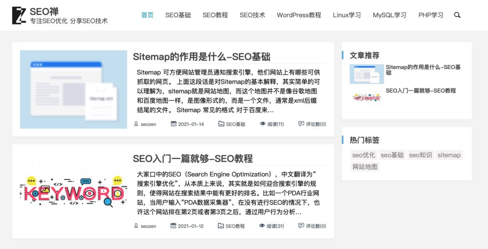
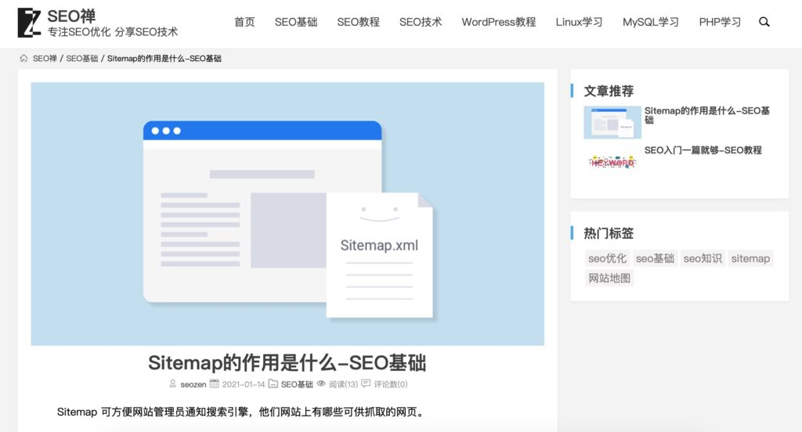

这里将会记录SEO禅网站的变化。

## v1.0版本

v1.0版本是在2021年1月12号部署，这个版本我用了2天时间建立的，只做了网页版，手机版还没有适配，因为没有合适的前端框架，所以决定从头开始自己写`CSS`样式，下面是主页和文章页面截图：

非常的简单，但是我是比较喜欢简洁的风格，只要内容质量高，其它的可以从简，还有很能功能没有加上，第一版本连评论都没有打开，因为评论的默认样式确实有点丑，会慢慢更新优化，所有改动我都会做相应记录，并发出来，虽然不知道SEO禅这个“私生子 ”能到什么高度，就当给自己的一个念想吧！
