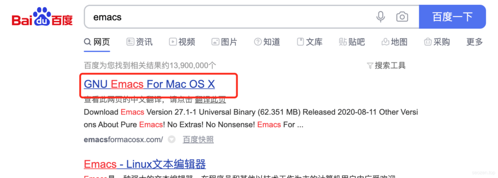

经常使用Linux系统的朋友，应该会时常在一些地方看到“**GNU**”这个词，比如在百度输入`emacs`，出现的第一个软件就是GNU Emacs，对于这个软件Linux用户应该不会陌生，但是为什么前面有个GNU呢？

## 什么是GNU/linux？

GNU是“GNU is Not Unix”的递归缩写，是一名叫**Richard Stallman** 的大神搞的一个操作系统开源项目，原本是因为**unix**开始商业收费，想搞出一个类似unix的系统，可能是大神精力有限，一直没有搞出合适的系统内核，在这开源项目之下又成立了FSF（Free Software Foundation）自由软件基金会，之后有了当今开源项目最流行的一个协议**GPL**（General Public License）通用公共许可，Richard Stallman大神把自己整的跟自由软件界“耶稣”一样，但是还是没整出一个给力的系统来。

但是这时候已经有越来越多的开源软件项目用GPL协议，整个GNU项目慢慢变的丰满起来，但是就是差一个关键部件——**系统内核**。

## Linus的Linux

GNU项目是在1983年发起的，整整差不多十年的时间，才有了自己合适的系统内核——**Linux**，在1991年，Linux的创始人**Linus**使用了GPL协议来发布Linux系统，这让GNU项目找到了最后一块“拼图”。

## GNU/Linux

在GNU项目找到Linux这最后的一块拼图以后，就有了我们今天所见到的Linux系统，其全称是**GNU/Linux**，Linux只是系统内核，在这之上GNU开源软件才是让Linux系统风靡世界的主力军，所以一定要记住，Linux并不只是Linus开发的类似unix的系统内核，而是包括大量GNU开源软件的一个集合体。
