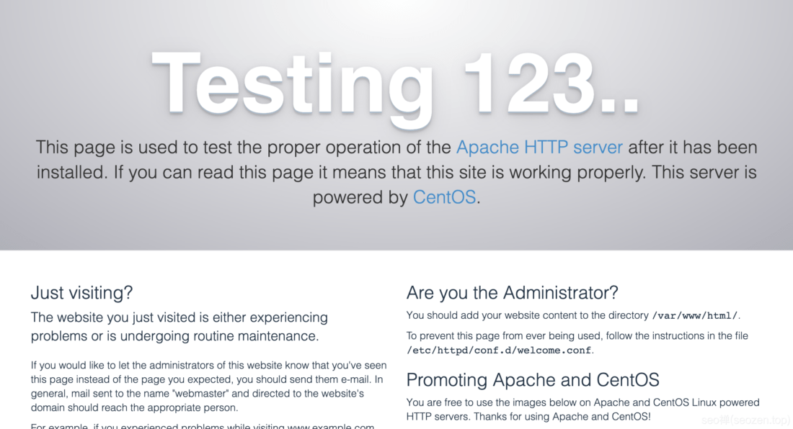

一转眼2020年已经过去了，看网络上很多WordPress的安装教程都比较旧，有些写的不太详细，WordPress是站长最喜欢的一款**建站系统**，数据统计到2020年为止，WordPress在所有网站的市占率已经达到35.7%，[SEO禅](https://www.seozen.top/)也是使用WordPress搭建的网站，在新的一年，我觉得有必要写几篇详细的文章来介绍**如何安装WordPress**，所以就有了《2021年最新WordPress安装教程系列》。

## WordPress安装环境

下面我们就来开始首先了解下**WordPress的安装环境**，今天是2021年1月3日，**WordPress官网**的安装环境要求如下：

- PHP 7.4以上
- MySQL 5.6以上
- 推荐Apache服务器或者Nginx服务器

知道了WordPress安装配置条件之后，我们就去试着搭建一个这样的安装环境，我使用的是Centos7版本号v 7.9 的GNU/Linux系统，你们可以使用其它版本的系统，原理都差不多一样，个别安装指令和步骤可能会有所区别。

## 安装Apache服务器

我们搭建WordPress环境，一般是先安装Apache服务器->PHP->MySQL，当然这个过程还有一些其它的内容，比如说一起顺道就把HTTPS认证做了，我会专门写一篇如何进行HTTPS认证的文章，教你网站如何做https认证，如何申请**免费SSL证书**，现在言归正传，我们先在**Centos 7.9** 上安装Apache，下面是我Centos的版本信息：
```
\[root@cxtech ~\]# lsb\_release -a
LSB Version:	:core-4.1-amd64:core-4.1-noarch
Distributor ID:	CentOS
Description:	CentOS Linux release 7.9.2009 (Core)
Release:	7.9.2009
Codename:	Core
```
在Centos7上安装Apache是最方便的了，只要下面这条指令：

### 命令安装Apache
```
yum install httpd
```
如果你不是`root`用户，那就加个`sudo`提下权限再安装。 安装完后，使用如下命令来启动**Apache服务器**：

### 启动Apache
```
apachectl start
```
### 检测Apache服务器状态

这个命令运行后没有反馈信息，所以可以运行下面的命令来看看启动情况：
```
systemctl status httpd
```
如果运行成功，应该会有下面这段信息：
```
httpd.service - The Apache HTTP Server
Loaded: loaded (/usr/lib/systemd/system/httpd.service; enabled; vendor preset: disabled)
Active: active (running) since Sun 2021-01-03 17:48:33 CST; 2min 16s ago
```
现在可以在浏览器输入服务器的IP地址，来看看最终的运行效果，如果成功的话，应该浏览器上会显示下面这张图片的内容：



### 设置Apache开机启动

我们再把Apache服务器设置成开机启动就可以了，运行如下命令：
```
systemctl enable httpd
```
再运行下如下命令看看有没有加入到开机启动中：
```
systemctl list-unit-files | grep httpd
```
## 安装PHP和MySQL

到这里就已经完成了Centos 7配置Apache服务器的步骤，接下来就需要**配置PHP和MySQL**，那就看下一篇文章吧：《[2021最新WordPress安装教程（二）：安装PHP和MySQL](https://www.seozen.top/wordpress-php-mysql-2021.html)》

如果有想学习了解**SEO优化**的朋友，可以看看SEO禅写的《[SEO优化入门一篇就够](https://www.seozen.top/seo-course-first-step.html)》这篇文章，希望对各位有所帮助，有什么不懂得可以留言评论。
