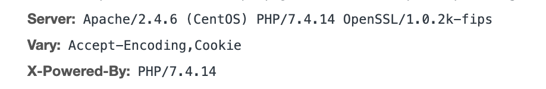

很多站长对服务器安全这块不是很重视，但是作为SEO优化的一个重要环节，**服务器信息安全**也是必须要注意的，如果一个服务器三天两日就被人黑进入挂马，这个网站对搜索引擎和用户来说也是没什么价值的，SEO是一门综合的艺术，并不是简简单单发个文章，发发外链就行。

我是99年就有了自己第一台TCL电脑，那时候用的还是ADSL上网，那时候我9岁，一开始有了电脑和大部分人一样，玩着扫雷，玩帝国时代，后来慢慢接触了一些黑客技术，也有点入门知识，但是并没有像比尔盖茨或者乔布斯一样走上人生巅峰，后面也慢慢接触的少了，但是从那时候起，计算机就算融入到了我的生活中。

又扯远了，**SEO禅**是用WordPress作框架搭建的，后台使用的是**Apache服务器**，刚开始我考虑用**nginx**，但是考虑到对nginx不是特别熟悉，要是遇到一些问题还不好解决，还是先用apache把网站弄好，后面再考虑用nginx做一些负载均衡之类的搭配。

从SEO禅返回的**header信息**下面这段内容，这其实是非常不安全的，容易被别有用心的人利用，当然真别有用心的人想破坏你的网站，要获得一些关键信息并不是难事，但是如果我们隐藏这些信息给对方制造点难度还是不错的。



我们需要配置`php.ini`和`httpd.conf`文件，作如下修改：

`/etc/httpd/conf/httpd.conf`
```
vim /etc/httpd/conf/httpd.conf
# 添加下面两个指令到httpd.conf文件
ServerTokens Prod
ServerSignature off
```
`/etc/php.ini`

有时候php.ini文件的位置不太好找，先用下面这个命令看看载入的php.ini文件在什么位置：
```
php --ini
```
再打开php.ini文件中找到`expose_php`把`on`改成`off`就可以：
```
expose\_php = off
```
再运行重启Apache服务器的命令：
```
apachectl restart
```
再看看头部信息是不是只有一个`server:apache`就表示成功了。
