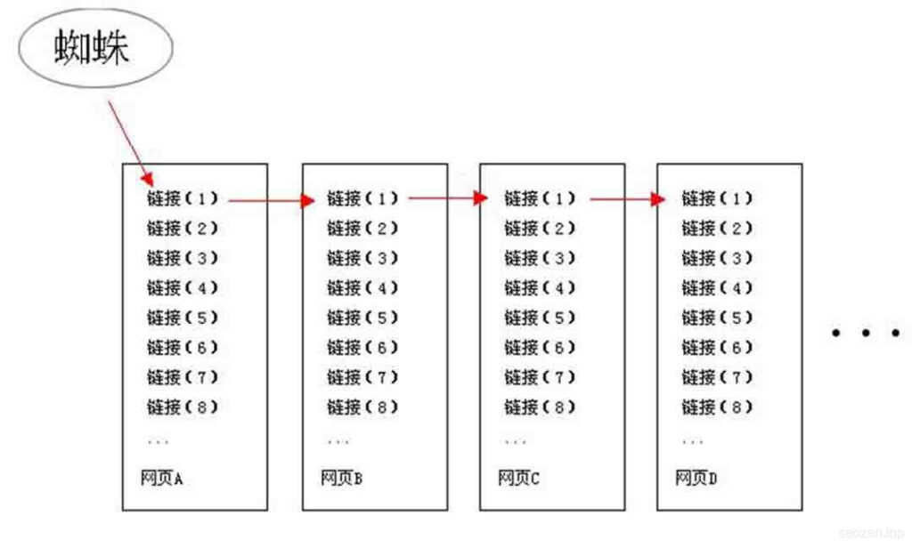
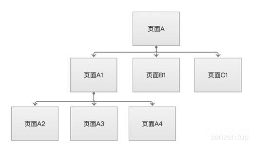

作为一名SEO人员，虽然不用很熟悉搜索引擎的工作原理，但是对搜索原理有一定的了解是必要的，我尽量用简洁的语句去解释。

## 搜索引擎的前世今生

 搜索引擎在早期的时候，是以**目录索引**的形式为世人所知，但是那并不算真正的搜索引擎，当时那些搜索结果多数是靠人工编辑的，有点像“hao123”之类的网站，现在的搜索引擎都是程序化的，所有内容，基本上靠的是程序自动化收集。虽然时代和技术都在改变，其实搜索引擎的原理一直都没有变，其实就是：**抓取内容**，**分类预处理**，**用户展现**。当然其中有很多技术细节，作为SEO人员就没有必要深入了解。

## 蜘蛛爬取

 在简单了解了搜索引擎的工作原理之后，我们可以知道，其中只有在抓取内容这一部分，我们可以通过一些SEO手段，来提高搜索引擎对网站的收录，那搜索引擎是如何收录这么多网站的呢？这里就要提到搜索引擎的爬取程序，**搜索引擎蜘蛛（Spider）**，每一种搜索引擎有它们自己的蜘蛛程序，各自的爬取习惯也不同，但是大致可以分为两种：

### 深度优先爬取

 深度优先爬取，就是“一条巷子走到黑”的方法，只要蜘蛛爬过的链接，都会顺着当前链接继续往下爬，即使页面中有其它的链接，也不会马上去爬取。

### 广度优先爬取

 广度优先爬取的策略，就是尽可能的把同一页面的链接访问完，再去访问下一个页面中的链接，如果一个页面中的链接太多，也会影响蜘蛛的访问效率。

## SEO优化的思考

上面简单介绍了搜索引擎的工作原理，还有蜘蛛的爬取习惯，各位朋友有没有考虑过，作为一个**SEOer**，如何根据这些信息，来调整优化网站，让搜索引擎提高网站的收录。

我来谈谈我的看法，就蜘蛛的工作方式来说，蜘蛛不可能无限的爬取一个网站，搜索引擎肯定制定了一系列规则，如果**网站**的层次太深，这肯定会不利于蜘蛛的爬取，同理，如果一个**页面**中有太多链接，也是会导致蜘蛛爬取效率的低下，所以我们在调整优化**网站结构**，**内部链接**的时候就需要考虑这个问题，还有网站的**404页面**也是需要考虑的，因为当蜘蛛爬取一个链接发现是死链接的时候，需要一个出口回到正常界面，如果没有这个出口，那对搜索引擎来说是非常不友好的。
