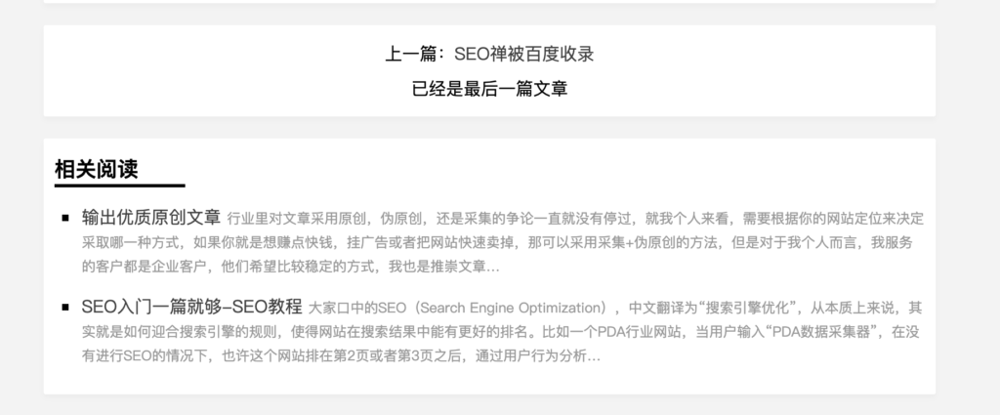

前两天搜索引擎爬虫疯狂来抓取网站，从1天几次飙升到快100多次，然后又降到正常值，就我这个新站点来说，如果突然增加这么高的频次，我也不好说是好事还是坏事，但是直觉来说应该是好事，所以这几天我把内链作了些优化，这样**搜索引擎爬虫**下次再来的时候就会看到网站有了些变化，有些文章应该会重新爬取，这样爬取的频次应该会增加一点。

我增加了文章的上下链接和相关文章列表，让单一文章页面内容更加丰富一些，我作这些操作并不是随便进行的，我是根据谷歌的数据来操作的，每进行一次更改我都会观察一段时间，如果收录正常不断增加，那就进行下一个更改，如果出现问题就回退一步再继续观察，我就是我实践SEO知识的地方，也可以检验所学的网站优化知识是否有用。

百度最近我是真摸不透它的脾气，在谷歌上看到的数据都很正常，收录也不错，排名也有了，就是百度不温不火，也有可能是这段时间百度内部在作调整，因为我看到很多用黑帽SEO的排在了首页，百度不可能不处理这些站点，有时候朋友也跟我说为什么不用快排，快排多爽啊，爽那是表面的，也只是骗骗自己和客户，这几天优化了点内链，观察看看情况，要是还是没什么变化就只能请外链帮忙了。
