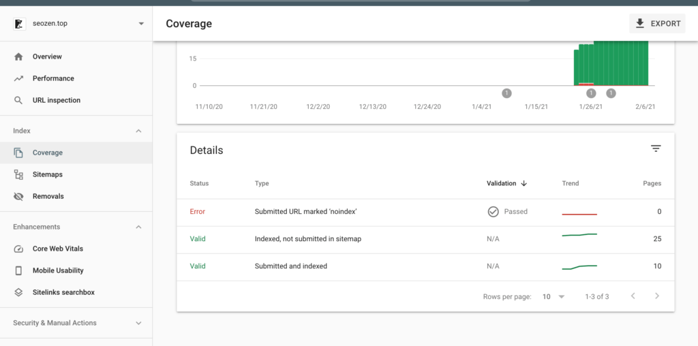

经过10篇文章，将近一个月的时间，SEO禅站点终于被百度收录，谷歌收录速度要快的多，差不多是隔天就收录了，这段时间百度可能在作内部调整，很多站长也说最近百度收录的观察期有点长。

谷歌收录的速度基本是隔天，在这个月我共发了10篇文章，基本都被谷歌收录了，下面是谷歌的收录情况：

相比之下百度收录少的多，但是只要百度收录了，就很容易会有排名，谷歌很容易被收录，但是不一定会有排名。

一开始我每隔2天发一篇文章，发了差不多6篇左右，就开始3到5天发一篇文章，正常来说只要持续更新高质量的原创文章，一周两到三篇就够了，做好关键字布局，慢慢都会有较好的排名。

接下去我会花点时间在内链建设上，最近比较忙，等年过完再说吧，在这里先祝大家牛年阖家幸福，身体健康！
