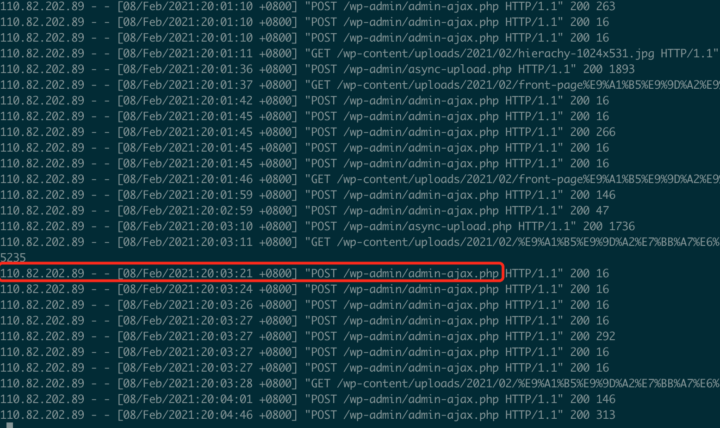

WordPress有一个`xmlrpc.php`文件，主要是为了离线发布文章使用。这个文件可以被别有用心的人利用，当作爆力破解密码的入口，虽然WordPress在登录功能作了次数限制，但是这个文件似乎没有作什么限制，黑客可以通过这个文件来绕开登录功能次数限制，先来了解下什么是`XMLRPC`：

- XMLRPC，是使用http协议作为传输协议的RPC机制，使用XML文本的方式传输命令和数据。
- RPC Client，向RPC Server调用方法，并接收相应的返回数据。
- RPC Server，响应RPC Client的请求，执行相应的方法，并将执行的结果返回给RPCClient
- RPC（Remote Procedure Call）远程过程调用，是一种在本地的机器上调用远端机器上函数方法的技术。

WordPress为方便离线发布管理文章的功能，提供了很多XMLRPC接口，但是爆力破解对我没什么用，我的密码连我自己都不记得，全部是复杂的组合，我都是用Google浏览器统一管理的，虽然破解不了我的密码，但是服务器还是会受到骚扰的，所以我们还是关闭这个功能比较好，如果没有使用的话，直接在主题文件`functions.php`写入下面一段代码：
```
//禁用XML-RPC接口
add\_filter('xmlrpc\_enabled', '\_\_return\_false');
```
看了Apache服务器日志文件，还有很多自动化程序在扫描尝试攻击我服务器，所以做好网站安全优化是非常必要的，不要做一只“鸵鸟”，那只是皇帝的新衣，自己在骗自己。


