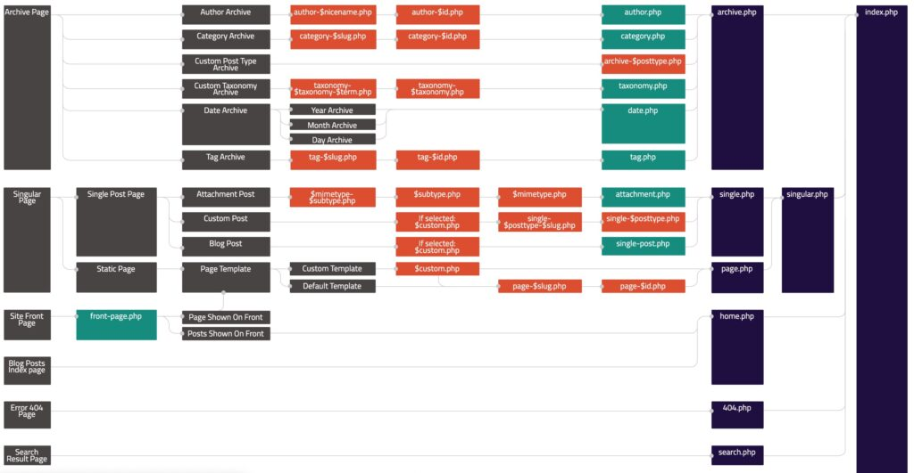
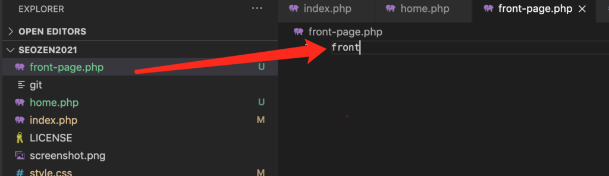
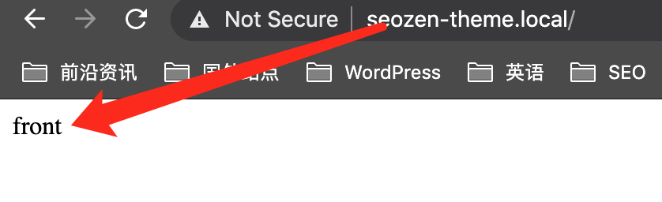

最近在给SEO禅开发一个简洁的WordPress主题，在网上转了一圈，既然发现这几年都没有像样的WordPress主题开发教程，不是太旧，就是有头没尾，还有的就是我也看不懂，可能水平不够吧！ 2021年WordPress的市占率已经超过37%，难道数据是假的（开玩笑）？既然没有，那SEO禅就写一个吧，希望能给各位没什么基础想学习**WordPress主题开发**的朋友一点提示。不懂怎么安装WordPress的朋友可以参考：[2021最新WordPress安装教程（一）：Centos7安装Apache](https://www.seozen.top/wordpress-apache-setup-2021.html "2021最新WordPress安装教程（一）：Centos7安装Apache")

> 没有PHP，HTML，CSS基础的朋友可能会有点吃力，但是我尽量说的详细点。

## WordPress主题开发基础文件

SEO禅刚开始学习WordPress主题开发的时候是一头雾水，没人教，就在网上查资料，可是查到的资料看完很多也就巴拉巴拉，脑袋里面还是一坨浆糊，可能是自己笨，但是后面，在油管上看了一些主题开发的视频，感觉思路就要清晰多了，按SEO禅的理解，如果想学习WordPress主题开发，首先要从WordPress主题的目录结构下手，WordPress规定，一个主题必须包含以下两个文件：

- `index.php`
- `style.css`

首先`index`文件就不用多介绍了，这就跟`Hello World`一样常见，我们在`wp-content/themes/`目录下面新建一个文件夹，SEO禅命名为`SEOZEN2021`，你们自己随意，之后向里面添加`index.php`和`style.css`两个文件。在**style.css**文件头部申明一下模板信息如下：
```
@charset "UTF-8";

/\*
Theme Name: SEOZEN Theme 2021
Theme URI: https://github.com/HelloYu/seozen-theme-2021.git
Author: Alan Yu
Author URI: https://www.seozen.top/
Description: this theme was create for seozen.top site.
Requires at least: 5.3
Tested up to: 5.6
Requires PHP: 5.6
Version: 1.0
License: GNU General Public License v2 or later
License URI: http://www.gnu.org/licenses/gpl-2.0.html
Text Domain: SEOZEN2021
Tags: two-column, accessibility-ready, custom-colors, custom-menu, custom-logo, editor-style, featured-images, footer-widgets, block-patterns, rtl-language-support, sticky-post, threaded-comments, translation-ready

SEOZEN Theme 2021 WordPress Theme, (C) SEOZEN.TOP
SEOZEN Theme 2021 is distributed under the terms of the GNU GPL.
\*/
```
上面一大段话都是废话，就为了大（装）气（逼），其实就`Theme Name: SEOZEN Theme 2021`有作用，只要申明这个，就可以在后台看到自己的模板了。

## WordPress主题层次结构关系

现在你的主题目录里面只有两个文件，但是WordPress已经能够识别到你的主题了，我们再来看看下面这张图：



要是看不清楚就自己去看：[wordpress页面层次结构](https://wphierarchy.com/)，我们现在只创建了一个index文件，按着上面这张图，我们试着创建下`home.php`文件，在里面写几个测试文字，你再刷新看看，现在主页是不是变成了home，因为太简单了就不截图了，你们自己去试，继续往home.php往后看，有一个绿色标记的`front-page.php`文件，再创建一个这个文件，你会发现前面的home文件内容被这个文件替换了，现在WordPress用的是**front-page.php**这个文件作为我们网站的首页了。



> screenshot.png是我随便放的一张临时图片，为了在后台主题界面中好区分



## 回顾

WordPress主题开发第一节的内容就算结束了，知识点不多，就三个：

- WordPress主题必须有：index.php和style.css文件。
- style.css文件内申明Template Name 后台就可以看到此主题。
- WordPress文件的层次结构，页面具有覆盖特性。

下一节我们来学习WordPress模块化的内容：《[2021从零开始开发WordPress主题教程（二）：模块化开发](https://www.seozen.top/wordpress-theme-development-modularization.html)》
