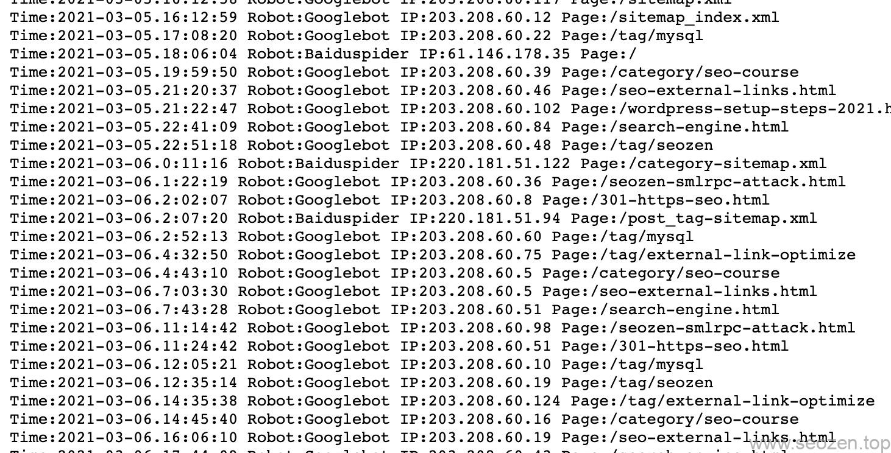
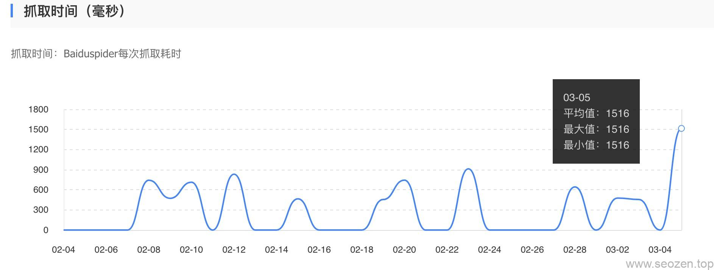
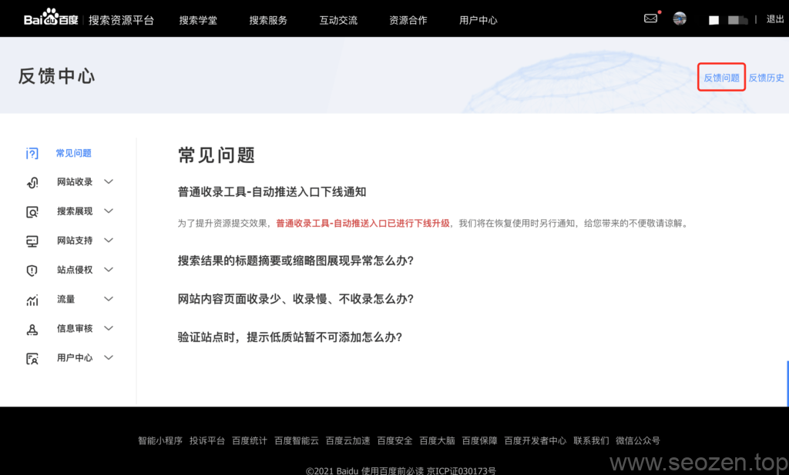
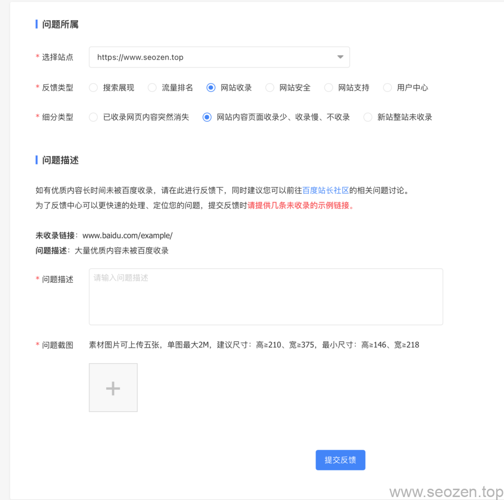
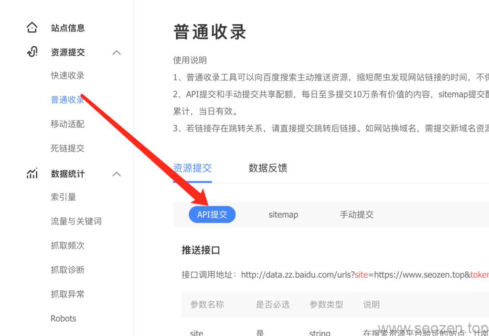

SEO禅已经创建快二个月的时间，从谷歌的数据来看是非常符合预期的，但是百度还是没有更新的动作，最近百度的蜘蛛抓取的频率不太高，和几个朋友交流了下，自**惊雷3.0算法**上线之后，基本上新站没有三五个月想要收录内页是很难的，为什么拉长观察期，原因其实大家都知道，就是为了防止**垃圾站群**，黑帽SEO利用快排工具，在短时间内把网站的“假权重”刷上去，导致**百度搜索结果**用户体验很差。

## 无蜘蛛访问

对于新站来说，既然百度这样规定了，我们也没什么办法，所以各位如果是新站，有蜘蛛来爬取，谷歌也有排名，那就不用太担心，做你日常工作就行，但是如果百度蜘蛛也不来，谷歌也没收录，那就要看看是不是网站自己的原因，下面列几个可能的原因。

### 域名刚注册

新域名肯定比老域名在信用权重上要差，所以对于刚注册几天或者十几天的域名来说，没有搜索引擎蜘蛛来爬取是正常的，但是如果过了个把月，还是没有蜘蛛来，那要看看是不是网站服务器把蜘蛛给屏蔽了，或者没有**导入链接**，但是一般可能性不大，最有可能就是[**robots.txt规则设置错误**](https://www.seozen.top/robots-mislead-seo.html)，所以首先要检查下robots文件是不是写错了，如果是WordPress搭建的网站，要看看**设置->阅读**菜单有没有勾选"**建议搜索引擎不索引本站点**"项，如果有勾选要取消掉。

### 网站打开太慢

谷歌的收录规则就是有一条，如果网站打开的速度太慢，也会导致不收录，正常来说，能在3秒之内进行页面交互的，就算合格的站点，注意我这里说的是**页面交互**，并不是算网站加载完成，什么区别？你看到浏览器图标那个位置有个加载图标一直在转的就是在加载，不转了就是加载完成，页面交互是指网站`DomContentLoaded`(在[Dev Tool](https://www.seozen.top/dev-tools-seo-ttfb.html)里面查看)事件发生之后的时间。

### 服务器不稳定

如果服务器网络不稳定，就有可能会因为网络原因，导致百度爬虫不去访问网站，你想想，如果别人天天来吃闭门羹，哪只蜘蛛还会愿意再来，所以可以去看看服务器的`access log`文件看看有没有搜索引擎蜘蛛来访问过，最简单的就是用`Ping功能`看看丢包率，如果丢包很厉害，那就换个服务器吧，最好把服务器放在国内再备案下，百度对备案的站点也会有一定的加权。

### 蜘蛛被屏蔽

对于新手站长确实会有这样的问题，一边向百度搜索引擎提交链接，sitemap地图，一边用Robots.txt文件屏蔽蜘蛛来爬取收录，我们可以使用站长平台自带的robots工具，去检测robots.txt规则写的有没有问题，SEO禅前端时间把规则写错了，也导致收录下降，但是发现的及时修正过来收录就恢复了，可以看看[错误的robots文件设置对SEO的影响](https://www.seozen.top/robots-mislead-seo.html)这篇文章。

## 有蜘蛛访问

如果在服务器看到有蜘蛛访问，像下面这样：

而且已经超过半年的情况，还是没有被收录要考虑是不是下面两种原因：

### 网站结构太深

这里的结构一个是目录结构，一个是代码结构，首先检查下网站代码，看看**HTML标签**是不是嵌套太多，导致网站代码冗余，内容分布很散，还有就是目录结构是不是层级太深，要知道新站最好就是保持在二层目录结构，也就是说进行最多三次点击就能进到文章页，不然对于爬虫分配的时间就可能抓取不过来。

对于SEO禅来说，百度的抓取时间和频率是在不断上升的，所以我并不担心不被百度收录，我只要继续更新文章，做好内容就可以，有空优化下网站内链，优化下用户体验，再偶尔发几个高质量的外链，被百度收录只是早晚的事情。

### 缺乏原创内容

对于新站来说，有些站长会图方便，直接去网络上复制粘贴内容，而不是自己原创的，这种类型的网站长时间没有收录也是很正常的事情，毕竟百度那么多算法工程师也不是吃素的，哪里那么好忽悠，所以如果网站缺少原创导致没有收录，那各位还是调整下自己的方式，以质胜量来达到收录的目的，不然有可能会被关进小黑屋的。

## 其它原因

对于新站不收录的原因肯定不止上面提到的这几点，每个网站都有自己的情况，具体问题需要具体分析，但是上面几个是比较常见的，如果不是上面的情况，可以考虑请有经验的站长帮忙看看，不要有病乱投医，最怕的是网站三天两天改这改那，这对收录也是影响很大的。

## 百度不收录解决办法

上面已经分析了大致几个**百度不收录的原因**，可以试试下面的办法来加快收录：

### 百度站长平台反馈

各位新手站长，一定要学会好好利用百度自家的产品，百度站长平台就有反馈中心，首先我们可以提交申请，让百度工作人员帮忙看看，如果网站是正规合法，内容都是原创的，完全不用担心会不收录，点击下面红框反馈问题链接：

百度站长反馈中心入口

之后会看到一个反馈的表单，选择自己验证的网站地址：

百度站长网站不收录反馈

填写好问题描述，附带几个优质的文章内页链接，再传几张网站的截图和一张百度`site`命令的截图，等工作人员反馈处理，虽然这个反馈入口经常石沉大海，但是有总比没有强。

## 自动提交收录

百度站长API提交

百度站长平台有提供自动提交的API，我们可以修改下网站发文部分的代码，如果有新的文章发布，就向百度自动提交收录请求，这样让百度尽快知道，自己的网站是经常更新的，不是垃圾站点，百度的观察期现在对于**非企业站**和**新域名站**明显延长了不少，各位要做好长期作战的准备。

## 其他解决办法

除了上面两个办法，我们还可以发一些优质的外链，加一些高质量的友链来引流蜘蛛，网站内部优化要持续的去做，很多时候使用百度Site命令查看没有收录并不代表网站有问题，只是百度还在观察，SEO禅的网站到现在百度也没有显示几个页面，但是从流量监控中看，已经有百度来的关键词流量，使用关键词去搜了下，果真看到了自己的网站，持续做好内容更新，网站结构优化，外链优化，排名和收录就不需要担心，这篇文章就分享到这，有什么不懂得可以留言评论。
