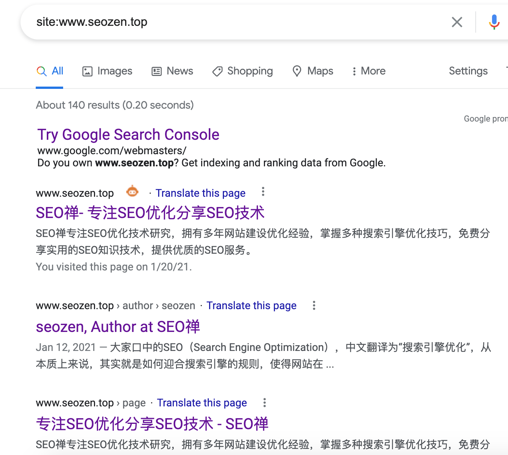

前段时间我给我站点加了一个搜索引擎抓取记录的功能，来看一看各大搜索引擎爬虫抓取情况，基本都是谷歌的蜘蛛。

百度大部分时间抓取都是`sitemap`文件，偶尔抓下其它界面，这对比真的是天差地别啊，虽然我知道我还在百度的观察期，这种情况最好不要进行什么骚操作，只要发一些高质量的外链和进行一些**网站内部优化**就可以，保持自己的节奏就行。

前几天我对我做了些**网站内链优化**和**网站外链建设**的工作，从谷歌蜘蛛爬取的频次来说是非常有效果的，但是百度蜘蛛不是特别理想，应该还是在沙盒的观察期中，不知道怎么做网站外链的朋友，可以看看《[什么是SEO外链？怎么做网站外链？](https://www.helloyu.top/seo-external-links.html)》这篇文章。

做完外链和内链优化没几天，蜘蛛来的频率和渠道明显多了许多，可以看到很多蜘蛛的IP地址是不一样的，抓取的页面也是不同的，这说明搜索引擎蜘蛛顺着网站外链来到我站点，我也去谷歌搜索了下，发现有一些发在外链平台上的文章被其它网站集采转载了。

再看看**Google Search Console**的情况，图表中可以看到这条几乎是垂直上升的收录效果。

再用`site`指令看看具体收录了多少界面。

这是我做完网站内链和外链几天后的情况，但是实际情况并没有这么多，写文章的这两天又降回正常值，因为我总的文章数也才20多篇，加上一些标签页，目录页，不可能达到这么高的收录量，有些页面因为我改动过名字所以重复收录了一些。

很有意思的一个地方，电脑端的网页没有我的排名，但是移动端我的这篇文章却排到了第2位，因为我发到不同平台的文章会做一些不同的标记，我可以知道大概这篇文章是从哪个平台发布的，也方便追踪在哪个平台发布外链效果比较好。

现在下去主要就是把文章的数量提升，其它没有什么特别需要做的地方了，也许网站的速度还可以再优化下，也考虑看情况加个CDN，过几天就要准备去三亚长住学习冲浪潜水了，调整下生活状态。
