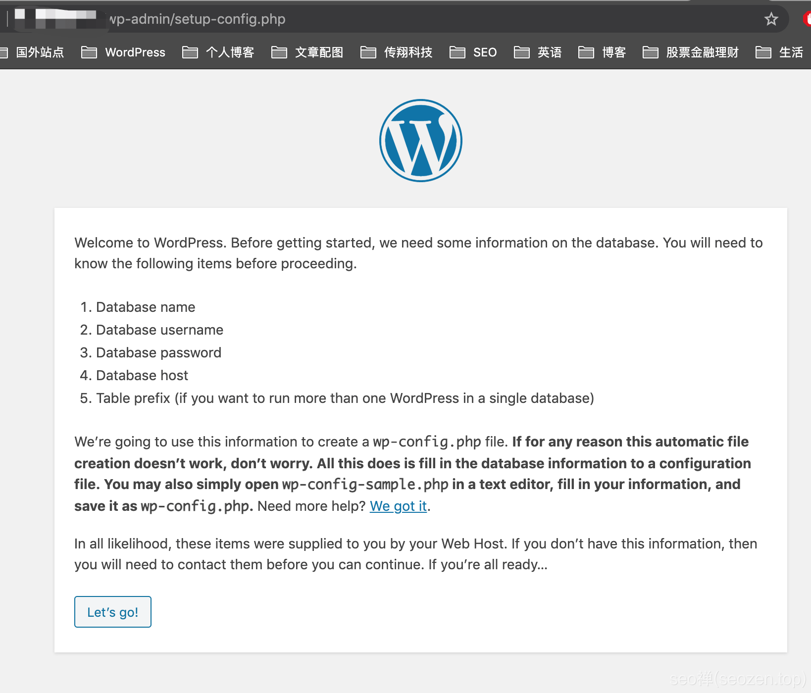
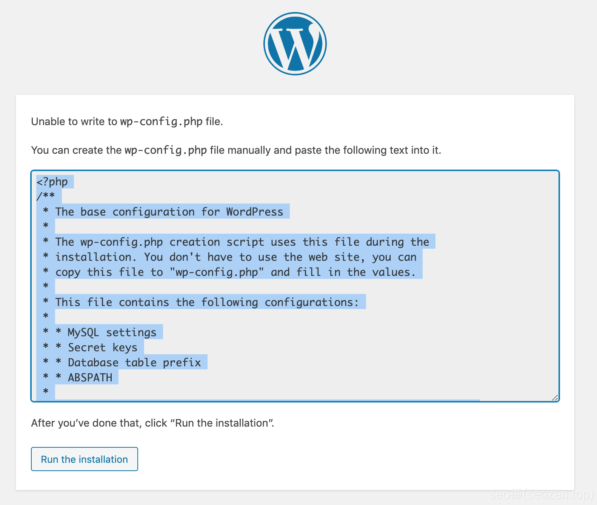
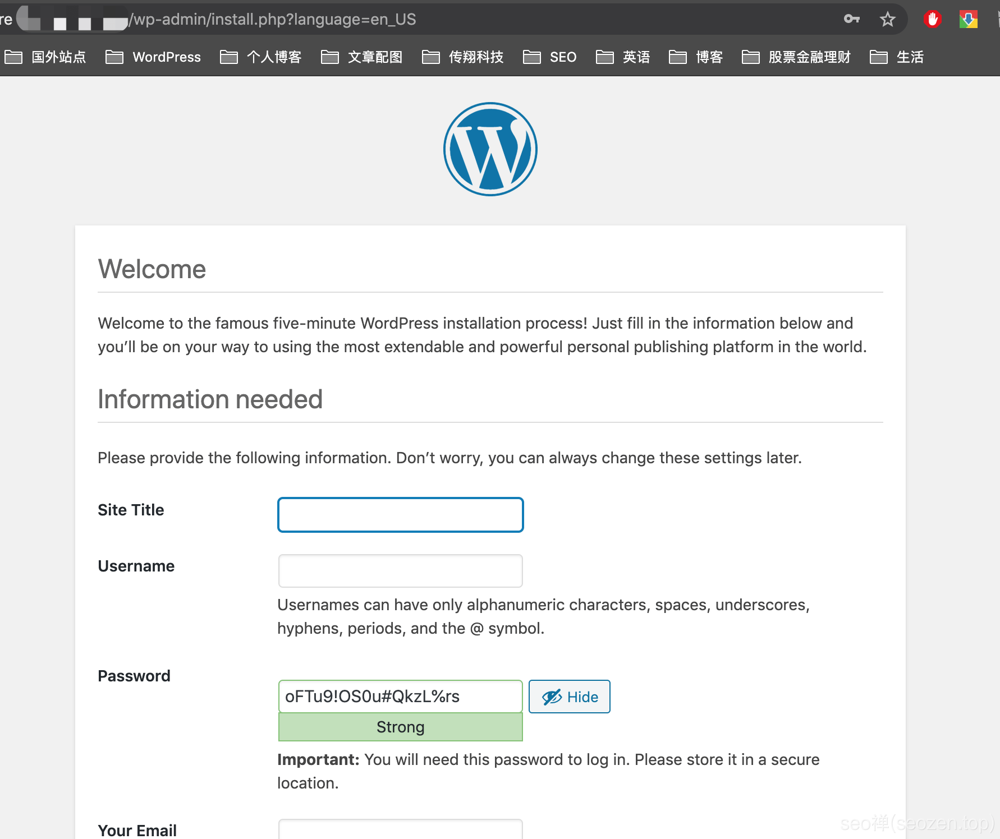

这篇文章是《2021最新WordPress安装教程》系列文章中的第四篇文章，如果没有看前面几篇文章，建议各位朋友返回去先看看前面的文章，如果在使用 **WordPress建站**过程中有什么问题，可以留言给我，我看到一定会回复。前一篇文章《 [2021最新WordPress安装教程（三）](https://www.seozen.top/WordPress安装-steps-2021.html)》中，已经基本把WordPress安装前期准备详细教给各位，下面这篇文章，将具体开始讲解 **如何安装配置WordPress**。

## Wget下载WordPress

在Centos7操作系统上，下载文件使用`wget`命令，输入如下命令：

wget https://wordpress.org/latest.tar.gz

我们下载的是最新的WordPress版本，如果官网下载很慢的话，换个下载地址：

wget http://wp101.net/latest.tar.gz

现在最新是WordPress 5.6版本，下载完后，我们解压文件：

tar -zxvf latest.tar.gz

解压后会在当前目录生成一个`wordpress`目录，我们将目录下的所有内容拷贝到Apache服务器中

cp -R wordpress/\* /var/www/html/

重启下Apache服务器

Apachectl restart

再刷新下浏览器，应该就会出现**WordPress著名的五分钟安装**界面

## WordPress五分钟安装

点击`Let's go`开始配置WordPress，到下一个界面，输入前面创建的数据库名，账号密码等信息，再点击下一步，你应该会看到下面这个界面：上面的意思是说，我们需要手工创建`wp-config.php`这个文件，因为WP没有这个权限，当然为了安全，我没有给Apache配置写的权限，在真实部署环境下，网站文件的拥有者和服务器运行用户需要设置不同一个用户，要是被拿到了`WebShell`，也不至于整个服务器被控制，关于网站权限这块的内容，我会另外再写文章来分析讲解，下面我们就先用超级管理员权限登录服务器，手工创建一下**wp-config.php**这个文件。

## 手工创建wp-config.php

进入网站根目录，运行`ls -l`可以看到如下内容

\[root@cxtech html\]# ls -l
total 220
-rw-r--r-- 1 root root   405 Jan  4 00:00 index.php
-rw-r--r-- 1 root root 19915 Jan  4 00:00 license.txt
-rw-r--r-- 1 root root  7278 Jan  4 00:00 readme.html
-rw-r--r-- 1 root root  7101 Jan  4 00:00 wp-activate.php
drwxr-xr-x  9 root root  4096 Jan  4 00:00 wp-admin
-rw-r--r-- 1 root root   351 Jan  4 00:00 wp-blog-header.php
-rw-r--r-- 1 root root  2328 Jan  4 00:00 wp-comments-post.php
-rw-r--r-- 1 root root  2913 Jan  4 00:00 wp-config-sample.php
drwxr-xr-x  4 root root  4096 Jan  4 00:00 wp-content
-rw-r--r-- 1 root root  3939 Jan  4 00:00 wp-cron.php
drwxr-xr-x 25 root root 16384 Jan  4 00:00 wp-includes
-rw-r--r-- 1 root root  2496 Jan  4 00:00 wp-links-opml.php
-rw-r--r-- 1 root root  3300 Jan  4 00:00 wp-load.php
-rw-r--r-- 1 root root 49831 Jan  4 00:00 wp-login.php
-rw-r--r-- 1 root root  8509 Jan  4 00:00 wp-mail.php
-rw-r--r-- 1 root root 20975 Jan  4 00:00 wp-settings.php
-rw-r--r-- 1 root root 31337 Jan  4 00:00 wp-signup.php
-rw-r--r-- 1 root root  4747 Jan  4 00:00 wp-trackback.php
-rw-r--r-- 1 root root  3236 Jan  4 00:00 xmlrpc.php

我们可以看到有一个`wp-config-sample.php`文件，我们先把这个文件拷贝：

cp wp-config-sample.php wp-config.php

我们再打开wp-config.php文件，手工编辑加入前面创建的WP数据库信息：

vim wp-config.php

根据自己的情况，把这三行配置信息填写正确：

define( 'DB\_NAME', 'database\_name\_here' );

/\*\* MySQL database username \*/
define( 'DB\_USER', 'username\_here' );

/\*\* MySQL database password \*/
define( 'DB\_PASSWORD', 'password\_here' );

填写完后，往下翻，找到下面这些代码：

define( 'AUTH\_KEY',         'put your unique phrase here' );
define( 'SECURE\_AUTH\_KEY',  'put your unique phrase here' );
define( 'LOGGED\_IN\_KEY',    'put your unique phrase here' );
define( 'NONCE\_KEY',        'put your unique phrase here' );
define( 'AUTH\_SALT',        'put your unique phrase here' );
define( 'SECURE\_AUTH\_SALT', 'put your unique phrase here' );
define( 'LOGGED\_IN\_SALT',   'put your unique phrase here' );
define( 'NONCE\_SALT',       'put your unique phrase here' );

访问：[https://api.wordpress.org/secret-key/1.1/salt/](https://api.wordpress.org/secret-key/1.1/salt/)这个地址生成密钥信息，替换这几行代码，完成这些操作之后，就可以保存文件：

：wq

> wq是vim的保存退出指令，前面的：号需要先按esc到命令模式再输入

根据自己的情况填写相关信息，WordPress安装基本到这一步就完成了，你可以开始你的WordPress之旅了，当然在你使用WordPress过程中，一定会遇到权限的问题，因为我们在实际部署环境中，都是遵守**最小授权原则**，这样能最大程度的保证网站的安全。

## 开启WordPress之旅

**WordPress安装教程**到这里基本就结束了，用了四篇文章，从零开始手把手教大家怎么安装WordPress，如果还有什么不懂的地方，朋友们可以在下面留言，我看到一定会第一时间回复，如果在使用WordPress过程中遇到什么问题，可以第一时间给我留言，接下来我还会继续写一些文章来介绍WordPress的相关内容，比如说：WordPress主题开发，WordPress插件开发，WordPress使用DIVI快速建站等内容，想要做好**搜索引擎优化**，WordPress是非常好的建站帮手，SEO优化不是单一的技术，你掌控的知识，经验，技术越多，你在SEO方面就能做的更出色。

SEO禅在开发WordPress主题或者插件的时候，已经不再使用传统的开发环境，这里推荐大家使用Docker开发WordPress，一个命令就可以，可以看看SEO禅写的使用[Docker配置WordPress开发](https://www.seozen.top/docker-wordpress-develop.html)中的介绍，希望对各位有帮助，有什么疑问可以留言评论，SEO禅已经可以评论咯！

如果有想要学习SEO优化的朋友，可以看看这篇文章入门[SEO优化入门一篇就够-SEO教程（2021年最新）](https://www.seozen.top/SEO教程-first-step.html)
