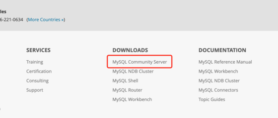

这是 **2021最新WordPress安装教程**系列的第二篇文章，前一篇文章《 [2021最新WordPress安装教程（一）：Centos7安装Apache](https://www.seozen.top/wordpress-apache-setup-2021.html)》已经完整的介绍了如何在Centos7上使用 **YUM安装Apache**，下面要介绍如何使用YUM安装PHP和MySQL。

## 安装PHP 7.4库

现在PHP最新的版本是PHP8，我选择安装PHP7.4的版本，最新的版本感觉还有点不够稳定。

### 安装EPEL和REMI库

因为yum库中默认的PHP版本是5.4，我们需要安装一个新的库，运行如下命令：
```
sudo yum -y install https://dl.fedoraproject.org/pub/epel/epel-release-latest-7.noarch.rpm
sudo yum -y install https://rpms.remirepo.net/enterprise/remi-release-7.rpm
```
### 在Centos7安装PHP7.4

上面命令运行完之后，我们就可以启用REMI库了，运行如下命令：
```
sudo yum -y install yum-utils
sudo yum-config-manager --enable remi-php74
```
现在开始正式安装PHP了，运行如下Bash命令：
```
sudo yum install php php-cli php-mysql php-gd php-zip php-mbstring php-xml  php-imagick
```
运行完命令之后就开始下载PHP，之后会询问你是否要安装，输入个`y`继续安装或者给指令加上`-y`参数。

### 查看PHP版本信息

安装完成后，输入：

php -v

如果安装正确，应该就会显示PHP的版本信息了：
```
PHP 7.4.13 (cli) (built: Nov 24 2020 10:03:34) ( NTS )
Copyright (c) The PHP Group
Zend Engine v3.4.0, Copyright (c) Zend Technologies
```
## MySQL安装

因为现在Oracle收购了MySQL，其它版本都是收费的了，我们需要下载`MySQL Community Server`社区版本，这个版本在官网上的下载入口还不好找，找了一会发现在页面最底下：

\[caption id="attachment\_209" align="aligncenter" width="560"\] MySQL下载\[/caption\]

### 下载MySQL 5.7 RPM文件

YUM的库下载地址：[https://dev.mysql.com/downloads/repo/yum/](https://dev.mysql.com/downloads/repo/yum/) 现在最新版本是MySQL 8，我选择安装MySQL5.7的版本，先下载库文件到本地：
```
wget -i -c http://dev.mysql.com/get/mysql57-community-release-el7-10.noarch.rpm
```
> wget默认是下载文件到你当前路径

### 安装MySQL社区版

下载完我们就可以安装MySQL，顺序运行下面两条命令：
```
yum -y install mysql57-community-release-el7-10.noarch.rpm
yum -y install mysql-community-server
```
下载安装需要一段时间，询问安装`y`通过就可以了。 安装完成后，我们启动下MySQL服务：
```
systemctl start  mysqld.service
```
再看看服务启动状态是否成功：
```
systemctl status mysqld.service
```
## 安装配置WordPress

到这里，我们已经基本算是安装好PHP和MySQL，WordPress安装环境基本上已经配置好，下面我们就来正式开始**安装WordPress**吧，参看下一篇文章：《[2021最新WordPress安装教程（三）：安装WordPress详细步骤](https://www.seozen.top/WordPress安装-steps-2021.html)》
