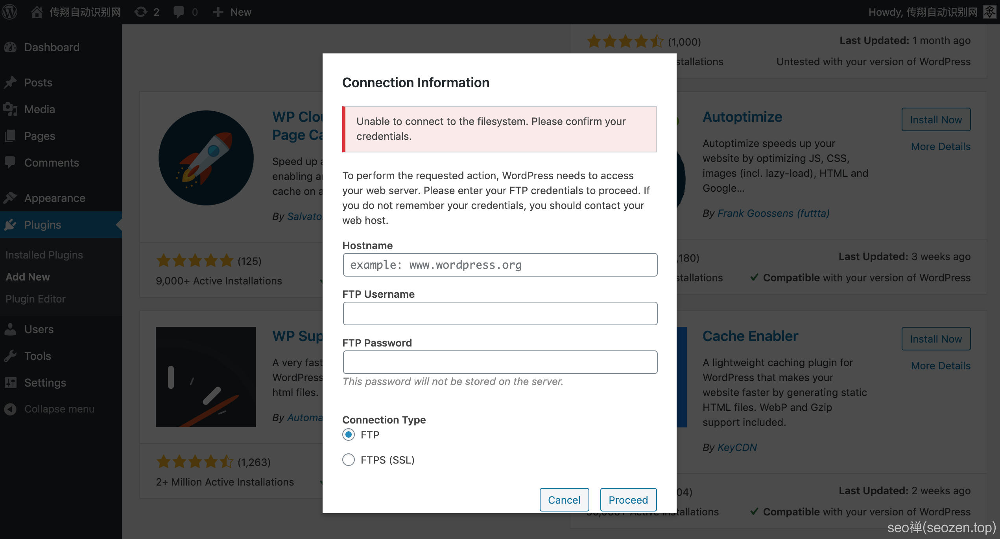

安装插件提示输入FTP凭证

> Unable to connect to the filesystem. Please confirm your credentials. To perform the requested action, WordPress needs to access your web server. Please enter your FTP credentials to proceed. If you do not remember your credentials, you should contact your web host.

当你第一次安装主题或者插件的时候，会弹出下面这个界面：
```
\[caption id="attachment\_264" align="aligncenter" width="2542"\] WordPress-FTP-error\[/caption\]
```
因为WordPress安装插件的时候要向`wp-content/plugins`这个目录写文件，但是这个目录文件属于的是`root`用户，而运行服务器的用户是`apache`用户，这个用户只有`r`读的权限，自然就无法写入。
```
ls -l wp-content/
total 12
-rw-r--r-- 1 root root 28 Jan 4 00:00 index.php
drwxr-xr-x 3 root root 4096 Jan 4 00:00 plugins
drwxr-xr-x 5 root root 4096 Jan 4 00:00 themes
```
解决方法有很多种，我这里只提供我的解决方案，我觉得这样最省事，也比较安全。

## WordPress目录权限解决方案

首先使用`chown`命令，改变下网站所有文件的拥有者，这里我改为服务器`apache`用户和用户组，运行下面这个命令：
```
chown -R apache:apache /var/www/html/\*
```
再运行下`ls -l`看看是不是执行成功。
```
ls -l wp-content
total 12
-rw-r--r-- 1 apache apache   28 Jan  4 00:00 index.php
drwxr-xr-x 3 apache apache 4096 Jan  4 00:00 plugins
drwxr-xr-x 5 apache apache 4096 Jan  4 00:00 themes
```
执行成功，我们运行一些重启`apache`的命令：
```
apachectl restart
```
之后就可以随便你安装插件，主题了，但是安装完主题插件之后，不要忘记把文件拥有者改回`root`：
```
chown -R root:root /var/www/html/\*
```
发文章，管理标签，分类这些操作是不受目录权限影响的。

## 正确设置WordPress目录权限

很多朋友WordPress后台用了弱密码口令，只要使用一个简单无脑的爆破软件，跑跑字典就会得到WordPress的管理员权限，而往往这样的朋友在建站的时候遇到权限问题，看到网上一些解决方法，就无脑的给所有网站文件设置`777`权限，这就等于把服务器和网站白白送给了别人，所以在架设WordPress站点的时候，一定要注意正确设置WordPress的目录权限，只要遵循权限最小授权原则，这样网站的安全性就会比较高，当然不排除其它的问题，比如说网站服务器组件的漏洞，系统的漏洞，服务器用户个人管理密码泄露之类。朋友们也可以看看这系列的文章《[2021最新WordPress安装教程（一）：Centos7安装Apache](https://www.seozen.top/wordpress-apache-setup-2021.html)》就是遵循最小授权原则，手把手教你如何安装WordPress。
