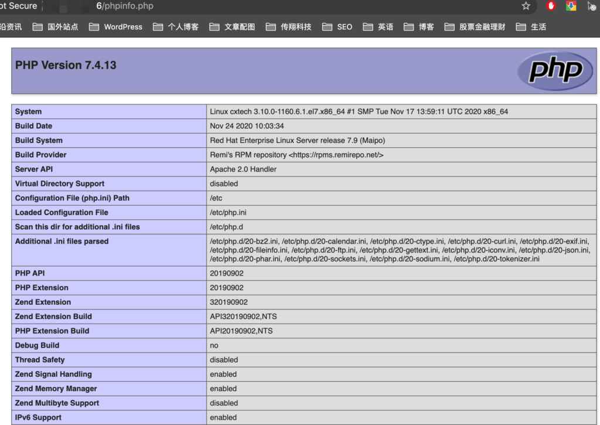

前面已经通过《 [2021最新WordPress安装教程（一）：Centos7安装Apache](https://www.helloyu.top/wordpress-apache-setup-2021.html)》和《 [2021最新WordPress安装教程（二）：配置PHP和MySQL](https://www.helloyu.top/wordpress-php-mysql-2021.html)》两篇文章来介绍了WordPress安装的基础环境配置，现在这篇文章，我们就来正式安装WordPress。

## Apache开启PHP支持

### Apache测试PHP是否开启

Apache默认是没有开启PHP功能的，我们需要自己手动去开启PHP模块的支持，我们可以先新建一个phpinfo.php文件测试下，在命令行输入如下命令：
```
echo "<?php phpinfo(); ?>" > /var/www/html/phpinfo.php
```
浏览器中访问下，应该是会出现下面这样没有解析的`PHP`语句：


### Apache载入PHP模块

我们找到Apache的配置文件`httpd.conf`在`/etc/httpd/conf`目录下，使用vim打开编辑：
```
vim /etc/httpd/conf/httpd.conf
```
> 提示：在编辑之前不要忘记先备份httpd.conf文件，这是一个好习惯。
```
\# LoadModule foo\_module modules/mod\_foo.so
#
Include conf.modules.d/\*.conf
#添加下面这行代码到这个位置，载入php模块
LoadModule php7\_module modules/libphp7.so 
```
再重启Apache，输入下面的命令：
```
apachectl restart
```
再刷新下界面，应该就能看到下面这个信息，说明`Apache`已经载入了`PHP`处理模块



## MySQL创建WordPress数据库

在上一篇文章：《2021最新WordPress安装教程（二）：配置PHP和MySQL》中我们已经安装好了MySQL，但是还没有正式使用，现在看看如何使用MySQL给WordPress创建一个数据库。

### 获取修改root密码

从MySQL 5.7版本之后，`root`原始密码就不再为空，而是一个随机的临时密码，使用下面这条命令查看：
```
grep "temporary password" /var/log/mysqld.log
```
得到初始密码，我们需要先登录MySQL客户端，再修改密码，使用下面这条命令：
```
mysql -u root -p
```
登录之后，你无法进行任务操作，只有修改了密码，MySQL才能让你操作数据库，输入下面这条命令修改密码：
```
mysql> ALTER USER 'root'@'localhost' IDENTIFIED BY 'new password';
```
现在你就有操作**MySQL数据库**的权限了，我们首先创建一个给WordPress使用的数据库。

### 创建WordPress数据库

因为你现在是`root`的用户权限，你可以进行任何数据库操作，首先运行下面这条命令创建一个后面要使用的WordPress数据库：
```
CREATE DATABASE 你的数据库名称；
```
> “你的数据库名称”是需要更换成你自己的数据库名字段的。

### 创建WordPress数据库用户

创建好WordPress数据库后，我们需要给WordPress单独创建一个用户，再给这个用户授权，这样在实际部署环境中才会比较安全，运行下面这条命令创建一个\*\*WP(WordPress)\*\*用户：
```
create user '用户名'@localhost identified by '用户密码';
```
> “用户名”和“用户密码”是需要更换成你自己的信息。

### 为WP用户授权

前面已经创建好WP数据库和用户，为了安全，这个WP用户只能对WP数据库进行管理，所以我们给WP用户进行单独授权，输入下面这个命令：
```
grant all privileges on dbname.\* to username@localhost identified by 'password';
flush privileges;
```
> 这里的“dbname”就是你的WP数据库，username和password就是你前面的WP用户

可以使用下面这条命令，看看我们的授权效果：
```
show grants for username@localhost
```
> username 换成wp的用户名

## 搭建WordPress网站

通过三篇文章，已经详细的讲解如何安装WordPress的安装环境，下面我们开始正式的进行安装配置WordPress，请参看下一篇文章《[2021最新WordPress安装教程（四）：搭建WordPress网站](https://www.helloyu.top/wordpress-install-2021.html)》
