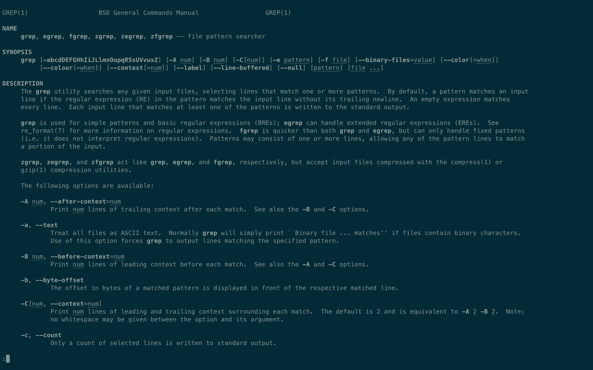
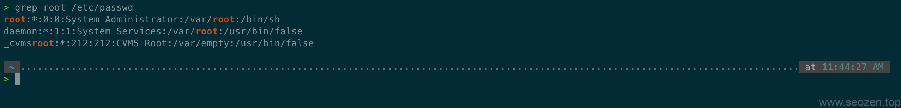

我们在使用Linux的时候，要查找一些特定的内容，最经常使用的命令就是`grep`，它是**Global Regular Expression Print** 的首字母缩写，使用的是正则表达式，能够很快速的搜索文件中的字符串，比如在使用`ps`命令的时候就可以搜索特定的进程。

## 搜索文件中的关键词

`grep命令`通常分为三个部分，`grep-搜索关键字-文件名`，其中搜索关键词可以使用正则表达式语法，还可以跟一些参数，如下man文档：

比如说使用`grep root /etc/passwd`查看passwd文件中有关`root`的记录，这样就会把包含root字符串的行都打印出来：

如果要搜索多个文件，只要在后面跟上多个文件名称就可以，grep会显示出所有这些文件中包含关键词的行。

## grep常用参数

- `-w`\-全匹配关键词，如果不使用-w，这个关键词如果是子字符串一样会返回
- `-i`\-忽略大小写，会输出大写和小写都匹配的结果，默认是大小写敏感的
- `-r`\-搜索子目录，如果搜索的是一个文件夹，使用这个参数会搜索子文件夹内的文件
- `-v`\-反选搜索，打印不包含关键词的行
- `-x`\-只有整行匹配关键词才返回，如果一行有其它字符不在关键词字符串中就不会匹配成功
- `-l`\-只会打印匹配成功的文件名称，不会返回行信息
- `-c`\-返回匹配的行数量

## grep返回上下文信息

在那么多参数中有3个非常有用的参数，`-A`，`-B`，`-C`：

- A-返回匹配行之前的信息，比如`-A 2` 就是返回之前2行的信息
- B-返回匹配行之后的信息，比如`-B 2`就是返回之后2行的信息
- C-返回匹配行前后的信息，比如`-C 2` 相当于 `-A 2 -B 2`

还有更多其它的参数信息可以使用`man grep`来查看，这篇文章讲的只是基础使用方式，就是简单的搜索文件中的字符串，SEO禅会另写几篇文章来分享**grep命令**和其它命令配合使用，还有正则表达式的使用。
