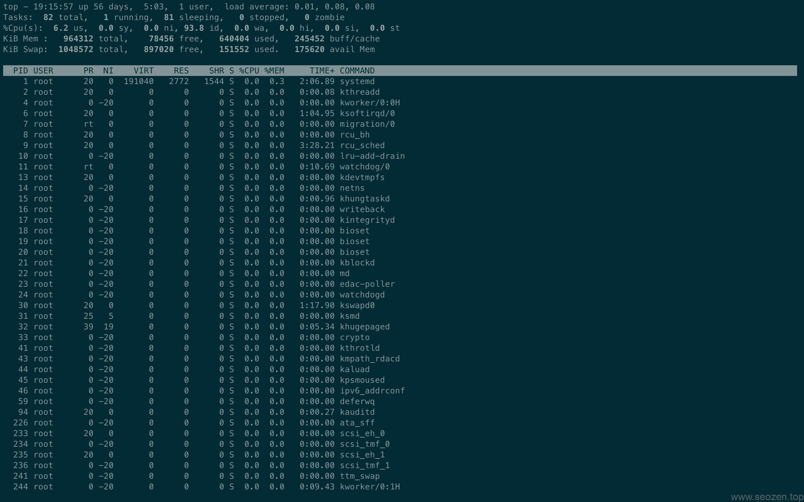

使用过Linux的朋友应该对`top`程序不会陌生，但是很多人并没有真正的把top用起来，有很多功能估计都没有使用到，这篇文章就分享下SEO禅在网站**运维服务器**过程中使用top的技巧。

## 使用top

首先我们要查看下top的版本，如果版本太低，有可能不支持下面介绍的一些功能，输入`top -v`看看自己的Linux安装的TOP程序是什么版本：
```
\[root@SEOZEN ~\]# top -v
  procps-ng version 3.3.10
```
在终端输入top应该可以看到类似下面界面的样式：



这个界面包含两部分，分别是`系统摘要`和`进程列表`，SEO禅会详细的一行一行的介绍。

## 系统统计信息

### **第一行：概况**
```
top - 19:42:49 up 56 days,  5:30,  1 user,  load average: 0.00, 0.01, 0.05
```
`19:42:49`\-系统当前时间

`up 56 days, 5:30`\-表示从服务器开机到现在一共运行的时间，这是是56天，19个小时42分49秒。

`1 user`\-当前登录用户数

`load average: 0.00, 0.01, 0.05`\-系统1分钟、5分钟、15分钟内的平均负载值，具体数值的含义和算法参考[这里](http://www.brendangregg.com/blog/2017-08-08/linux-load-averages.html)。

### 第二行：进程计数
```
Tasks:  82 total,   1 running,  81 sleeping,   0 stopped,   0 zombie
```
`total`：进程总数。 `running`：正在运行的进程数，对应状态TASK\_RUNNING。 `sleeping`：睡眠的进程数，对应状态TASK\_INTERRUPTIBLE和TASK\_UNINTERRUPTIBLE。 `stopped`：停止的进程数，对应状态TASK\_STOPPED。 `zombie`：僵尸进程数，对应状态TASK\_ZOMBIE。

### **第三行：**CPU使用率（%Cpu(s)）
```
%Cpu(s):  0.0 us,  0.0 sy,  0.0 ni,100.0 id,  0.0 wa,  0.0 hi,  0.0 si,  0.0 st
```
`us`：进程在用户空间（user space）消耗的CPU时间占比，不包含调整过优先级的进程。 `sy`：进程在内核空间（kernel space）消耗的CPU时间占比。 `ni`：手动调整过用户态优先级的（niced）进程的CPU时间占比。 `id`：空闲的（idle）CPU时间占比。 `wa`：等待（wait）I/O完成的CPU时间占比。 `hi`：处理硬中断（hardware interrupt）的CPU时间占比。 `si`：处理软中断（software interrupt）的CPU时间占比。 `st`：当Linux系统是在虚拟机中运行时，等待CPU资源的时间（steal time）占比。

### **第四、五行：物理内存和交换空间（Mem/Swap）**
```
KiB Mem :   964312 total,    85656 free,   687008 used,   191648 buff/cache
```
单位为KB，以物理内存为例： `total`：内存总量。 `free`：空闲内存量。 `used`：使用中的内存量。 `buff/cache`：缓存和page cache占用的内存量。

## **进程详细信息**

这里显示的数据列是可以改的，默认会显示如图中的12列。其含义分别如下： `PID`：进程ID。 `USER`：进程所有者的用户名。 `PR`：从系统内核角度看的进程调度优先级。 `NI`：进程的nice值，即从用户空间角度看的进程优先级。值越低，优先级越高。 `VIRT`：进程申请使用的虚拟内存量。 `RES`：进程使用的驻留内存（即未被swap out的内存）量。 `SHR`：进程使用的共享内存量。 `S`：进程状态可以为R=running，S=interruptible sleeping，D=uninterruptible sleeping，T=stopped，Z=zombie。 `%CPU`：进程在一个更新周期内占用的CPU时间比例。 `%MEM`：进程占用的物理内存比例。 `TIME+`：进程创建后至今占用的CPU时间长度。 `COMMAND`：运行进程使用的命令。

## TOP内的操作

`上下移动`\-通过键盘上下箭头来移动显示其它进程的信息。

`左右移动`\-通过键盘左右箭头来移动显示进程列信息可见性，如果有的行显示太长就可以通过这个操作查看。

`改变数值单位`\-通过小写`e`和大写`E`来分别改变系统统计信息和进程详细信息的数值单位。

`多cpu使用情况`\-如果你有不止一个cpu内核，可以通过按下`1`按钮来显示其它CPU信息，因为SEO禅的服务器就一个CPU内核，所以没得东西看。

`切换CPU图表`\-按下`t`按钮来切换CPU实用的显示方式，挺有意思的自己可以试试。

`切换内存/SWAP图表`\-按下`m`按键来切换内存和交换区的显示方式。

`添加颜色显示`\-可以按下`z`来切换颜色显示程序进程信息。

`高亮运行进程`\-按下键盘`y`来显示正在运行的进程。

`高亮显示当前排序列`\-按下键盘`x`会高亮显示当前排序依据的列，默认是CPU列，可以能过按下如下大小字母来选择排序的表：

- **P:** The `%CPU` column.
- **M:** The `%MEM` column.
- **N:** The `PID` column.
- **T:** The `TIME+` column.

`切换command列显示`\-按下`c`按键可以切换command列的显示。

`单独显示特定用户进程`\-按钮`u`按键，再输入用户名称就可以查看特定用户的进程信息。

`设置进程的优先级`\-按下键盘中的`r`，再输入PID进可以设置进程的nice值了。

`结束一个进程`\-按下键盘`k`，再输入PID结束一个进程。

基本使用差不多就上面这些，主要我们使用TOP程序来查看系统进程，来发现一些有问题的进程及时进行处理，保持服务器的速度和稳定，这对于我们做SEO优化来说是很重要的。

本文参考资料：

https://www.howtogeek.com/668986/how-to-use-the-linux-top-command-and-understand-its-output/

https://www.jianshu.com/p/a6e96c102881

https://blog.csdn.net/dxl342/article/details/53507673
