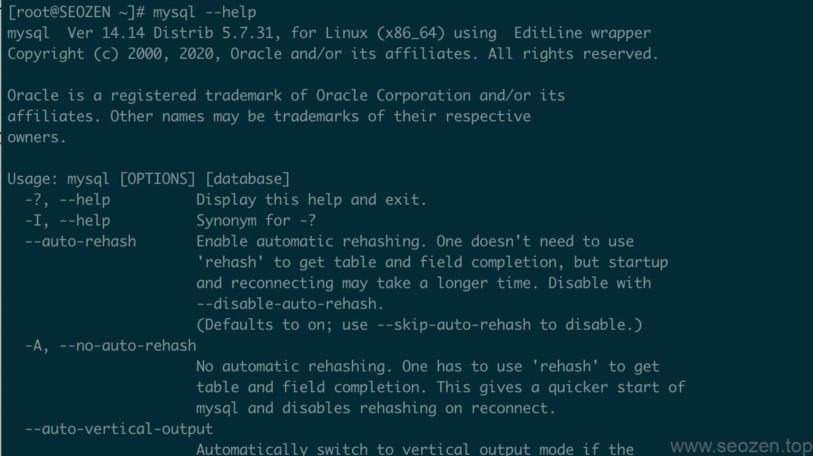

SEO禅在学习一项新的技能的时候，最喜欢去寻找的就是官方的帮助文档，因为它是最新的，也是个人认为面向最广的，所以正常情况下官方的文档都具有普适性，相对来说都比较简单易懂，SEO禅在学习MySQL的时候也是这样，因为**MySQL 8**太新了，我就用**MySQL 5.7**的官方使用文档来写一些简单的基础文章，首先可以通过下面这条命令来查看`MySQL --help`所提供的帮助和功能选项：



可以看到有很多查选的参数，往下拉还有很多，不需要记，有用到再去找再去看看，首先介绍下**如何连接mysql。**

## 连接MySQL5.7

使用mysql第一步肯定是要先知道怎么连接上mysql数据库，输入下面这条命令：
```
mysql -u root -p
```
上面有两个参数`-u`和`-p`这时候就可以用`mysql --help` 查看一下这两个参数的意思，比如：
```
\-u, --user=name     User for login if not current user.
```
可以看到`-u`是为了指定登录用户的，当输入上面第一条命令，再输入密码就可以登录到mysql命令行界面REPL(Read-Eval-Print-Loop)
```
mysql>
```
注意：如果mysql数据库不是在本机，需要加上`-h`然后跟上mysql的服务器地址。

现在就可以输入SQL语句来使用**mysql数据库**了

## MySQL help使用

现在我们还没有切换到任何数据库，只是登录了MySQL的客户端程序，但是一样可以使用一些内置查询语句，比如：
```
mysql> select user();
+----------------+
| user()         |
+----------------+
| root@localhost |
+----------------+
1 row in set (0.00 sec)
```
返回的是当前的mysql用户和host信息，那我怎么知道`user()`这个函数是干什么的？又是哪里找的呢？第一个肯定是官方文档，第二就是通过`help`这个命令，直接输入以后会得到下面的显示：
```
mysql> help

For information about MySQL products and services, visit:
   http://www.mysql.com/
For developer information, including the MySQL Reference Manual, visit:
   http://dev.mysql.com/
To buy MySQL Enterprise support, training, or other products, visit:
   https://shop.mysql.com/

List of all MySQL commands:
Note that all text commands must be first on line and end with ';'
?         (\\?) Synonym for \`help'.
clear     (\\c) Clear the current input statement.
connect   (\\r) Reconnect to the server. Optional arguments are db and host.
delimiter (\\d) Set statement delimiter.
edit      (\\e) Edit command with $EDITOR.
ego       (\\G) Send command to mysql server, display result vertically.
exit      (\\q) Exit mysql. Same as quit.
go        (\\g) Send command to mysql server.
help      (\\h) Display this help.
nopager   (\\n) Disable pager, print to stdout.
notee     (\\t) Don't write into outfile.
pager     (\\P) Set PAGER \[to\_pager\]. Print the query results via PAGER.
print     (\\p) Print current command.
prompt    (\\R) Change your mysql prompt.
quit      (\\q) Quit mysql.
rehash    (\\#) Rebuild completion hash.
source    (\\.) Execute an SQL script file. Takes a file name as an argument.
status    (\\s) Get status information from the server.
system    (\\!) Execute a system shell command.
tee       (\\T) Set outfile \[to\_outfile\]. Append everything into given outfile.
use       (\\u) Use another database. Takes database name as argument.
charset   (\\C) Switch to another charset. Might be needed for processing binlog with multi-byte charsets.
warnings  (\\W) Show warnings after every statement.
nowarning (\\w) Don't show warnings after every statement.
resetconnection(\\x) Clean session context.

For server side help, type 'help contents'
```
可以看到最后有个提示输入`help contents`那输入看下:
```
mysql> help contents
You asked for help about help category: "Contents"
For more information, type 'help <item>', where <item> is one of the following
categories:
   Account Management
   Administration
   Components
   Compound Statements
   Contents
   Data Definition
   Data Manipulation
   Data Types
   Functions
   Geographic Features
   Help Metadata
   Language Structure
   Plugins
   Storage Engines
   Table Maintenance
   Transactions
   User-Defined Functions
   Utility
```
可以看到其中有一个`Functions`，那我们再输入`help Functions`看看是什么内容：
```
mysql> help Functions
You asked for help about help category: "Functions"
For more information, type 'help <item>', where <item> is one of the following
categories:
   Aggregate Functions and Modifiers
   Bit Functions
   Cast Functions and Operators
   Comparison Operators
   Control Flow Functions
   Date and Time Functions
   Encryption Functions
   Enterprise Encryption Functions
   GROUP BY Functions and Modifiers
   GTID
   Information Functions
   Internal Functions
   Locking Functions
   Logical Operators
   Miscellaneous Functions
   Numeric Functions
   Performance Schema Functions
   Spatial Functions
   String Functions
   Window Functions
   XML
```
到这里是不是有点晕跟俄罗斯套娃一样，一层又一层的，因为MySQL把功能文档分的很细，分类做的很好，其实我觉得这样更容易使用和理解，可以看到有一条`Informaition Functions`我们再`help`一次看看：
```
mysql> help  Information Functions
You asked for help about help category: "Information Functions"
For more information, type 'help <item>', where <item> is one of the following
topics:
   BENCHMARK
   CHARSET
   COERCIBILITY
   COLLATION
   CONNECTION\_ID
   CURRENT\_ROLE
   CURRENT\_USER
   DATABASE
   FOUND\_ROWS
   ICU\_VERSION
   LAST\_INSERT\_ID
   ROLES\_GRAPHML
   ROW\_COUNT
   SCHEMA
   SESSION\_USER
   SYSTEM\_USER
   USER
   VERSION
```
可以看到其中有一个`USER`，那我们继续`help USER`看看是什么情况：
```
mysql> help user
Name: 'USER'
Description:
Syntax:
USER()

Returns the current MySQL user name and host name as a string in the
utf8 character set.

URL: https://dev.mysql.com/doc/refman/8.0/en/information-functions.html

Examples:
mysql> SELECT USER();
        -> 'davida@localhost'
```
这就是我们最终的使用函数的解释，可以很清楚的看到返回的是用户信息，还有使用方法，我这里就举这么一个使用`mysql5.7 help`的例子，希望你能举一反三，自己去看看再试试，这是《2021MySQL 5.7简明教程》的第一篇文章，后面会慢慢补齐内容，我写的这些文章不是说把官网的文档照搬过来，我更希望的是能分享自己的学习方法，希望对大家有所帮助。
