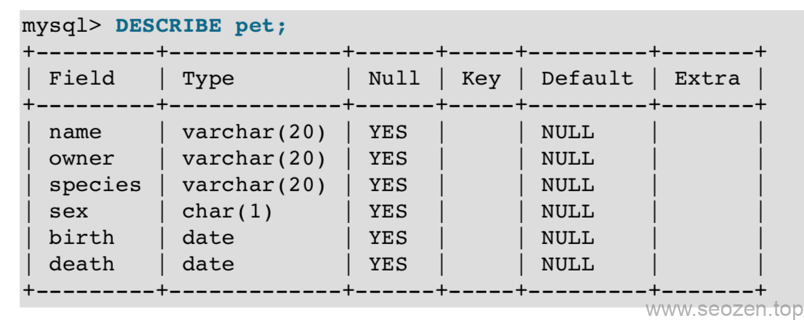

前一篇《MySQL 5.7简明教程2021（二）：创建和使用数据库》介绍了数据库的创建和使用，这一篇SEO禅给大家分享下数据库表的使用。我们使用`use 数据库名称`来切换数据库，创建的新数据库肯定是空的，里面没有一张表，我们可以使用下面这个命令查看：
```
mysql> SHOW TABLES; 
Empty set (0.00 sec)
```
创建数据库是非常容易的一件事，难的是如何确定数据库的结构，表之间的关系，表内的字段，我们就先创建一个`pet`表来举例，用来记录宠物的信息。

## 创建数据表

首先我们来分析下，一个pet表需要什么字段？最少得有名称吧？但是只有名字这个字段好像有点太简单无趣了，那我们再加一此字段吧，年龄怎么样？记录每只宠物的年龄？但是年龄可是会变的，那我们不是要经常去更新数据库表么，这个做法不太好，出生日期怎么样？我们只要用现在的时间减去出生日期，就可以知道宠物的年龄了，而且mysql也有自带计算功能，这个想法看上去不错，加点别的字段？性别？品种？好像都是不错的选择，宠物也有主人，再加一个字段记录他们的主人如何？好像还差点什么？死亡日期？对！就是这个，我们需要有一个日期来记住他们，就像我们人类会记住自己亲人离世的日子一样，那最终我们就可以通过下面的命令来创建这个数据表：

mysql> CREATE TABLE pet (name VARCHAR(20), owner VARCHAR(20), species VARCHAR(20), sex CHAR(1), birth DATE, death DATE);

使用`varchar`类型来创建name，owner，species字段是非常合适的，因为他们的长度是可变的，但是前提是要设计好允许的最大长度，可以设置从1到65535的长度，如果到时候要修改我们可以使用`alter table`语句，现在我们再使用`show tables`命令应该会得到下面的数据：
```
mysql> SHOW TABLES; 
+---------------------+ 
| Tables in menagerie | 
+---------------------+ 
| pet                 | 
+---------------------+
```
我们可以使用`describe pet`命令来看看表结构是不是我们想要的样子：



你可以随时使用这个命令来查看表结构，如果你忘记表的字段名称。

## 数据库表操作

现在我们已经创建好表，可以往里面插入一些数据，我们可以使用`insert`命令：
```
 mysql> INSERT INTO pet VALUES ('Puffball','Diane','hamster','f','1999-03-30',NULL);
```
我们要从数据库表中读数据的话可以使用`select`命令：
```
SELECT what\_to\_select
FROM which\_table
WHERE conditions\_to\_satisfy;
```
我们经常会把`what_to_select`设置成`通配符*`，意思是选择所有字段，比如：
```
mysql> SELECT \* FROM pet WHERE name = 'Bowser';
```
意思就是我们从pet表中找出name为Bowser的所有记录，where后能跟的条件有很多，这里使用的是`=`，还有很多种条件语句：
```
mysql> SELECT \* FROM pet WHERE birth >= '1998-1-1';
mysql> SELECT \* FROM pet WHERE species = 'dog' AND sex = 'f';
mysql> SELECT \* FROM pet WHERE species = 'snake' OR species = 'bird';
mysql> SELECT \* FROM pet WHERE (species = 'cat' AND sex = 'm') OR (species = 'dog' AND sex = 'f');
```
如果我们想知道一共有多少人有记录，而且这些人可能还不止一条宠物记录，我们就需要去除重复的统计，我们可以使用`distinct`语句：
```
SELECT DISTINCT owner FROM pet;
```
这样就会返回不重复的主人名称。我们还可以使用`order by`语句来给宠物按出生日期排序：
```
mysql> SELECT name, birth FROM pet ORDER BY birth;
```
默认mysql是按升序来进行排序的，我们可以加一个关键词`DESC`在birth后面按降序进行排序。

这篇文章先写到这，关于数据表更多的操作，比如前面说的通过出生日期计算年龄，模式匹配等内容，放到下一篇来说：《MySQL 5.7简明教程2021（四）：数据库表操作续》
