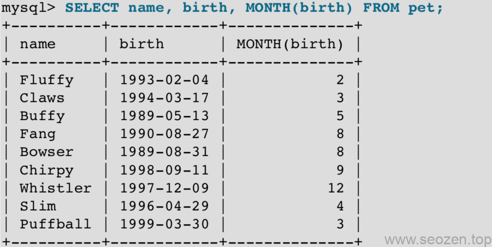

前面一篇文章《MySQL 5.7简明教程2021（三）：操作数据库表》介绍了MySQL表的基本内容，这篇再来延深一些数据库表的操作，前面使用pet表作为举例，有说到记录宠物年龄的时候，我们只记录了出生时间，年龄是通过当前时间减去出生时间计算来的，下面就介绍下MySQL自带的计算日期的功能。

## MySQL日期操作

MySQL提供了需要计算日期的函数，这里我们使用`TIMESTAMPDIFF()`函数来计算宠物的年龄：
```
mysql> SELECT name, birth, CURDATE(), TIMESTAMPDIFF(YEAR,birth,CURDATE()) AS age FROM pet ORDER BY name;
```
其中CURDATE也是内置的函数，表示当前日期，`TIMESTAMPDIFF`的第一个参数是单位，可以设置成如下：
```
mysql> SELECT TIMESTAMPDIFF(MONTH,'2003-02-01','2003-05-01');
        -> 3
mysql> SELECT TIMESTAMPDIFF(YEAR,'2002-05-01','2001-01-01');
        -> -1
mysql> SELECT TIMESTAMPDIFF(MINUTE,'2003-02-01','2003-05-01 12:05:55');
        -> 128885
```
如果我们想知道下个月有哪些宠物生日？那我们就要把他们出生日期中的月抽出来，MySQL提供了几个抽取日期信息的函数：`YEAR(), MONTH(), and DAYOFMONTH()`，我们可以使用MONTH来满足这个需求：



## 模式匹配

MySQL操作数据库表使用模式匹配和[Linux下grep](https://www.helloyu.top/linux-grep-command.html)差不多，用`_`表示单个字符，`%`匹配0个或任意个字符，这时候我们在`where`条件语句里面就不能再使用`=`或`<>`这种语法，我们要使用`LIKE`或`NOT LIKE`，比如我们要找宠物名字为`b`开头的：
```
mysql> SELECT \* FROM pet WHERE name LIKE 'b%';
```
或者名字以`seo禅`结尾的宠物：
```
mysql> SELECT \* FROM pet WHERE name LIKE '%seo禅';
```
如果要匹配的字符串在中间位置，可以在左右两边加上`%`:
```
mysql> SELECT \* FROM pet WHERE name LIKE '%w%';
```
如果要匹配5个字符要像下面这样：
```
mysql> SELECT \* FROM pet WHERE name LIKE '\_\_\_\_\_';
```
## 多表查询

我们在设计数据库表的时候要遵循三个范式：

- 第一范式：对属性的原子性约束，要求属性具有原子性，不可再分解；
- 第二范式：对记录的惟一性约束，要求记录有惟一标识，即实体的惟一性；
- 第三范式：对字段冗余性的约束，即任何字段不能由其他字段派生出来，它要求字段没有冗余

所以有时候我们并不会把所有的字段放在一个表里面，这样会让一个表过大，数据也冗余，我们在需要的时候把相关记录的表关联起来查询就可以，如下使用`inner join`语句：
```
mysql> SELECT pet.name, TIMESTAMPDIFF(YEAR,birth,date) AS age, remark
FROM pet INNER JOIN event
         ON pet.name = event.name
       WHERE event.type = 'litter';
```
可以看到`FROM`后面多了`INNER JOIN`，后面跟的是相关表名，这里的`ON`是表示两个表关联要按`name`字段来匹配，如果有相同的name才会返回记录。如果数据库表字段比较长，还可以使用`AS`来进行缩写操作：
```
FROM pet AS t1 INNER JOIN event AS t2
```