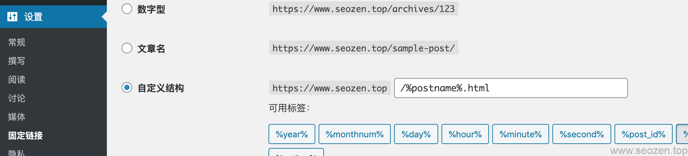

WordPress作为当前最流行的建站程序，市场占有率那是相当的高啊，你说一个做SEO的要是不懂做**WordPress** **优化**，那他可能是个假SEOer，虽然说平时接的单子很多是企业的优化项目，但是最多的还是WordPress相关的项目，尤其是在Upwork，Freelancer，Fiverr这些自由职业者平台上，WordPress的需求一直是很大，所以我觉得有必要写一系列文章来说一说，关于WordPress的SEO优化要怎么做，因为WordPress是现成的框架，而且插件丰富多彩，SEO类型的插件也是非常多，我都会分享给大家。

## 基础信息优化

我们建好WordPress之后，如果在5分钟建站步骤没有填好网站信息，要进行的第一步优化就是去修改网站的基础信息，打开**设置->常规**，把下面的信息填写完整：

标题和副标题需要突出自己网站的主题，不要写不相关的内容，也不要作关键词堆砌，现在关键词堆砌对搜索引擎已经没有正面的效果，反而会把网站拉进小黑屋的，URL地址要填写完整。

## 搜索引擎索引

再到**设置->阅读**查看**“建议搜索引擎不索引本站点”**，这个复选框有没有被勾选，如果选中的话就取消掉，因为有时候会在线上调式的时候打开了这个功能，要是忘记关了就不要怪搜索引擎不收录了。

## 图片优化

到**设置->媒体**面板下，设置相应的图片大小，这个需要根据前端设计来定，设置不同尺寸的照片WordPress会自动切好相应比例的照片，不同分辨率的设备就会引用不同分辨率的图片，这样网站在加载的时候速度就会更快点。

## 

## 

可以看到我的网站在手机分辨率下用的是中等尺寸的照片。

## 链接优化

WordPress在比较早的版本都是动态的链接地址，这是非常不利于SEO优化的，但是现在固定链接设置基本是SEO的标配了，除非你是大型的新闻站点，像企业站点，个人站点，最好都要设置固定链接，而且这个链接名称应该语义化，不要设置无意义的URL。

这是WordPress最基础的SEO优化，也是最简单的操作，我会陆续把其它的优化分享出来，这篇文章就先到这里。
