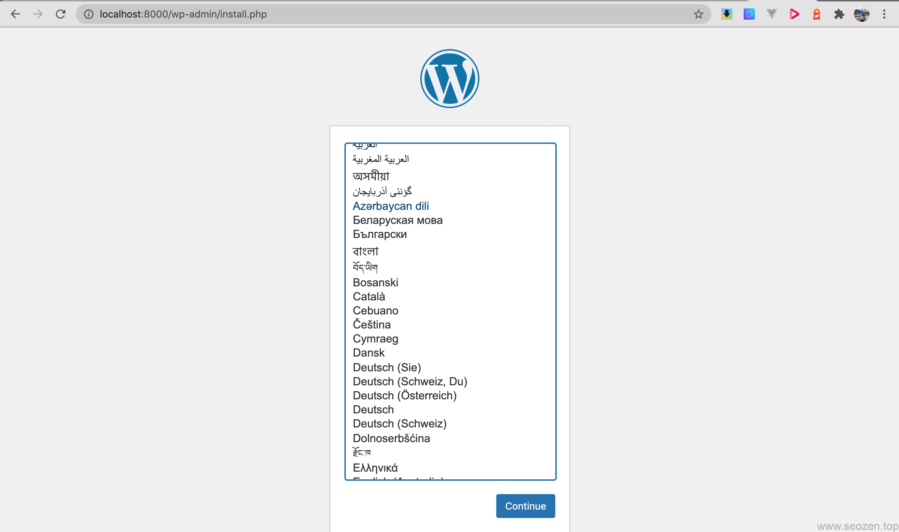

原来SEO禅在开发WordPress的时候，使用的是标准配置，无论是MAMP，XAMPP还是LAMP，都是要安装部署，而且环境比较单一，比如自己要切换PHP的版本，那就非常麻烦，如果想安装一个Nginx配合Apache作负载均衡就非常的蛋疼了，现在使用Docker来开发和部署就非常方便，一个命令搞定。今天来分享下如何使用Docker配置WordPress开发环境。

## 第一步：WordPress docker-compose配置

首先创建一个空的开发文件夹，`mkdir wordpress-docker`然后进入到`cd wordpress-docker`目录，之后创建`touch docker-compose.yml`文件，将下面的配置信息写入：

version: "3.9"

services:
  db:
    image: mysql:5.7
    volumes:
      - db\_data:/var/lib/mysql
    restart: always
    environment:
      MYSQL\_ROOT\_PASSWORD: somewordpress
      MYSQL\_DATABASE: wordpress
      MYSQL\_USER: wordpress
      MYSQL\_PASSWORD: wordpress
    networks:
        - wp

  wordpress:
    depends\_on:
      - db
    image: wordpress:latest
    volumes:
      - .:/var/www/html
    ports:
      - "8000:80"
    restart: always
    environment:
      WORDPRESS\_DB\_HOST: db:3306
      WORDPRESS\_DB\_USER: wordpress
      WORDPRESS\_DB\_PASSWORD: wordpress
      WORDPRESS\_DB\_NAME: wordpress
    networks:
      - wp
networks:
  wp:
volumes:
  db\_data: {}

## 第二步：运行

docker-compose up -d

## 第三步： 哇！

在浏览器输入地址，就能看到WordPress的安装界面啦

在本地文件目录内你应该就能看到WordPress的源码文件了，现在就开始去开发吧，关于`docker-compose.yml`文件内容SEO禅会在其它文章分享。
