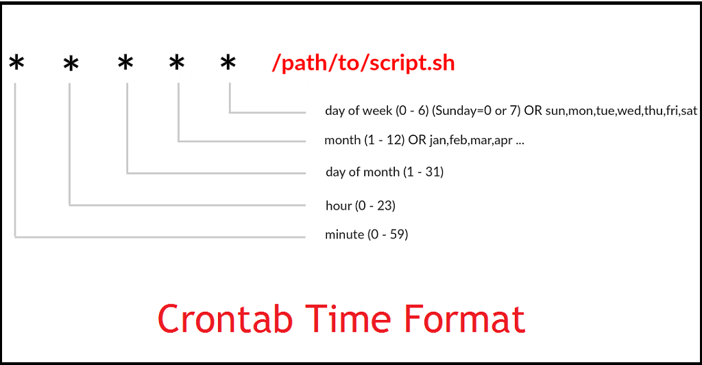

作为一名站长，SEO禅经常需要在服务器运行一些日常任务，比如备份网站数据库，定期清理日志文件等，这种事一般不会在白天进行操作，都是等下半夜没有太多访问量的时候进行，那我们不可能熬夜去做这些事吧，所以最好有能定时执行这些任务的办法，这就是cron后台程序在Linux下做的事。

## cron 和 crontab的区别

cron和crontab是依存关系，cron是运行在linux中的一个程序，负责执行计划任务，而crontab是一个管理cron文件的程序，有点像vim，使用crontab可以创建计划任务文件，这个文件我们通常也叫作crontab，有相应的语法规则，下面会介绍，是不是有点绕，其实就是crontab表示的是一个程序，又表示是计划任务的配置文件。

## crontab配置文件

首先使用crontab命令来创建一个新的计划任务文件，默认系统中是没有这个文件的，可以使用`crontab -e`来创建：

SHELL=/bin/bash
MAILTO=root@example.com
PATH=/bin:/sbin:/usr/bin:/usr/sbin:/usr/local/bin:/usr/local/sbin

# For details see man 5 crontab on macos

# Example of job definition:
# .---------------- minute (0 - 59)
# |  .------------- hour (0 - 23)
# |  |  .---------- day of month (1 - 31)
# |  |  |  .------- month (1 - 12) OR jan,feb,mar,apr ...
# |  |  |  |  .---- day of week (0 - 6) (Sunday=0 or 7) OR sun,mon,tue,wed,thu,fri,sat
# |  |  |  |  |
# \*  \*  \*  \*  \* user-name  command to be executed

这个crontab配置文件默认会创建在`/var/spool/cron`目录下，头三行是运行环境的配置信息，因为cron不会提供运行环境，所以要每一个配置文件需要设置好运行环境，其实最难理解的就是这里的时间配置格式，SEO禅来详细介绍下。

## Crontab语法格式

在上面示例代码中已经有crontab的日期格式，下面贴张更直观的图：

默认情况下每一位是`*`作为占位符，表示每一分钟，每一个小时，每一天，每一月，每一周，根据需要去修改就行，如下：

01 02 \* \* \* /root/backup.sh

上面表示早上`02:01 am`执行backup，这是设置在特定时间执行，如果我们要每隔10分钟检测一次服务器状态，我们就可以像下面代码一样用`/`:

\*/10 \* \* \* \*

如果我们要在工作日执行一些特定任务要怎么操作？可以使用`-`来实现：

0 4 \* \* 1-5 /root/backup.sh

表示周一到周五早上4:00 am 执行，那我们如果想在周二和周四执行一些特定任务怎么办呢？使用`,`来分隔：

0 4 \* \* 2,4 /root/backup.sh

具体其它的使用，可以输入`man 5 crontab`来查看。
