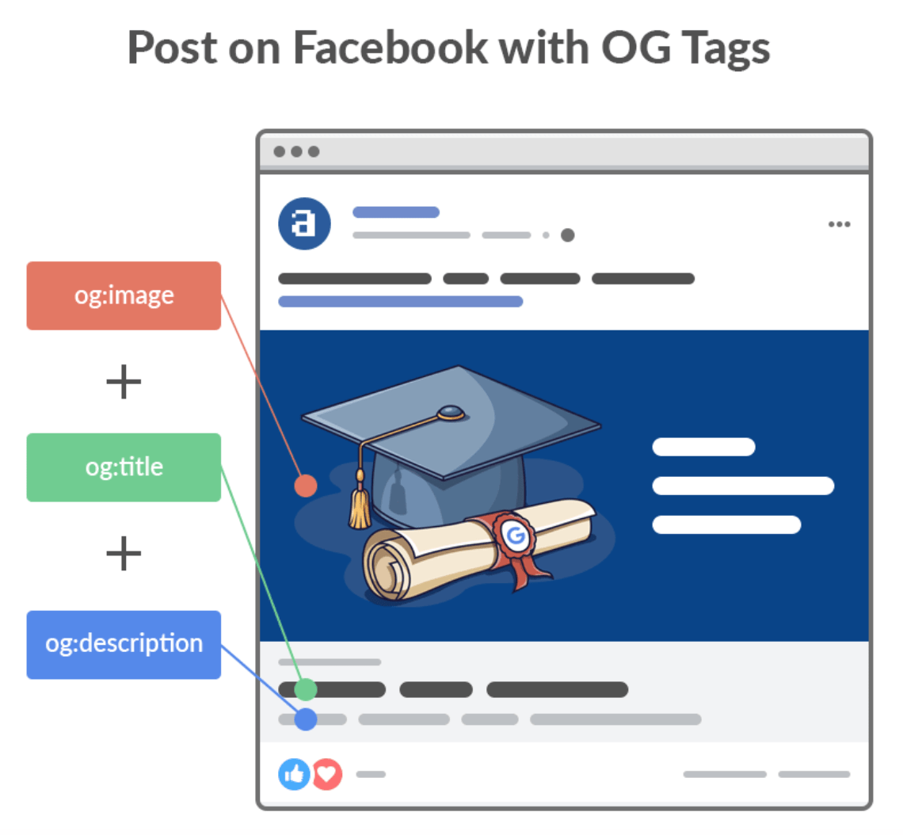

网络从2000年到今天这20年间飞速的发展起来，能在网络上获取到的内容也越来越丰富，我是99年有了自己第一台个从电脑，那时候是一台有着“大屁股”显示器的TCL台式机，那时候网络上还没有像现在这么多类型的资源，多数都是上上BBS论坛，发个贴，浏览浏览让人心情“愉悦”的图片，视频都很少见，因为那时候还ADSL拨号，下载的速度就50kb左右，回到今天的话题`OG标签`，OG标签的出现其实和`JSON-LD`有着相同的SEO意义，都是为了将网络上的内容，进行结构化，富媒体化，方便第三方调用显示。

## 什么是OG标签

OG全称是Open Graph Protocol，中文是**开放内容协议**，也称为OG标签，最开始的时候是被一些社交软件广泛使用，Fackbook、renren、微博等，现在搜索引擎和一些第三方服务也支持了OG标签，比如IMD影评网站。

我的博客也是有OG标签的，只不过是使用了Yoast SEO插件来实现的，这是《 Linux入门：grep命令基础使用》这篇文章`head`内的`OG标签`代码：

<meta property="og:locale" content="zh\_CN" />
<meta property="og:type" content="article" />
<meta property="og:title" content="Linux入门：grep命令基础使用 - 我" />
<meta property="og:description" content="我们在使用Linux的时候，要查找一些特定的内容，最经常使用的命令就是grep，它是Global Regula \[&hellip;\]" />
<meta property="og:url" content="https://www.helloyu.top/linux-grep-command.html" />
<meta property="og:site\_name" content="我" />
<meta property="article:published\_time" content="2021-04-20T12:22:00+00:00" />
<meta property="article:modified\_time" content="2021-04-05T04:08:12+00:00" />
<meta property="og:image" content="https://www.helloyu.top/wp-content/uploads/2021/04/grep-commands-in-linux.png" />
<meta property="og:image:width" content="800" />
<meta property="og:image:height" content="400" />

## OG标签知识

使用OG标签是为了之后进行社会化分享作的准备，我虽然现在还没有开社交分享功能，但是日后可能会开，WordPress很方便，但是如果是自己单独开发的网站，就要提前把功能加进去，有的社交平台也会通过分享的链接地址自动提取里面的OG标签，生成结构化数据，我们来熟悉下OG标签：

// 普通类
og:locale //网站语言
og:type //类型 (常用值:website；article；book；movie)
og:title //标题
og:description //页面的简单描述
og:url //当前内容链接
og:video //视频
og:audio //音频
og:photo //图片
og:product //产品
og:image //缩略图
og:link //链接
og:site\_name //页面所在网站名
og:audiosrc //音频地址
rr:appid //如果您的网站是 CONNECT 到 renren.com 的，请提供该 ID
og:videosrc //视频资源链接，例如可是播放视频的 flash 地址
og:width //视频、图片的宽度
og:height //视频、图片的高度
og:artist //音乐家
og:contentid //内容主体的 ID，用来标识当前页面主要内容所处的 HTML 标签的 ID
og:price //产品价格
og:nick //店铺名
og:postfee //运费
 
// 小说类
og:novel:category // 小说目录
og:novel:author // 小说作者 
og:novel:book\_name // 小说书名
og:novel:read\_url  // 小说阅读地址
og:novel:status    // 小说状态
og:novel:update\_time   // 小说更新时间
og:novel:latest\_chapter\_name // 小说最新章节
og:novel:latest\_chapter\_url  // 小说最新章节地址
 
// 其他
首页一般设置 og:type 为： website
文章页一般设置 og:type 为：articleh

上面是比较常用的，不同的内容类型，使用不同的标签。使用这些标签以后，如果把文章分享到Facebook，就会像下面这张图一样展示你的内容：

OG标签现在的使用越来越广泛，不再只局限于社交平台，作为站长，知道怎么使用这个标签对搜索引擎优化也是很有用处的，给你的网站添加OG标签就是一项基础的SEO工作，这也是作为SEO从业者需要去做的事。
