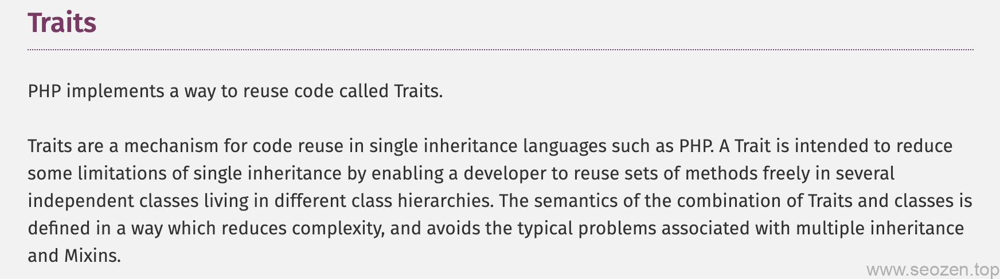

作为一名程序猿出身，我在写代码的时候始终把DRY（Do Not Repeat Yourselft)放在心上，因为曾经走过的坑太多了，代码复用性差，有时候不是客户要改需求，而是产品经理在没有和客户沟通的情况下，不断的在改需求，客户一用不行，又得重新改，遇到这样的产品经理真的是很坑，但是你也没办法，寄人篱下只能让自己提高效率，去适应环境，我是很少有加班，也可能和工作的公司有关系，原来做的不是外包型的公司，而是做自己的产品，害，又闲聊了这么多，回到今天的正题，PHP在5.4版本中加入了Traits特性，让PHP能够在开发复杂系统的时候能更好的复用代码，主要也是为了解决PHP单继承的问题，今天就简单介绍下PHP的Traits特性。

## 什么是Traits ？

Traits其实和`Abstract`和`Interface`很类似，但是Traits不需要`Implement`和`extends`，就像使用包一样在需要的地方`use`一下就可以，下面是PHP官方对Traits的定义：



上面这段话的意思就是Traits的出现就是为了更好的`code reuse`代码复用，还有就是多继承和Mixins会有一些问题，所以PHP才使用Traits来解决类之间的代码利用。

## Traits实现单例模式

就拿设计模式里面的**单例模式**来说，如果我们使用普通的方法，需要在每一个Class里面去实现类自身的单例实现，然后我们使用Traits特性就很方便，如下：
```
<?php
trait Singleton
{
    private static $instance;

    public static function getInstance() {
        if (!(self::$instance instanceof self)) {
            self::$instance = new self;
        }
        return self::$instance;
    }
}

class DbReader extends ArrayObject
{
    use Singleton;
}

class  FileReader
{
    use Singleton;
}
```
上面代码中的Singleton代码中有一个`getInstance`的静态方法，其中`self`指的是当前类，如果没有实例`$instance`就`new self`一个，下面再看看使用的代码：
```
<?php
$a = DbReader::getInstance();
$b = FileReader::getInstance();
var\_dump($a);  //object(DbReader)
var\_dump($b);  //object(FileReader)
```
这样使用Traits是不是就提高了代码的可读性和复用性，PHP是在编译阶段把Traits代码片段插入到Class中来。

## 多个Traits的使用

就像Interface一样，我们可以使用多个Traits，这样可以把复用的代码放到多个PHP文件中，只要使用多个use去使用Traits或者使用`,`分割，如下：
```
<?php
trait Hello
{
    function sayHello() {
        echo "Hello";
    }
}

trait World
{
    function sayWorld() {
        echo "World";
    }
}

class MyWorld
{
    use Hello, World;
}

$world = new MyWorld();
echo $world->sayHello() . " " . $world->sayWorld(); //Hello World

## Traits组合

Traits特性也支持在Traits中使用Traits，可以像下面一样使用Traits进行组合：

<?php
trait HelloWorld
{
    use Hello, World;
}

class MyWorld
{
    use HelloWorld;
}

$world = new MyWorld();
echo $world->sayHello() . " " . $world->sayWorld(); //Hello World
```
最后要分享的是PHP中对同名方法的执行顺序，首先执行**本类下的方法**\->**Traits中的方法**\->**父类中的方法。**
