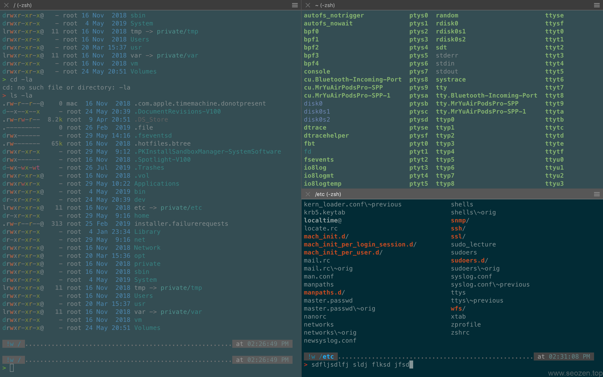
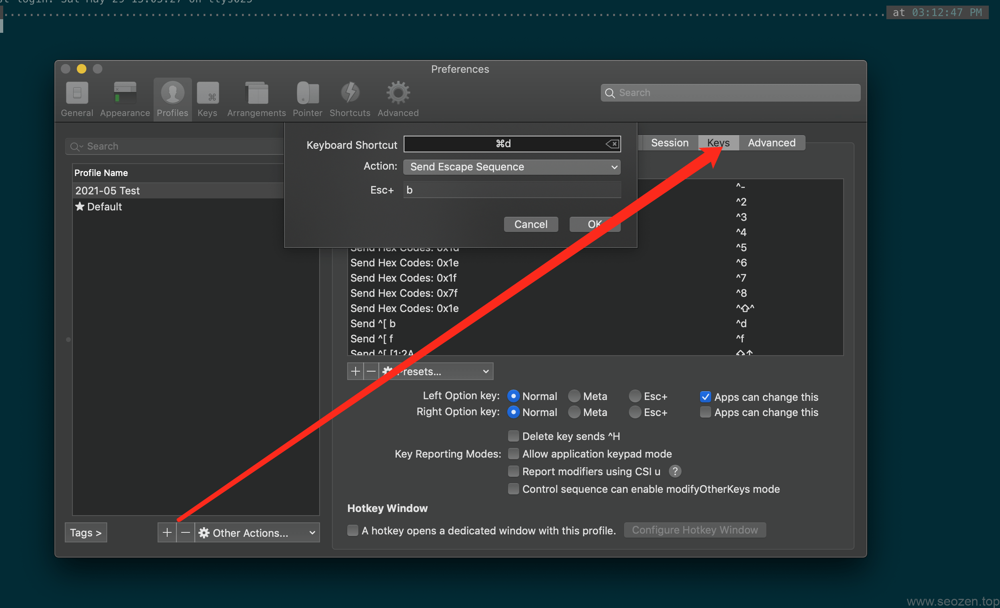

从MacOS默认的Terminal终端，切换到[iterm2](https://iterm2.com/)下已经有一段时间了，分享一些SEO禅在使用iterm2的经验心得，下面是当前使用的iterm2的样式界面：

试用了好多款`oh-my-zsh主题`，就发现这款还不错，简洁明了：

ZSH\_THEME="powerlevel10k/powerlevel10k"

不懂怎么配置?没关系，收藏SEO禅的网站，过一段时间再来看看就会有《教你如何玩转iterm2：zsh和oh-my-zsh》这篇文章，你可以按照里面的步骤去一步一步完成iterm的安装到oh-my-zsh的配置，最后也可以拥有强大和舒适的终端shell，保证你慢慢会喜欢上使用shell command的快感。

## 常用快捷键

⌘: command ⇧: shift ⌥: alt ^: control

记住MacOS上这四个常用的快捷键意思，SEO禅经常看着符号有时候想不起来，下面的快捷键会使用到这些符号，以下是使用默认的`Profile`进行的测试，有些快捷键可能和你现在装的有点区别，如果效果不一样看看是不是当前的配置问题。

## Tabs

- ⌘+T，创建新的tab
- ⌘+⇧+\[，回到上一个tab
- ⌘+⇧+\]，回到下一个tab
- ⌘+数字，跳转到对应顺序的tab

## Panes

- ⌘+D, 垂直分屏，分出一个竖向的面板，相分几个分几个
- ⌘+⇧+D, 横向分屏，分出一个横向的面板，随意分
- ⌘+⌥+方向键, 切换分屏焦点
- ⌘+^+方向键, 调整当前分屏大小

Iterm2是支持多面板在同一个窗口里面，这功能其实很方便进行多文件协作。

## Profiles

在终端输入命令最头疼的事就是要回退去修改一个命令，以前都是使用回退方向键一直按着，在iterm2下你可以设置快捷键，可以以一个`word`方式去回退，按下快捷键`⌘+O`调出`profiles配置面板`，点击右下角的`edit profiles`按钮，可以看到如下图界面：

你可以自己新建一个profile，也可以改默认的，之后选择`Keys`菜单，再点下面的`+`号，Action选择\`Send Escape Sequence，`Esc + b`表示光标回退一个单词，`Esc + f`表示光标前进一个单词，上面的shortcut自己设置，SEO禅使用的是`⌘+d`和`⌘+f`。

Iterm2还有很多很方便的操作，这篇文章就分享到这。
