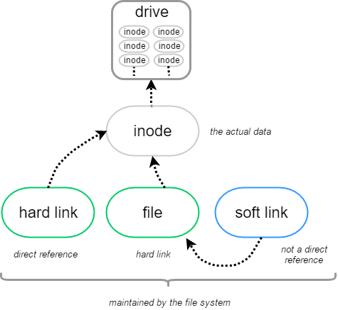

在用Windows系统的时候，大家肯定会经常使用快捷方式去链接一些秘密文件，这些文件一般都藏在很深很深的目录里面，有时候自己都忘记在哪，但是在夜深人静的时候，就会悄悄点开这些文件，欣赏这世间的美好，哈哈，扯远了，SEO禅是正经人，话说回来在Linux系统下，也是有这样的功能，他们被分为：硬（hard）链接和 符号（symbolic）链接，符号链接我们也经常称为软链接，下面看一张图区分下硬链接和符号软件的区别在哪：

我们可以看到不管是`hard link` 和`soft link`都不是直接链接到真正的数据上的，这中间有一个`inode节点`。

## 什么是inode？

用简单的语言去解释，inode就是一个登录表，上面记录着真正的文件数据在硬盘上的位置，和这些数据的各种信息，比如文件权限信息，文件创建者，大小等信息，这些都是文件的**元(meta)信息**。

## 硬链接和软链接的区别？

从上图我们可以看出来最直观的区别，就是**hard link**是直接指向`inode`节点的，而`soft link`不是，其实soft link就像是windows的快捷方式，而hard link相当于文件副本，下面用代码作个测试就知道他们之间的区别：

\[seozen@Linux\]$ touch f1          #创建一个测试文件f1
\[seozen@Linux\]$ ln f1 f2          #创建f1的一个硬连接文件f2
\[seozen@Linux\]$ ln -s f1 f3       #创建f1的一个符号连接文件f3
\[seozen@Linux\]$ ls -li            # -i参数显示文件的inode节点信息
total 0
9797532 -rw-r--r-- 2 seozen seo 0 May 06 08:11 f1
9797532 -rw-r--r-- 2 seozen seo 0 May 06 08:11 f2
9797598 lrwxrwxrwx  1 seozen seo 2 May 06 08:11 f3 -> f1

可以看到f1和f2有相同的**inode号**，而软链接f3的inode号就不一样了，这里记住硬链接只能链接同一个硬盘下的内容，而且只能是文件，使用软链接就没有这些限制，他们还有一些特性的区别，用代码解释下：

\[seozen@Linux\]$ echo "SEO禅 hello world" >>f1
\[seozen@Linux\]$ cat f1
SEO禅 hello world
\[seozen@Linux\]$ cat f2
SEO禅 hello world
\[seozen@Linux\]$ cat f3
SEO禅 hello world
\[seozen@Linux\]$ rm -f f1
\[seozen@Linux\]$ cat f2
SEO禅 hello world
\[seozen@Linux\]$ cat f3
cat: f3: No such file or directory

向原文件`f1`写入内容从其它文件打开都是一样的，如果把f1删除，对于f2没有影响，但是f3就成了死链接，如果删除f2那这个文件才算真正删除，如果删除f3，对f1和f2都没有影响。
