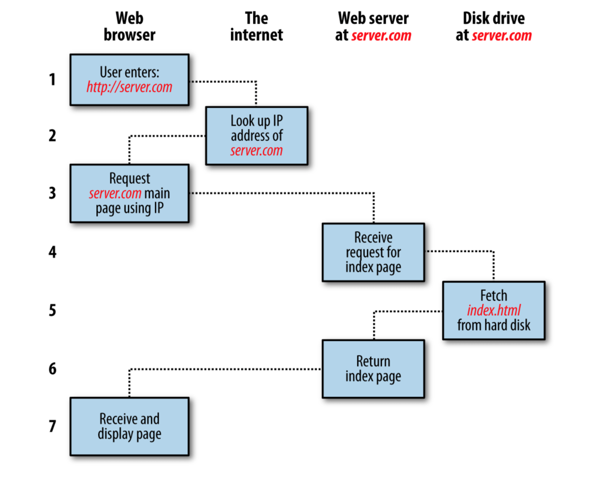

SEO的从业门槛在SEO禅认为，相对其它技术类的职位要低的多，可以说没有什么门槛，但是这不代表SEO很简单，SEO需要学的东西非常的多，有些东西很细，有些东西没有技术背景理解起来就要吃力的多，比如`JSON-LD标签`要是没有前端知识，就很难去实现，所以对于**SEO新手**，储备一定的软件知识是非常有利的，对未来的职业发展也是有好处，这篇文章就简单的介绍一下，网站从无到有的过程，其中涉及到的技术。

## 一个网站的诞生

一个网站刚开始创建的时候，需要先注册一个域名，一个服务器，之后设置域名指向服务器的IP地址，如果是在国内的服务器，还需要备案，再把网站程序，如[WordPress部署](https://www.seozen.top/wordpress-apache-setup-2021.html)到服务器上，这样输入域名就可以访问自己的网站。

## 服务器到浏览器

当用户在浏览器上输入域名回车后，浏览器就会将域名通过DNS服务转换成IP地址，之后拿着这个地址去请求网站所需要的文件，比如`html`，`JS`，`CSS`等资源，服务器收到浏览器的请求，如果是正常的请求，就会返回相应的资源文件，浏览器收到这些资源文件，就会将他们整合组装在一起，成为一个完整的网页界面，这就是用户输入域名到看到一个完整网页的过程，往往就是2，3秒的时间，但是就是这么短的时间内，浏览器和服务器共同为我们做了很多事。



其中上面提到的三种资源是网站中最重要的资源：

- html - 网站有什么内容
- JS - 网站有什么行为
- CSS - 网站长什么样子

## 结构化数据

SEO中的SE是Search Engine的缩写，[搜索引擎](https://www.seozen.top/search-engine.html)的前身是目录索引，当时只能把一些网站归类，像雅虎在早期的时候还是用人工手动编辑搜索关键词，那效率和今天比真的是大海里面一滴水的感觉，即使今天搜索引擎如此强大，但是他们想理解人类的语言还是有一定困难的，比如一篇文章，是介绍一部电影，搜索引擎是怎么从这么多文字里面知道这篇文章是介绍哪部电影？导演是谁？演员有谁？这就要说到[Schema标签](https://schema.org/)，这个标签的作用就是让网站数据结构化，搜索引擎能够更好的理解网站的数据内容，在网站`head`代码里面，经常能看到如下代码：
```
<script type="application/ld+json" class="rank-math-schema">内容</script>
```
这是谷歌的[JSON-LD标签](https://en.wikipedia.org/wiki/JSON-LD)，只要是WordPress的网站，安装SEO插件，一般都有自带生成这种标签。

## Canonical标签

前面说了Schema标签是为了帮助搜索引擎更好的理解文章内容，在SEO优化中还有一个很重要的标签，那就是Canonical标签，他能告诉搜索引擎，[如何区分同一个页面不同URL](https://www.seozen.top/seo-canonical.html)，哪个才是主要的URL，举个例子，比如说商城产品，有时候是同一个产品，不同的参数，只是URL地址后面改变了一点参数，网页是基本不变的，太多这样的网页，搜索引擎有可能会认为网站内容重复，质量低下，这时候我们就要指定一个URL作为主要的URL，让搜索引擎屏蔽相似的URL就可以。

这些都是**SEO技术**层面的内容，当然要说的远远不止这些，只是篇幅有限，写太多也不会认真看，通过这篇文章希望SEO新人能有一些技术优化的意识，做SEO优化不止是发发文章，发发外链这么简单的事，在平时的工作中也要注意提升自己技术方面的修养，再把这些技术用到实践中，不断的检验提高。
