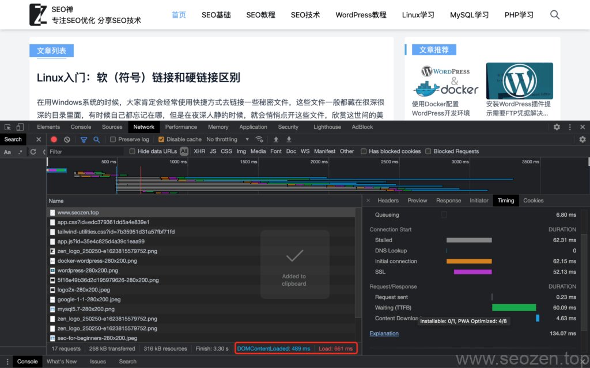
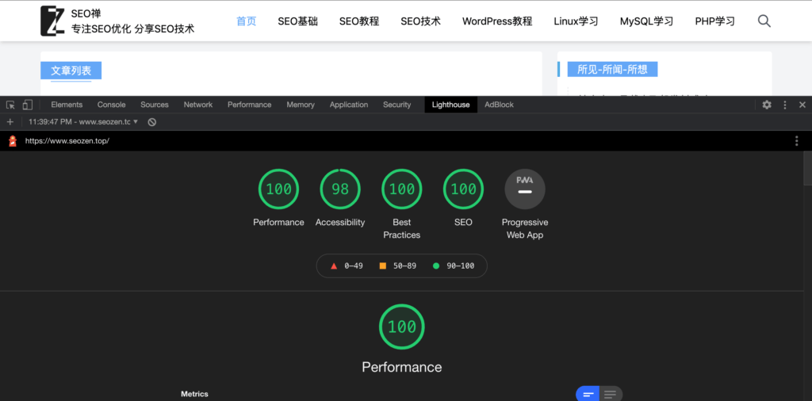
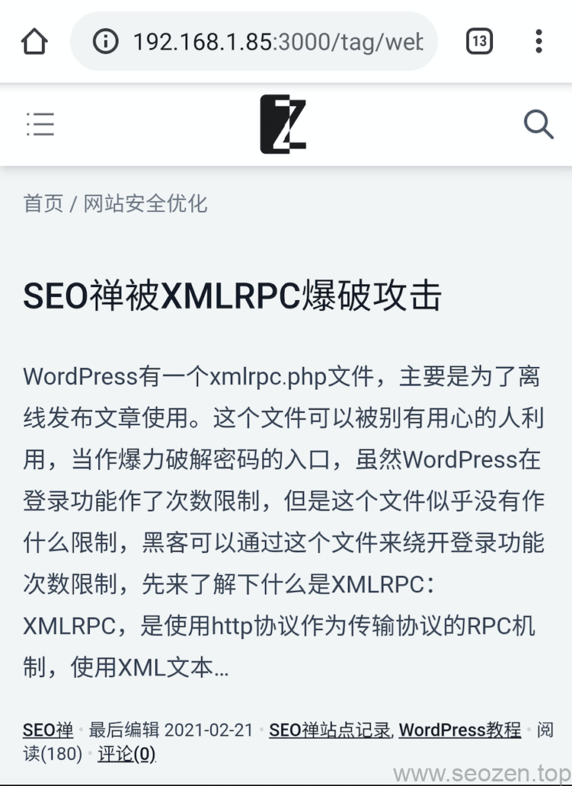
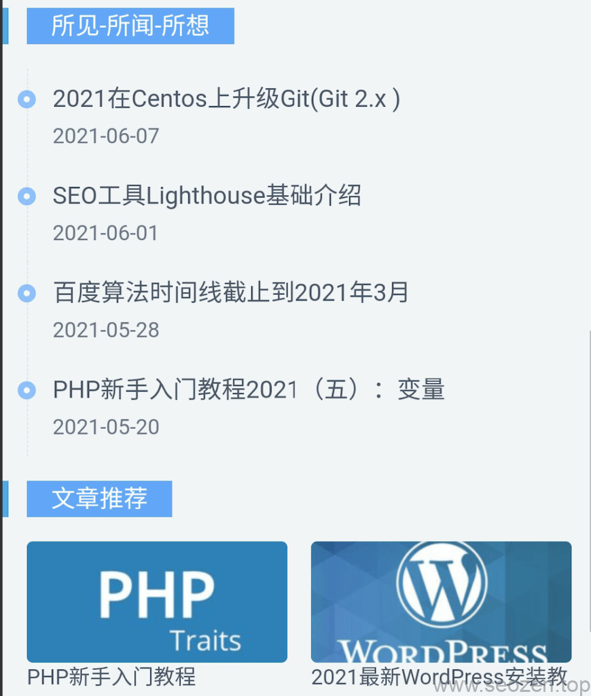
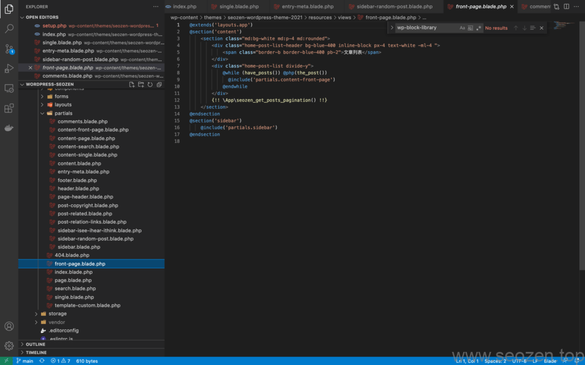
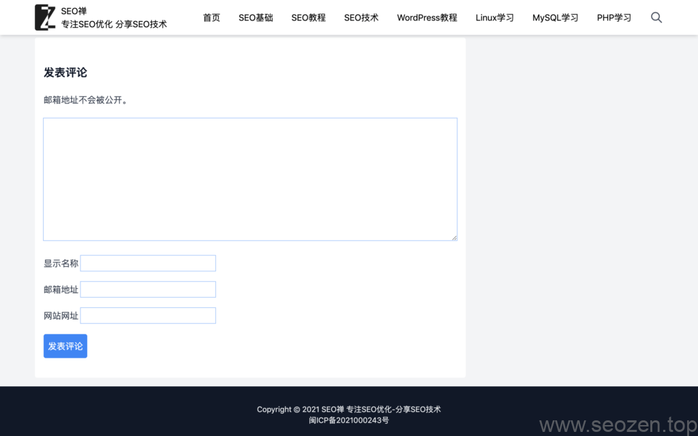

[我第一版本V1.0](https://www.helloyu.top/我记录-1.html)，上线已经有半年的时间，写了将近70篇的文章，也慢慢有人浏览了，这两天在V1.0的基础上，重构我站点，最大的改动就是用了新的技术，我V2.0使用**Laravel Blade**模板引擎，让代码更简洁，网站速度更快，现在基本是500-1000ms的打开速度，这对于1M宽带1GB内存的主机来说，在我技术范围内应该算是极限了，下面先看看新版V2.0PC端的载入速度：

seo禅 Chrome Dev Tool 载入测试

如果想把SEO做好网站速度是非常重要的一个指标，3秒之内是必须的，图片能使用`Lazy load`就使用懒加载，再看看[Lighthouse测试工具](https://www.helloyu.top/google-lighthouse-seo-tool.html)的得分：

SEO新版Lighthouse测试得分

手机端的样式和PC端这次设置了不同的样式，无白色背景，让阅读视角更大，还加了一个**所见-所闻-所想**模块，这个侧边栏模块是记录我日常生活，不一定是和**SEO优化**有关的内容，下面看看Mobile端样式：

我Mobile端界面

我手机端界面

这次也把多余的插件给清理掉，保留了最基础的几款插件，为了就是提升网站载入速度，以后文章多了之后就会加入专题模块。这次新版最大的改变就是在代码方面，使用了**Blade模板引擎**，**Laravel Mix自动化构建工具**：

我Laravel整合Mix Blade开发

再也没有满屏的`<?php ?>`代码了，在速度方面也做了一定的提升，用[SEO Lighthouse](https://www.helloyu.top/google-lighthouse-seo-tool.html)的跑分测试也将近满分，评论一直想开，终于在这次更新做了简单的模板，虽然还是不好看，但是勉强先用：

我评论框

各位朋友可以想说什么都可以留言，我看到了就会回复，我技术也有限，也会出错，要是看到哪里写的不对的，欢迎指正，接下去要写一个Android的项目，有机会就把安卓开发的资料整理整理做成一个专题给有需要的朋友参考。
