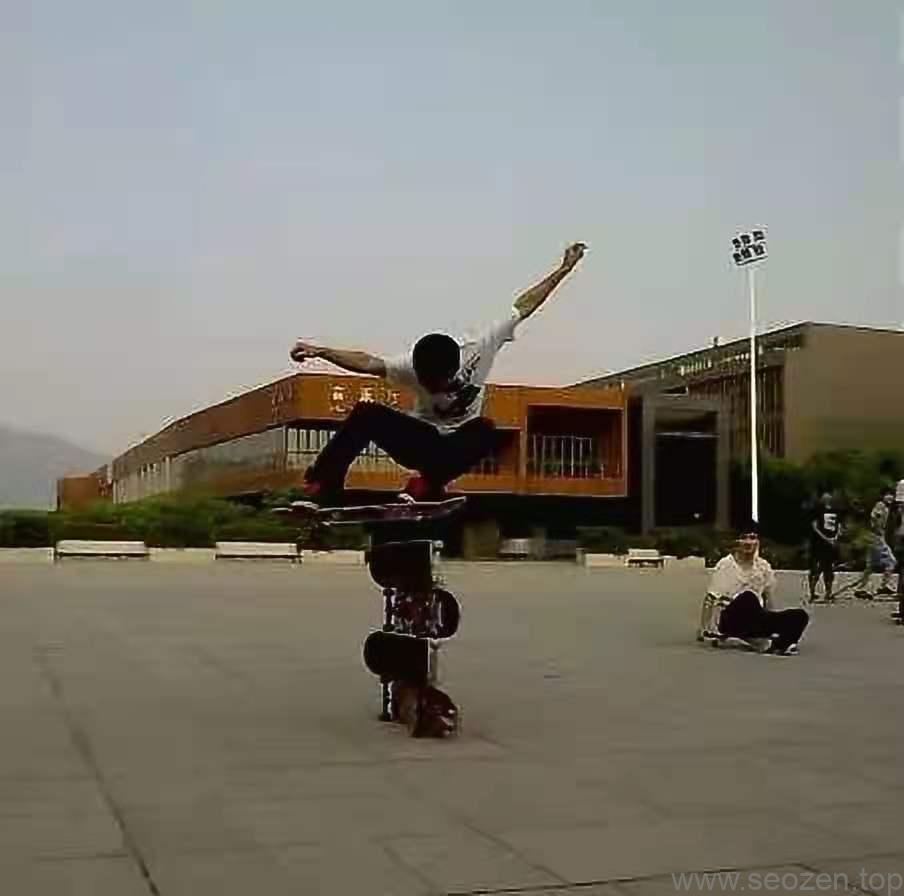
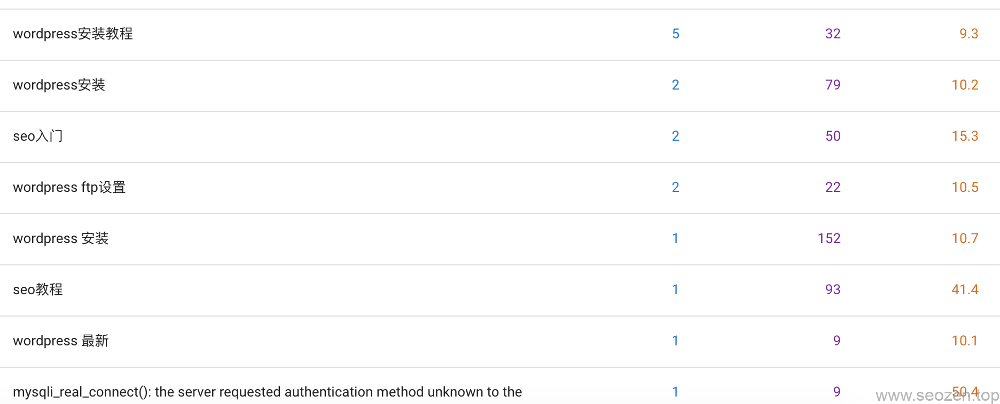
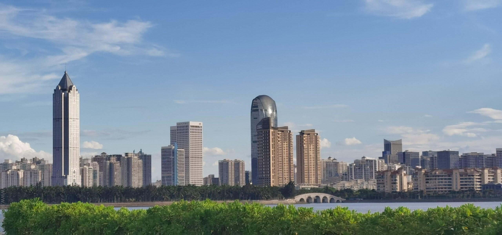

从2021年1月12发表的第一篇文章[SEO入门一篇就够-SEO教程](https://www.seozen.top/seo-course-first-step.html)，已经五个月的时间过去，在这五个月里，SEO禅从自己的家乡骑自行车来到海南，准备以自由职业人的身份长期生活在万宁，学习冲浪，这是人生新的开始，是一种新的生活方式，前方充满挑战和困难。

记得我做这个决定的时候，一晚没有睡，第二天在客厅开始高兴的跳起舞来，SEO禅是一名程序员，SEO优化是个人爱好，现在开始成为一名自由职业者，从事软件开发和SEO服务，因为写代码，发现问题解决问题能让我有成就感，在完成工作之余，SEO禅会拿起相机到处走走，也会玩玩滑板，从初中开始就玩起了滑板。

这是大学时候拍的，现在会来到万宁学习冲浪，也是因为那时候就种下了“放纵不羁爱自由”的种子吧，既然决定了下一段人生要这么渡过，那就努力的去实现。

对于计算机，他很早就进入了我的生活，过去他也给过我很多机会，我没有好好把握，接下来的日子，会脚踏实地的去做好当下的事，保持终生学习的习惯，

## SEO禅站点排名情况

时间过的飞快，SEO禅这个网站是我在广州花了2天弄的一个WordPress主题，样式和功能都非常的简单，一下就5个月过去了，谷歌后台的数据表明已经有自然流量在进来，谷歌对SEO禅还是挺照顾的，给的排名还不错：

百度的话因为一些原因没有多少收录，这也正常，毕竟SEO类的网站太多，百度也被黑帽SEO搞的鸡犬不宁的，我就先认真把内功修炼好，后面有时间了再去调教百度，为什么要改版，我想有两个主要原因：一个是有你们在看我写的文章，我分享的生活，另一个原因，是自己觉得是时候要改版，要明确SEO禅这个网站的使命，我的个人网站不止这一个，以前都因为一些原因中途停掉了，经过一段时间的思考，明确了这个网站未来的方向。

## SEO禅未来方向

SEO禅这个网站，未来会记录我的成长，主要分享SEO优化，网络营销方面的内容（包括天猫运营），其它包括：APP小程序开发，WordPress开发，网站开发等；也会有专门的地方分享个人的**所见\*所闻\*所想。**

## 为什么不做自媒体？

有朋友问：你摄影不错，手机自媒体平台那么多，为什么不去运营个自媒体平台？

SEO禅：**知识的分享还是文字最高效**

现在保持一天至少写一篇文章的节奏，强迫自己去提高自己写作的能力，也是为了更好的去分享自己所学到的知识，SEO禅所有的文章都为原创，如果有引用一般都会标注在文章底部。

## SEO禅新版

新的网站版本还是基于WordPress搭建，主题也是自己开发的，因为手头上还有3个项目同时进行，尽量在一个月内把新版本的原型完成并上线测试，新的SEO禅站点有以下模块：

### SEO基础

分享一些SEO入门的基础内容，一些SEO新手需要知道的基础知识，SEO作为一项综合技能，需要很广的知识面去支撑，我把SEO定义为：**SEO技术+营销思维**，他们相辅相成，缺一不可。

### SEO优化

分享一些特定领域的优化方法，比如百度SEO优化，谷歌SEO优化，今日头条SEO优化之类，有明确的优化场景，提供优化的思路和方案。

### SEO教程

分享关于SEO优化从新手入门再到高手进阶一系列的内容，SEO禅在99年的时候拥有人生第一台PC机，那时候还是“大屁股”显示器的时代，玩的也是红警，帝国时代的年纪，接触电脑有非常长的时间，但是真正开始研究和从事这方面的内容并不算太长，在SEO方面算不上高手，但是个人认为也在中上水平，分享这些内容，只是希望你们别像自己再走太多弯路。

### SEO技术

分享SEO技术性方面的内容，一些SEO工具的使用，比如[Developer Tools在SEO中的运用](https://www.seozen.top/developer-tools-network-seo.html)，SEOer如果是技术出身，那他其实是有一点优势的，可以很高效的去完成**SEO网站优化调整**，可以自己去改动网站代码达到优化目的。

### WordPress建站

分享WordPress主题，插件开发，WordPress SEO优化等内容，WordPress是世界上最受欢迎的建站程序，没有之一，市场占有率达到了恐怖的41.7%(根据[W3Techs](https://w3techs.com/technologies/details/cm-wordpress)最新统计数据)，虽然这几年网站这种媒介被新媒体抢占了很多市场，但是作为企业用户来说，拥有自己的门户网站的需求是不可能变化太多，毕竟手机的屏幕太小，**表现力**是不可能和大屏的电脑比的。

### SEO问答(陆续上线)

这个板块想做一个像知乎一样的开放式话题问答，如果各位朋友有什么想问，想知道的内容都可以在这个模块去发言。

### SEO案例(陆续上线)

分享SEO禅自己实践的优化案例，从接到这个项目开始说起，也有会分享一些SEO行业的典型案例，让各位有实际案例可以参考学习。

### SEO工具(陆续上线)

这个板块会提供一些自己写的免费SEO工具，让有需要的朋友使用，帮助一起测试，如果有其他需求可以和SEO禅分享，要是有能力就会尽可能去实现。

### SEO服务

这个模块是SEO禅个人宣传模块，如果你或者公司负责人看了SEO禅的文章，希望能有更深入的合作，帮你解决你现在遇到的问题，可以到这个模块找到具体的合作信息。

前几天去海口拍的二张照片，给下面这张取了个名：“明日世界”，代表着希望。

\[caption id="attachment\_582" align="aligncenter" width="2560"\] seozen-future\[/caption\]

