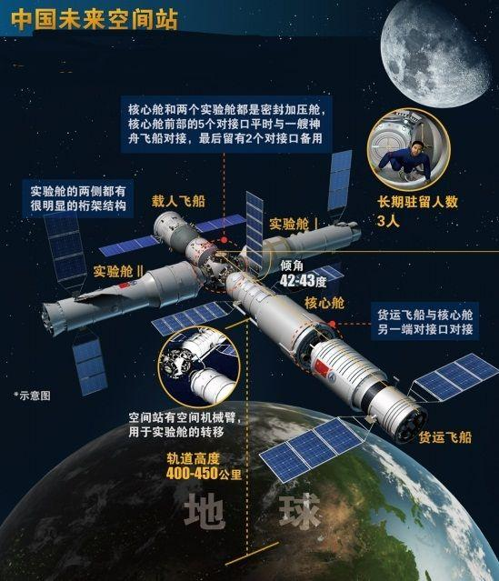

今天最大的新闻应该就是**神舟十二号载人飞船发射任务圆满成功**了，早上8点就打开直播间在等待发射的那一刻，当倒数指令被一字一字的读出，心里也更加紧张起来，虽然知道我们国家的航天发射任务成功率很高，但是也不免担心，火箭升空的一瞬间，让我感受到航天工作者的敬业，火箭尾部的蓝色火焰和马赫环，火箭上的零件和设备如果出错，那可能直接影响到这次发射任务，还好火箭升空之后一切顺利，我们马上就要有自己的**天宫空间站**，原来西方发达国家各种嫌弃，我们中国人都啪啪啪的打了他们脸，我们每个人努力做好自己岗位上的事，相信中华复兴的愿望很快就可以实现，记得在高中，因为自己认知的局限，容易被西方的信息洗脑，那时候一点都不爱国，随着年纪的增长，接触的信息多了，看的也多了，慢慢的发现西方国家的所谓民主，自由，都是假的，如今的中国已经不再是鸦片战争时候的中国，中国这头雄狮已经醒来，我们的使命是星辰大海！

中国天宫空间站
