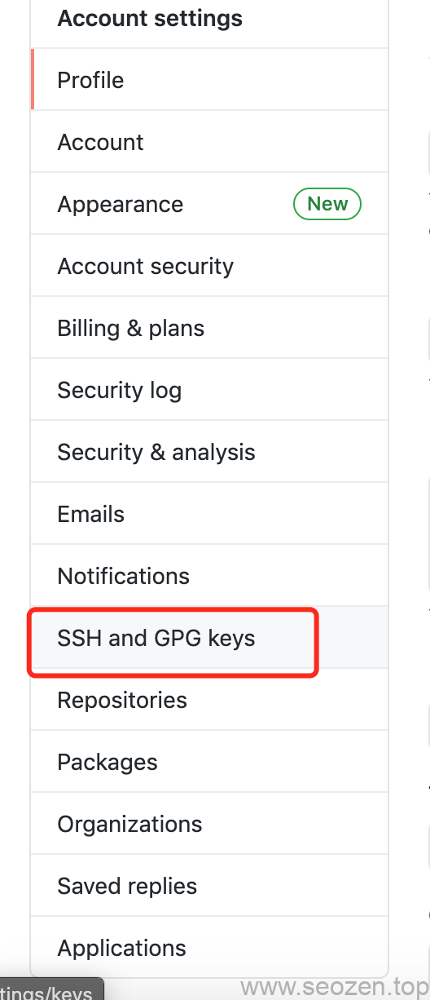

因为现在`github`开放了**私有仓库**，用来部署和同步网站是非常方便的，只要`push`到私有仓库，然后在Linux服务器上`pull`一下就行，有时候在服务器上还会直接改动一些配置，也只需要`push`到私有仓库，最麻烦的就是每次运行`git命令`需要输入登录信息，我作为一名`DRY(don't repeat yourself!)`的拥护者，肯定对这种事不能忍，那我们就配置一个默认的登录信息，这样就不用每次输入密码，这篇文章说的是SSH方式连接GITHUB，使用`https`方式可以去网上找下。

## 检测密钥信息

首先我们要看下有没有已经生成好的密钥对信息，如果已经有了就直接用，没有的话重新生成一个，运行如下指令：
```bash
ls -al ~/.ssh
```
如果有密钥信息的话，默认的密钥文件应该是下面这些：

- _id\_rsa.pub_
- _id\_ecdsa.pub_
- _id\_ed25519.pub_

## 生成新密钥对信息

如果没有公钥和私钥文件，那我们就生成新的密钥文件，运行如下命令：

ssh-keygen -t ed25519 -C "your\_email@example.com"

把后面的邮箱地址改换成github上的登录邮箱地址就可以。

提示“Enter a file in which to save the key（输入要保存密钥的文件）”时，按 Enter 键。

提示时输入安全密码，按回车再输入一次确认密码，这个密码要记住，后面需要用到，不用密码也可以直接回车就行。

## 使用密钥文件

首先我们要把密钥添加到后台的`ssh-agent`代理，让他帮我们在需要的时候完成授权任务，运行如下命令：
```
eval "$(ssh-agent -s)"
```
接下来我们需要把私钥加到`ssh-agent代理`里，运行如下命令：
```
ssh-add ~/.ssh/id\_ed25519
```
## SSH公钥加入Github账号

最后一步，我们需要把公钥信息加入到Github的SSH管理中，使用如入命令查看ssh公钥信息：
```
cat ~/.ssh/id\_ed25519.pub
```
复制公钥信息后，在github点击自己头像，如下图所示，再点击`settings`:


之后在左边点击`SSH and GPG Keys`



之后在右边面板会看到一个`New ssh key`的按钮，把刚才复制的公钥信息添加进行就可以了，随后我们在服务器上测试下有没有授权成功，运行如下命令：
```
ssh -T git@github.com
```
之后会有提示信息，如果没有成功自己到[github](https://docs.github.com/en/github/authenticating-to-github/connecting-to-github-with-ssh/testing-your-ssh-connection)找找帮助信息。

注意：这里的`git remote add origin`要使用SSH的地址!
