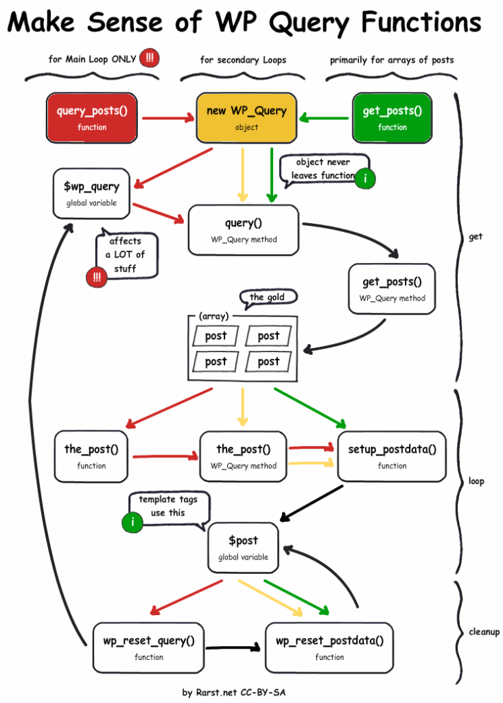

在进行WordPress开发的时候，我们经常要去自定义一些参数，比如说把一些文章排除，今天我就来分享下，如何自定义主循环**Main** **Query**，我们在刚开始开发WordPress，所有的主题模板一定会有下面这段代码：

```
if ( have_posts() ) {
    while ( have_posts() ) {
 
        the_post(); ?>
 
        <h2><?php the_title(); ?></h2>
 
        <?php the_content(); ?>
 
    <?php }
}
```

## WP\_Query对象

这是WordPress默认的**主循环查询**，在访问网站的时候，WordPress程序会根据一些默认的参数设置，查询出一些内容，之后把这些数据装载到全局变量`$wp_query`中，[wp\_query对象](https://developer.wordpress.org/reference/classes/wp_query/)是在WordPress开发中最重要的一个研究对象，比如我们看看`the_post()`这个全局函数的源代码：

```
function the_post() {
    global $wp_query;
    $wp_query->the_post();
}
```

其实这个函数内部也是直接调用了`$wp_query`对象中的`the_post`方法，所有我们使用的`the_content`这些函数也只是一些语法糖，方便我们调用而已，真正做事的还是`WP_Query`，看看下面这张图：



WP\_Query对象解析

## pre\_get\_posts自定义

上面讲了这么多，还没说到如何实际去自定义这个主循环，自定义的方法肯定不止一种，这里只介绍我认为最合理的一种，那就是[pre\_get\_posts hook](https://developer.wordpress.org/reference/hooks/pre_get_posts/)，这个过滤钩子是在执行实际查询前生效，把查询条件自定义后返回，再继续进行实际的查询，下面就拿我博客举例，在[我V2.0版本](https://www.helloyu.top/seozen-website-new-version-2021.html)中，有一个**所见所闻所想**模块，这个模块的内容是平时我个人的所见所闻所想，但是这块内容也会出现在主循环上，主循环只想有和**SEO优化**有关的内容，所以就要想办法把他们去除掉，看下面的代码：

```
// 从主查询中移除所见所闻所想文章
function remove_isee_ihear_ithink_posts_from_main_query($query)
{
    if ( $query->is_front_page() && $query->is_main_query()) {
        $query->set('tax_query',array(
            array(
                'taxonomy' => 'category',
                'field'    => 'slug',
                'terms'    => 'isee-ihear-ithink',
                'operator' => 'NOT IN',
            ),
        ));
    }
}
add_action('pre_get_posts', __NAMESPACE__ . '\\remove_isee_ihear_ithink_posts_from_main_query');
```

`category`有直接排除的参数，但是使用的是`id`作为条件，我比较懒，不想去查id，因为`slug`别名是自己设置的肯定比较熟悉，就直接使用别名好了，但是没有现成的参数支持，那我们就使用`tax_query`组一个，具体的参数可以查看WP\_Query中的[tax\_query部分](https://developer.wordpress.org/reference/classes/wp_query/#taxonomy-parameters)，上面的`__NAMESPACE__` 是因为我使用的是Laravel来开发的WordPress，你们自己的就按平时的写法就行。这里只是简单的举个例子，自己可以去看看文档，根据自己的实际需求进行调整。
