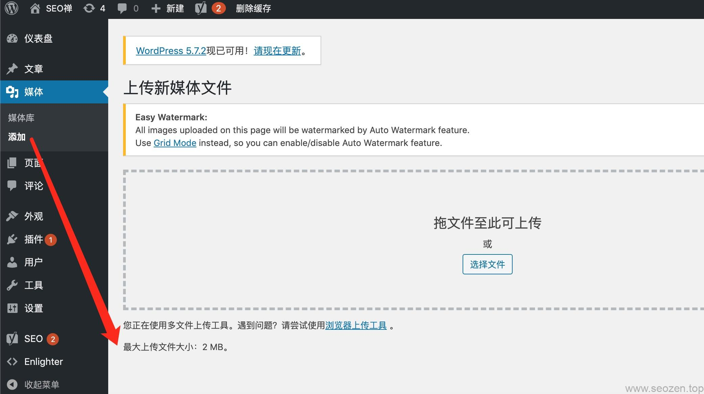

无论是开发还是使用WordPress，解除文件上传限制大小一定是必须要做的事，有些资源很容易就超过2M这个限制，比如开发的时候要上传一些测试数据包，或者是一些企业网站要上传一些大的资源下载文件，这是PHP为了安全作出的一些限制，防止上传数据资源太大，导致服务器卡死，不过我们可以适当的对这个值作一些修改，可以点击`媒体->添加`查看具体上传文件大小，一般情况是2M：

下面分享三种办法：

## 服务器根目录php.ini文件

我自己使用的是这个方法，使用PHP的配置文件`php.ini`去设置，在WordPress站点的根目录创建这个文件，然后把下面的代码拷贝到文件中，再重启下Apache应该生效了。

upload\_max\_filesize = 64M
post\_max\_size = 64M
max\_execution\_time = 300

上面的数值可以根据自己需求去改。

## 服务器根目录.htaccess文件

修改网站根目录的.htaccess文件也能达到同样效果，加如以下代码：

php\_value upload\_max\_filesize 64M
php\_value post\_max\_size 64M
php\_value max\_execution\_time 300
php\_value max\_input\_time 300

## functions.php文件

最后一种办法是修改主题的`functions.php`文件，这是最不推荐的一种，因为大部份使用的主题都是第三方开发的，如果修改这个文件，在下次更新的时候里面的代码就会被覆盖，或者更新失败，很多自定义的功能可以放到插件或者`child theme`去完成，这些内容我会在其它文章介绍，下面是加入的代码：

@ini\_set( 'upload\_max\_size' , '64M' );
@ini\_set( 'post\_max\_size', '64M');
@ini\_set( 'max\_execution\_time', '300' );
