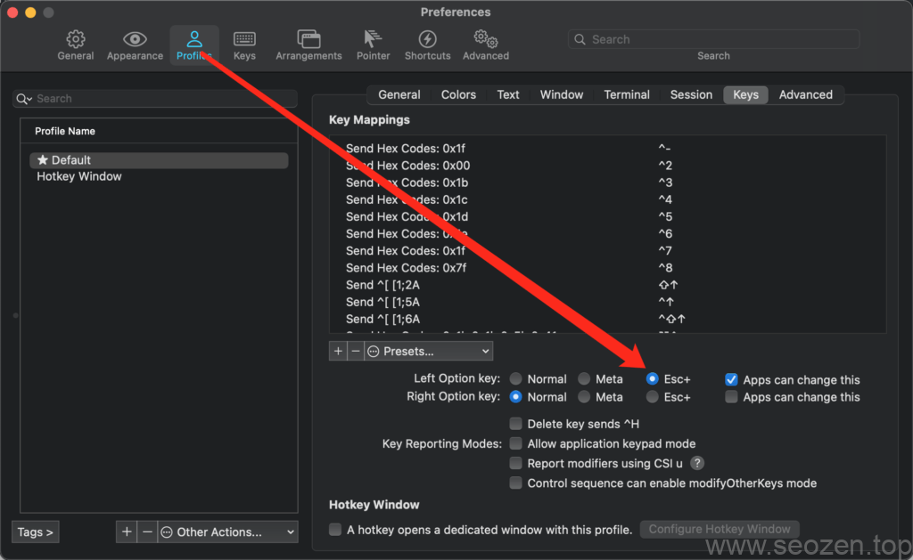

不知道大家在使用终端输入命令的时候，经常是怎么操作的，如果这个命令输入错了想删除或者重新输入的话，是不是像SEO禅最开始的时候用方向箭头一个字符一个字符的跳转，这样效率实在是太低了，其实Linux系统下就有自带的**命令行编辑快捷键**，进行**快速移动光标**，今天给大家分享在iterm2上如何使用**Bash Shell**的[Command Line Editing](https://www.gnu.org/software/bash/manual/html_node/Command-Line-Editing.html)命令行编辑快捷键，首先要打开iterm2的**Meta快捷键**支持：

iterm2配置option支持meta快捷键

## 命令行基础操作

首先SEO禅介绍几个基本的操作，这些操作在日常使用Bash的时候非常的方便，比如说**光标按单词移动**，**删除一个单词**，撤销操作等

- `Ctrl + b` - 光标向前移动一个字符，和向左方向键一样。
- `Ctrl + f` - 光标向后移动一个字符，和向右方向键一样。
- `Ctrl + d` - 删除当前字符。
- `Ctrl + -` - 撤销操作。

上面这四个是非常常用的基础操作命令，下面再介绍一些提高效率的命令。

## 快捷操作快捷键

- `Ctrl` + `a` - 将光标移动到行首的位置。
- `Ctrl` + `e` - 将光标移动到行尾的位置。
- `Meta` + `f` - 将光标向后移动一个单词，这里的meta在MacOS系统就是我们前面设置的左边的option。
- `Meta` + `b` - 将光标向前移动一个单词。
- `Ctrl` + `l` - 清空屏幕内容。

## 剪切粘贴快捷键

- `Ctrl` + `k` - 从当前光标位置剪切所有内容直到行尾的位置。
- `Meta` + `d` - 从当前光标位置剪切到一个单词的尾部位置。
- `Meta` + `Backspace` - 从当前光标位置剪切到一个单词的开始位置。
- `Ctrl` + `w` - 和上面基本差不多？SEO禅没发现有什么区别。
- `Ctrl` + `y` - 粘贴所剪切的内容。
- `Meta` + `y` 这个功能就相当于选择剪贴历史，需要在`Ctrl+y`命令后使用。
- `Meta` + `.` 这个功能相当于粘贴原来使用的命令行，类似`History`。

## 搜索历史命令行

- `Ctrl` + `r` - 按下后输入要查找的命令，再按继续往上查找.
- `Ctrl` + `j` - 使用当前搜索到得命令，结束搜索。
- `Ctrl` + `g` - 取消搜索，恢复命令行。

学习和使用上面这些**操作快捷键**，使用Shell**管理Linux系统**能提高效率，慢慢你会发现根本不需要鼠标，SEO禅已经好几年没有使用鼠标了，有什么问题不明白的，欢迎各位留言评论，希望这篇文章对你有所帮助。
