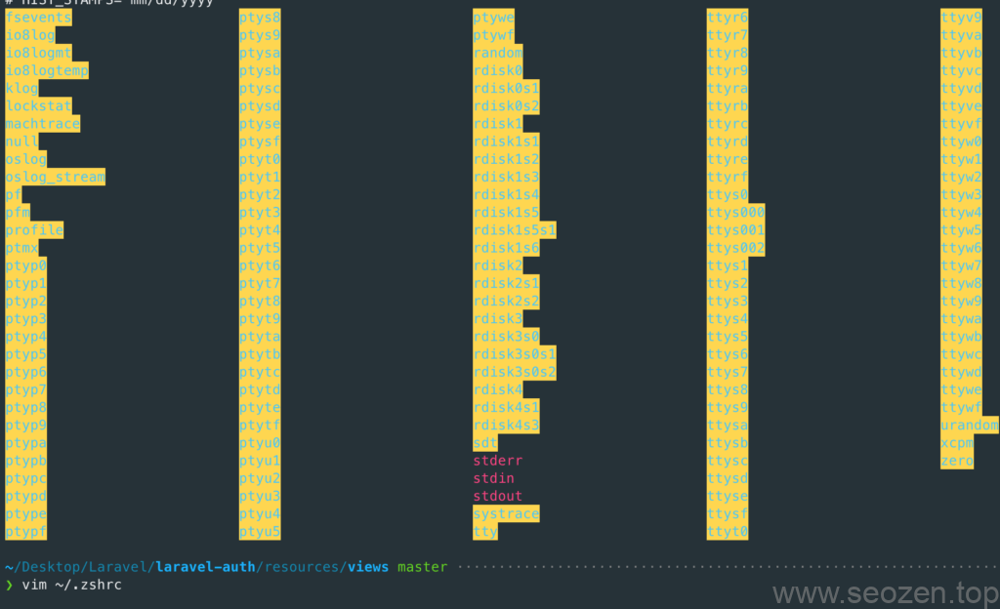
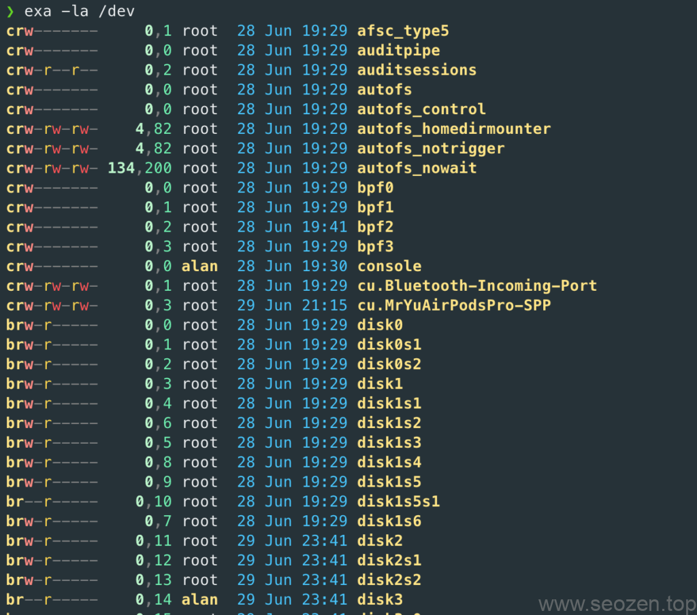
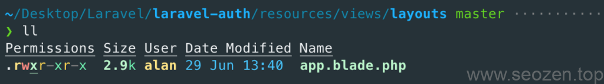

前面一篇已经介绍了如何在[iterm2安装zsh和oh-my-zsh](https://www.seozen.top/wp-admin/post.php?post=769&action=edit)，这篇文章SEO禅要分享一个很不错得**shell程序**——**exa**.

> A modern replacement for `ls`.
> 
> https://the.exa.website

上面这段话是exa的目标，为什么要用exa替换ls呢？因为ls默认输出的颜色真得太丑了：



默认的ls输出颜色

在MacOS上安装exa最快得方法就是使用`brew`，如果没有安装的小伙伴运行如下命令：

```
/bin/bash -c "$(curl -fsSL https://raw.githubusercontent.com/Homebrew/install/HEAD/install.sh)"
```

安装好brew之后，再运行如下命令安装exa：

```
brew install exa
```

exa的命令是基本兼容ls的，运行`exa -la` 看看，你会瞬间感觉高大上了不少：



exa输出颜色

但是平时我们实用`ls ll`这样的命令习惯了，改成`exa -l`这样肯定不太习惯，没关系，我们可以使用`alias`命令去做一个替换：

```
alias ls="exa"
```

将上面的代码写入到你们的bash配置文件中，比如`~/.zshrc`，这样所有的ls就成了调用exa.



使用alias替换ls为exa

最后要使用下source命令更新生效下配置文件`source ~/.zshrc`

exa更多使用方法，SEO禅会在其他的文章分享，今晚失眠，随手写了这篇文章，希望对各位有帮助。
