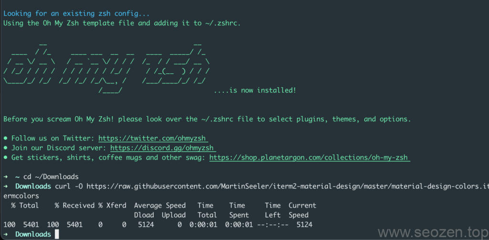
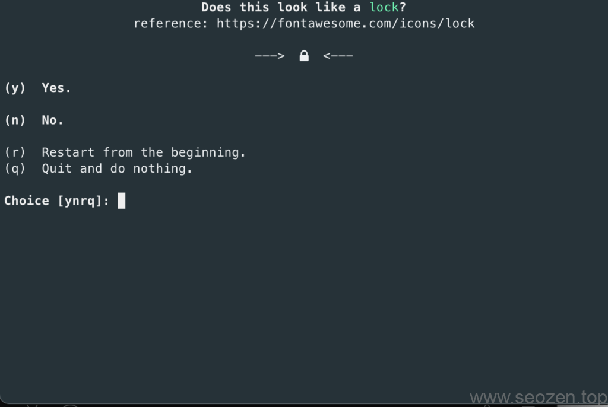
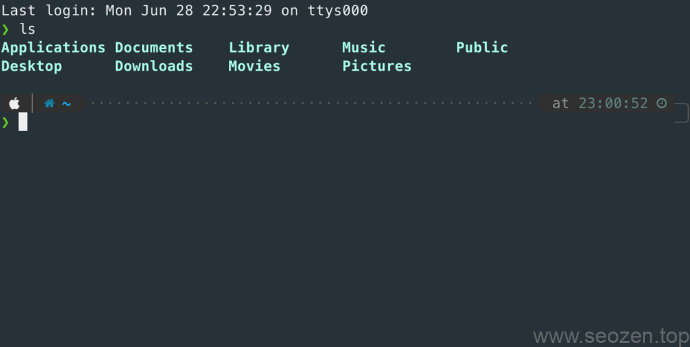

一直在找机会写这篇文章，今天SEO禅把硬盘格式化，升级了MacOS到最新的**Big Sur**，正好补上这篇，使用**iterm2**学习和工作已经有段时间，真得越用越喜欢，希望能分享一些有用得东西给大家，其他系统怎么配置要去别的文章看看，这篇文章只说如何在MacOS配置**iterm2+zsh+oh-my-zsh**，如果有哪里不对的地方，可以留言指出。

## 安装iterm2

首先我们先要[下载iterm2](https://iterm2.com/downloads.html)，SEO禅下载的版本是**iTerm2 3.4.8 (OS 10.14+)**，反正下载最新版的就是。

## 安装zsh+oh-my-zsh

新版得MacOS Big Sur应该是自带了`zsh`，打开自带的`terminal`上面显示的是**zsh**，如果没有的话，用`brew`命令安装下：

```
brew install zsh
```

**zsh**是啥？其实和`bash`这些一样都是命令行程序，**oh-my-zsh**是对`zsh`进行配置的开源程序，自带了很多主题和插件，还有很多功能，今天主要是使用oh-my-zsh来配置主题样式，输入下面的命令安装：

```
sh -c "$(curl -fsSL https://raw.githubusercontent.com/robbyrussell/oh-my-zsh/master/tools/install.sh)"
```

注意：要提前安装好xcode开发者工具，没有装的话安装iterm2的时候也会自动提示安装，确定就好。

## 设置iterm2为material design配色

首先我们要先下载Material Design配色，因为curl命令默认下载到当前运行目录，所以先进入到`Download`目录，再使用curl命令下载：

```
curl -O https://raw.githubusercontent.com/MartinSeeler/iterm2-material-design/master/material-design-colors.itermcolors
```

之后打开`iterm2`，点开 _Preferences > Profiles > Colors Tab_ ，之后再点击`Color Presets`在右下角，之后点击`import`导入刚才下载的文件`material-design-colors.itermcolors`，然后再选择配色方案，应该就像下面这样：



iterm2使用material design配色

如果不喜欢这个配色还可以选择其他配色，或者用默认的都行。

## 更换zsh默认主题

zsh默认的主题并不是每个人都喜欢，所以下面SEO禅来说下如何更换主题，因为`oh-my-zsh`已经有带了一些主题，我们配置下，更换下主题就好，打开配置文件：

```
vim ~/.zshrc
```

可以看到当前的主题是`ZSH_THEME="robbyrussell"`，可以访问[oh-my-zsh主题](https://github.com/ohmyzsh/ohmyzsh/wiki/Themes)列表查看有什么主题可以更换，也可以安装其他主题，SEO禅安装的是一款叫`powerlevel10k`的主题，可以看看主题的[github库](https://github.com/romkatv/powerlevel10k#oh-my-zsh)，如果你们也喜欢的话，运行下面命令先下载主题：

```
git clone --depth=1 https://gitee.com/romkatv/powerlevel10k.git ${ZSH_CUSTOM:-$HOME/.oh-my-zsh/custom}/themes/powerlevel10k
```

之后将**zsh配置**文件改下主题：

```
ZSH_THEME="powerlevel10k/powerlevel10k"
```

保存退出后，在运行`source`命令，让配置文件生效：

```
source ~/.zshrc
```

之后应该会跳出配置程序，安装提示输入y/n就行：



powerlevel10k配置过程

配置完以后，大概是下面这样：



powerlevel10k配置效果

每个人喜好不一样，如果不满意命令行输入`p10k configure`进行重新配置，SEO禅对这个效果还不是特别满意，后续还会花点时间继续调整，比如上面的文件夹颜色太单一，这个需要使用其他插件来换配色，到时候会分享在其他文章，这篇文章就先写到这。
