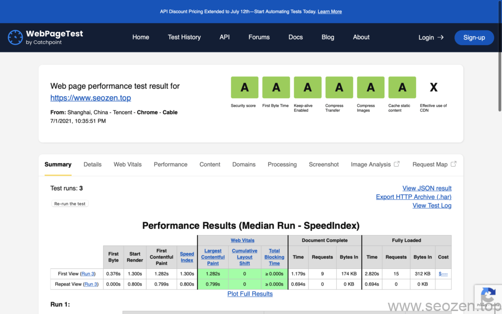
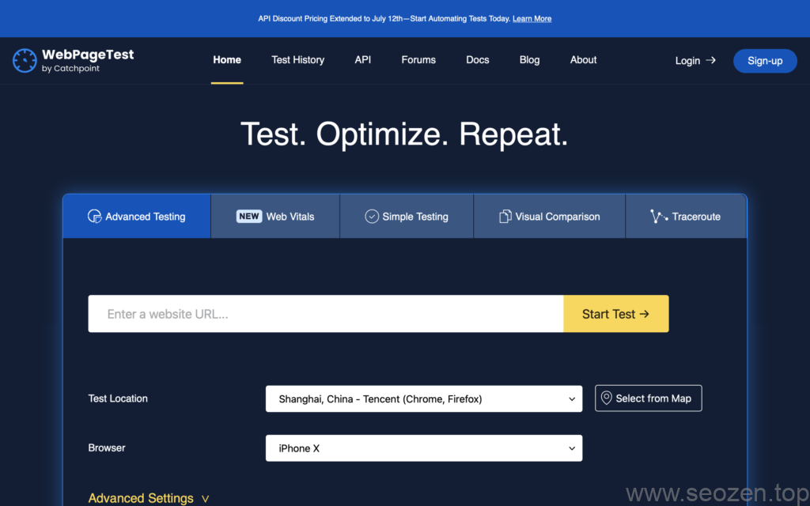
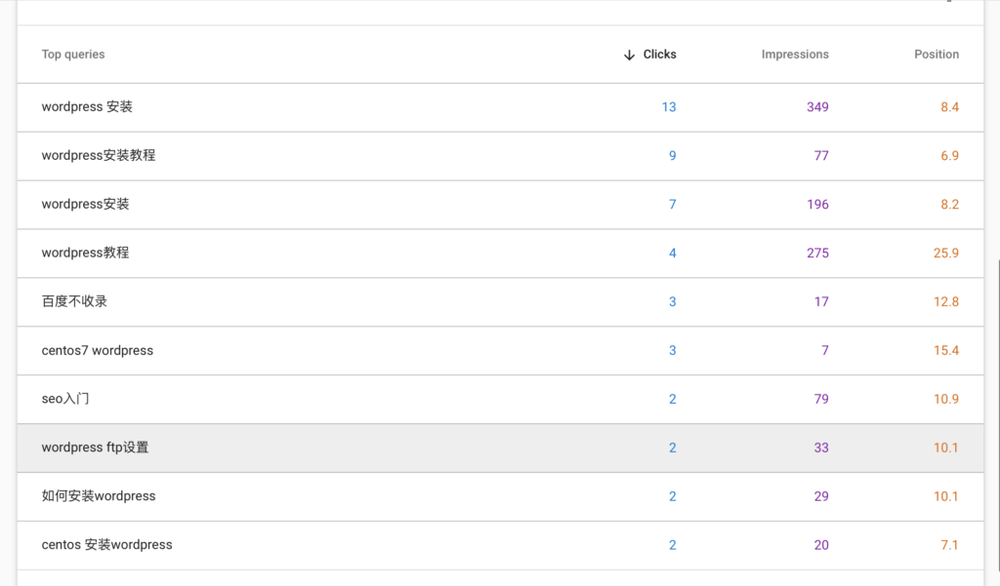
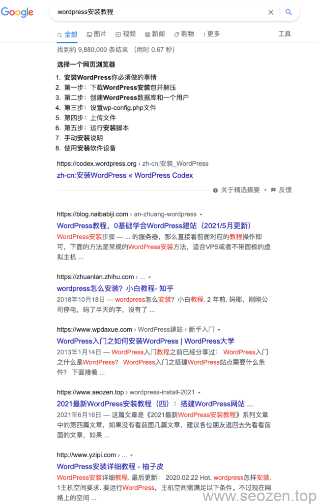

SEO禅最开始的时候是做前端开发，所以收藏了比较多的[网站优化测速工具](https://www.seozen.top/google-lighthouse-seo-tool.html)，今天再跟大家分享一款前端网站测试工具在SEO优化中的应用，今天要介绍的是[WebPageTest](https://www.webpagetest.org)，这款工具是免费的，主要功能有测试网站打开速度，还有安全性等，也有提供收费的API接口，一般我们使用免费的就可以，下面是SEO禅的**WebPageTest**的得分：

SEO禅WebPageTest测试得分

可以看到一共有7个测试项目，第一个是安全得分满分是A+，其余都是A，除了最后一项CDN没有分数之外，这样的得分应该算是比较好的，如果你们的得分没有A，那可以点击进去具体看看是什么没有达标。

## WebPageTest.org主界面

WebPageTest和**[PageSpeed Insights](https://developers.google.com/speed/pagespeed/insights/)**都是网页版的测试工具，PageSpeed Insights需要翻墙使用，而WebPageTest是不需要翻墙就可以使用(但是效验机制调用了谷歌的接口，所以一样要翻墙)，下面看看主界面长什么样：

WebPageSpeed主界面样式

可以看到默认的是在**高级测试**这个功能界面，还有后面还有几个功能暂时这篇文章不介绍，可以自己去看看，高级测试这边我们主要设置下**测试服务器地址**和**模拟的浏览器**，下面还有高级功能的设置，具体可以自己看看，我们就先简单的使用测试地址和模拟浏览器就行，这里SEO禅选择上海的服务器和**手机Iphone X**作为模拟浏览器，点击开始测试之后，一般会跳出效验机制，就是确定这个操作是人发出的不是机器发出的，跟着提示做就好，之后会显示类似上面SEO禅贴出的测试截图。

## WebPageTest 在SEO优化中的应用

为什么SEO禅要用不同的工具去测试网站？而且很多都是测试网站打开速度的工具？这是因为[站点的打开速度是排名的一项重要因素](https://developers.google.com/search/blog/2010/04/using-site-speed-in-web-search-ranking)，下面这张图是最近Google Search Console排名的情况：

SEO禅谷歌关键词排名情况

可以看到像[WordPress安装教程](https://www.seozen.top/wordpress-apache-setup-2021.html)这种比较热门的关键词，谷歌对于SEO禅这种新站既然能给到6.9的排名位置：

SEO禅WordPress安装关键词谷歌排名

可以看到第一个位置是**WordPress官网**，第二个是**[奶爸建站](https://blog.naibabiji.com)**的网站，他的**网站SEO**确实做的很不错，但是SEO禅这算是新站，能和他们排在首页已经感觉很满意，SEO禅认为其中很重要的一个原因，就是**网站加载速度**，写WordPress安装教程的网站肯定不少，但是会给新站排名靠前的就没有多少了，而且SEO禅更新文章的频率不是很高，现在也只是保持2天更新一篇，因为有自己的事情要做，到现在SEO禅也只是把基础的[SEO知识](https://www.seozen.top)使用上，还有很多**SEO技巧**没有时间去实施，在这里分享的都是一些比较简单和使用的东西，说了那么多言归正传。

因为WebPageTest的一部分功能和Lighthouse有类似重复，SEO禅在之前[使用Lighthouse优化网站速度](https://www.seozen.top/google-lighthouse-seo-tool.html)中有简单的介绍到，这里只介绍Lighthouse没有的功能，WebPageTest第一项是安全得分，这个在**网站SEO排名**中也是很关键的一个步骤，首先要保证[网站安全](https://www.seozen.top/apache-php-version-hidden.html)，才能谈网站优化，我们点击第一项安全得分，看看里面有什么内容：

SEO禅WebPageTest安全得分项

WebPageTest安全测试中有五项内容，如果你们安全得分比较低，那红叉叉应该是比较多的，可以看到SEO禅有一项安全测试点没有通过，我们就可以点击下面的链接看看是什原因，然后试着去修复它，**网站安全优化**的内容还是比较多的，到时候SEO禅会专门写文章分享，这篇文章先简单的分享使用WebPageTest这个工具去测试网站，具体有什么不懂得可以留言评论。
