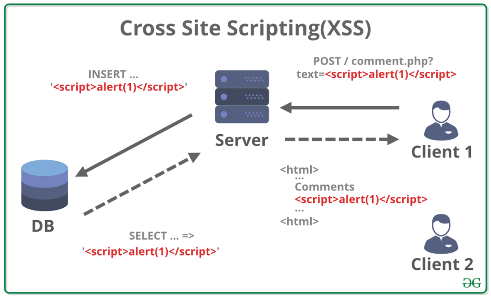
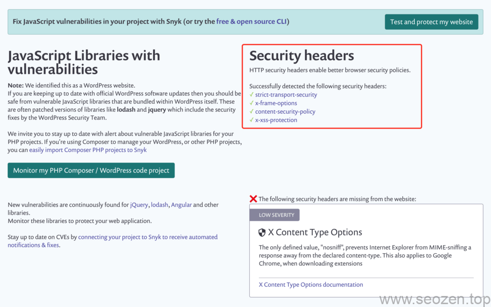
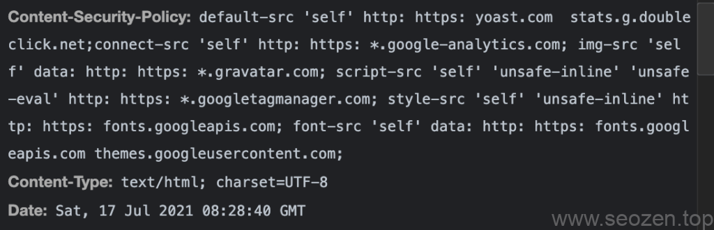

前一段时间SEO禅介绍了WebPageTest这个网站测速[SEO工具](https://www.seozen.top/SEO工具-webpagetest-2021.html)，其中第一项分数就是安全测试，今天SEO禅就来分享一下关于如何防止网站被**跨站脚本XSS**攻击，首先还是老套路，做这件事之前我们要知道这东西是什么，XSS是Cross Site Scripting的英文缩写，不是应该是CSS吗？理论上是，但是CSS和我们HTML中的CSS样式一样缩写，后来我们都把XSS来表示跨站脚本攻击了。

## 什么是XSS？

简单举个例子，一个网站如果没有经过特殊处理防范，比如说有评论接口，或者说用户字段可以修改自己的资料，这些接口没有经过安全处理，用户输入的内容都会原样保存到数据库中，那这就成了安全漏洞，就可以被利用作为XSS攻击的切入点，怎么做到得？我们所看见的浏览器上的网页主要由3种语言脚本组成：HTML，JS，CSS俗称前端三剑客，其中JS的权限比较大，可以操控用户浏览器，甚至借助一些第三方支持，可以操控系统内容，所以就有人利用这个特点编写了一些本不应该执行和操作的JS脚本，用来窃取用户资料，或者进行一些破坏行为的操作。

## XSS实现原理

上面已经介绍，XSS其实就是黑客利用网站漏洞，编写恶意JS代码进行破坏的操作，那这个是具体怎么实现的呢？SEO禅在这里简单介绍下，首先来看张图：



跨站脚本攻击示例

我们可以看到这里的**Client 1**向服务器提交了一段`<script>alert(1)</script>`的代码，这段代码是在评论界面插入的，而网站没有做任何安全过滤，直接插入到服务器数据库中，第二个用户访问同样的评论网页，就会跳出一个提示框，因为浏览器默认遇到`<script>`标记就会当作JS脚本代码去执行，这就达到了跨站脚本攻击的效果，跨站在这里的意思并不是说其它网站，而是对于第一个用户而言，他的攻击操作影响到访问这个网站的其他用户，就像**爱情跨越山河去遇见，来到你的面前一样。**

## 如何防范XSS攻击

跨站脚本攻击XSS是最普遍的网站安全问题，SEO禅记得在2000年左右，那时候的脚本攻击非常鼎盛，打开浏览器访问网站，就可能遇到到处弹框的垃圾信息，其实就是很多网站被XSS了，虽然到了20年后的今天，大多数站长的安全防范意识还是不高，这种低级漏洞还是时有发生，那如何防范**跨站XSS**呢？

最简单的办法就是断绝危险源头，首先网站所有能写入数据库的操作，都要经过一次安全过滤，把含有JS脚本代码的文本全部进行**escape化**，转义成无害的文本内容，在杜绝源头上做好还是不够，我们还要做的更好，通过使用WebpageTest测试工具我们可以看到安全得分中有一项**Content-Security-Policy**:



SEO禅WebPageTest安全得分项

CSP翻译成中文叫内容安全策略，可以通过使用规则来告诉浏览器，什么来源的脚本可以执行，什么样的不可以执行，上面说的都还只是XSS中的一个方面，还要通过外部JS代码来进行跨站攻击的，而这种方式才是真正意义上的跨站脚本XSS攻击，在防止插入恶意脚本的基础上，我们还要防止网站引用外部脚本所带来的风险，这里就要设置相应规则，让浏览器不能运行不在白名单中的**外部JS脚本**，实现方式有两种：

第一种通过Meta标签，告诉浏览器运行规则，如：

```
<meta http-equiv="Content-Security-Policy" content="script-src 'self'; object-src 'none'; style-src cdn.example.org third-party.org; child-src https:">
```

第二种通过Http Header信息，如：



SEO禅内容安全策略头部信息

这是写死在Apache配置文件中的代码，具体的语法可以参考MDN关于[Content-Security-Policy](https://developer.mozilla.org/zh-CN/docs/Web/HTTP/Headers/Content-Security-Policy)的语法说明，篇幅有限SEO禅就不详细介绍，配置了这个策略有一个麻烦的地方就是，如果网页代码修改了，要加入新的脚本，发布部署新代码之后，都要修改**内容安全策略白名单**，虽然是麻烦点，但是这种方式很安全，会省去很多日后的麻烦，也算是省事吧，自己见仁见智咯，这篇文章先分享到这，有什么不懂得可以给SEO禅评论留言，要是有什么错误可以指出讨论。
