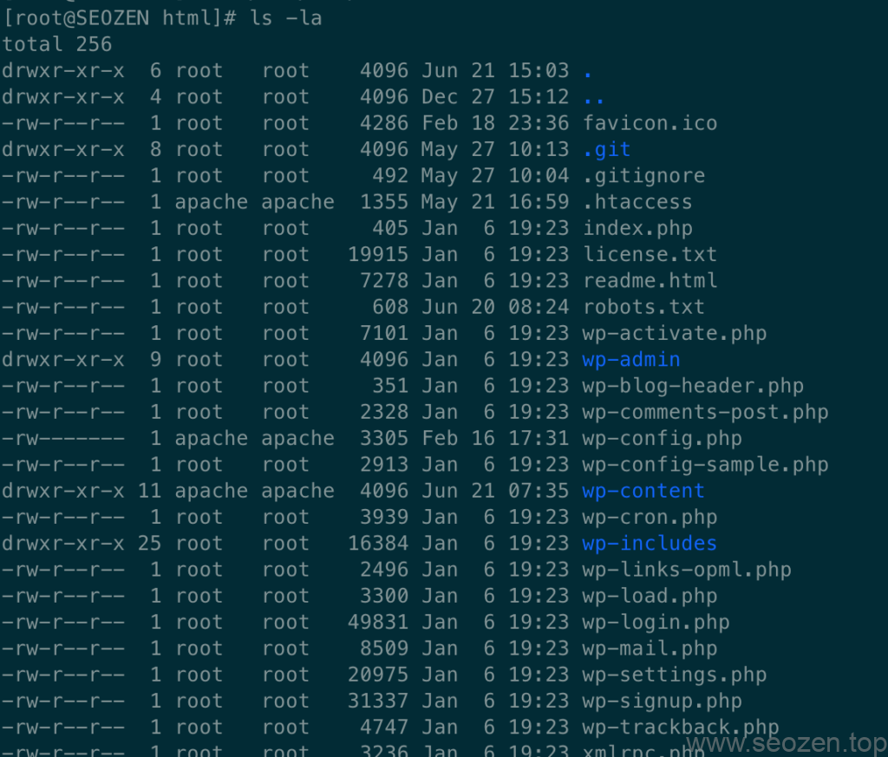

今天SEO禅要跟大家说说**WordPress文件权限**的问题，这个事可大可小，要是遇到了哪个无聊的「黑客」，扫你们的WordPress的网站，刚好你的账号密码又是弱口令，那如果没有设置好**目录文件权限**，那你的服务器就成了他们的「肉鸡」了，如果设置好**服务器文件权限**，至少服务器没有那么容易被控制，网站最多被挂个木马，或者网页被篡改，要是服务器被拿了权限，这个人又「心狠手辣」，一个`rm -rf /*`命令就可以把你的网站和服务器送回远古时代。SEO禅在之前写的[WordPress安装教程](https://www.seozen.top/wordpress-install-2021.html)中就有提到，我们在部署WordPress项目的时候，就要遵循**最小授权原则**，就是按最小的运行权限需要去进行授权，下面就来说说WordPress项目应该怎么设置文件权限，因为SEO禅使用的就Linux服务器，没有**Linux基础**的朋友可以先看看[Linux文件权限](https://www.seozen.top/linux-file-permission.html)这篇文章，简单了解下Linux中的文件权限是什么概念。

SEO禅WordPress服务器目录文件权限设置

上面这张图是SEO禅的服务器目录权限设置，因为SEO禅没有使用FTP去管理网站，所以把WordPress源文件都授权给`root`账号，如果是公司的项目，最好单独开一个账号，从上面图片可以看到下面：

- wp-content目录
- wp-config.php文件
- .htaccess文件

这三个目录和文件是`apache`用户，其他都是`root`而且基本都是`644`权限，就是只能读`r`和写`w`，其他用户和组只能读，这样就算网站被上传了[一句话木马](https://baike.baidu.com/item/%E4%B8%80%E5%8F%A5%E8%AF%9D%E6%9C%A8%E9%A9%AC/1845646?fr=aladdin)，它也是无法执行的，防止服务器被进一步提权拿了**Webshell**，WordPress的主题，插件，和上传的图片等，都是在`wp-content`这个目录，如果是**WordPress管理员权限**被破解，那黑客可能会上传插件木马到插件目录去执行，但是如果文件权限设置的合理，他也执行不起来，所以最多被删除文章，其他都不需要担心，从浏览器是运行不起来木马程序的，因为外部无权访问服务器的文件，不信你可以在浏览器上输入`wp-config.php`文件的地址，返回的肯定是空白的网页，如果需要升级WordPress，把权限开一下，再重新关掉就好，使用shell脚本很方便，下次SEO禅会分享如何使用Shell脚本给WordPress更改权限，方便升级，WordPress目录权限就分享到这里，有什么不清楚的可以留言评论，SEO禅看到了就一定会回复的。
