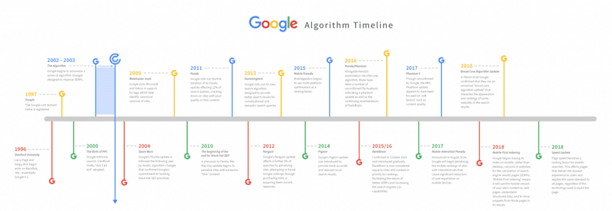

前段时间，SEO禅写了一篇[SEO禅站点谷歌排名情况分析](https://www.seozen.top/seozen-google-ranking-july.html)文章，记录在这段时间SEO禅在谷歌的排名情况，谷歌还是很给面子的，很多个有流量的关键词已经排名到首页，每天有真实的流量进来，许多其他的关键词也在陆续上升，关键词库在不断扩大：

谷歌SEO禅关键词库

上面是**GSC谷歌站长**后台最近28天的关键词情况，有682个关键词有展现，截止目前，[SEO禅](https://www.seozen.top)发表的文章也才93篇，如果按这样算，那平均每篇文章是7个关键词左右，当然实际肯定是不能这么算的，这里只想说明一件事，如果没有做**谷歌SEO优化**，是不可能有这么大的**SEO关键词库**，靠伪原创和采集的文章，也是不可能达到这样的**SEO点击率**的，点击率就是**点击数/**展现量****，这个比值百分比是越大越好，表明你的文章标题取的很有诱惑力，能抓住用户的眼球，写**SEO文章标题**的方法，SEO禅过一段时间单独再来分析，好了废话这么多，下面就开始分享下**如何做[谷歌SEO](https://www.seozen.top/Google SEO优化-tutorial-starter-guide-2021.html)优化**。

## 谷歌搜索基本原理

搜索引擎的工作原理都是大致相同的，基本都分为三部分：抓取内容，建立索引，排名展现，可以看看[SEO新手入门系列2021（三）：搜索引擎工作原理](https://www.seozen.top/seo-tutorial-moz-serial-2021-search-engine-first.html)这篇文章，但是具体的实现可能有一些不同，做谷歌SEO优化的话，一个新的网站，不需要去提交链接，自然就会被谷歌爬取，谷歌有两种方式抓取网站，一种是通过自然抓取，就是顺着其他链接，或者是从域名运营商那得到新注册域名信息来抓取，另一种就是我们说的[sitemap网站地图](https://www.seozen.top/what-sitemap-is.html)的方式，谷歌还提供[Search Console](https://support.google.com/webmasters/answer/9128668?hl=en)也就是我们所说的站长平台，站长可以在这个平台提交自己网站的sitemap，这个平台是SEO禅最喜欢用的，里面能看很多有用的数据，当然还有Google Analytics也是谷歌另一个很强大的数据分析平台，搜索引擎工作原理只是SEO入门的基础，需要做好SEO排名优化，就需要深入研究搜索引擎排名机制，下面SEO禅带大家了解几块和谷歌排名机制有关的内容。

## 谷歌搜索语义分析

SEO禅作为一名程序员，经常使用的是谷歌去搜索问题的解决办法，为什么不用百度呢？因为百度搜索到得内容不够准确，也存在很多垃圾信息，在时间就是金钱的这个年代，降低学习成本也是很重要的事，为什么谷歌能搜的这么准呢？当然这个和谷歌财大气粗肯定有一定的关系，不过更重要的是谷歌在语义分析方面做了很多优化，举个简单的例子，比如我们在谷歌搜索**SEO优化**这个关键词，这是一个非常大的词，首先谷歌会找出含有这个词的网页，进行展示，在这个基础上，谷歌还会进行语义分析，希望能知道搜索这个词的准确意图，比如用户是需要搜索带有SEO优化这次的图片？还是有关于SEO优化的教程？还是SEO优化的新闻？或者SEO相关的视频，在前面获取到相关内容的基础上，谷歌会加入这些元素，试图了解用户真正的意图，经过大数据和机器学习之后，这个准确度就会越来越高，谷歌就会知道大多数人搜索SEO优化这关键词，可能是为了找SEO优化的教程，那谷歌就会把有SEO优化，又有SEO优化教程的内容排名在靠前的位置，当然实际过程要比这复制的多，SEO禅在这里只是提供一个思路，敲黑板划重点『**相关内容聚合**』。

谷歌分析搜索意图

## 谷歌搜索排序算法

当谷歌抓取网页内容，并建立索引之后，要如何高效准确的展示搜索结果，这里就要说到谷歌的搜索排序算法，这里说的排名算法不只是一个，是有很多很多很多的算法组成的，举个例子，谷歌在爬取SEO禅网站，发现**SEO优化**这个关键词，连同包含的网页一起抓取回谷歌其中的一个数据库机房，这个机房就像一个小社会，他们自己单独进行排序排名操作，而且应用的算法可能和其他的数据机房也不一定一样，之后我们在谷歌搜索**[SEO优化](https://www.seozen.top/SEO教程-first-step.html)**这个词，谷歌告诉很多数据机房，嗨！老弟，我要这个关键词，把你们机房排名最高的含有这个关键词的那位找出来给我，最后通过过滤组合，呈现了包含10个关键词排名页面给用户，用户看到的搜索结果页，就是谷歌觉得最适合用户搜索意图的排序结果，这其中要怎么去排这个关键词所关联的网页先后顺序，跟所使用的排序算法关系就很大了

Google谷歌算法

其中有一项很重要的内容，划重点了『**即时信息**』，谷歌和人一样，也是喜新厌旧的主，如果一个网站的内容很旧，谷歌就会认为这个网站没有人再维护，提供的内容页无法跟上时代，自然就不会给特别高的排名，这里只是说一般情况，当然也有很多原来权重很高，内容陈旧的老站有很好的排名，当然首先你要做到原来排名就很好，所以有规律经常更新网站内容是很重要的，不一定要多，但是要经常更新，质量要高，可以用site命令看下很多SEO同行的网站，收录的内容很多，但是关键词排名并不一定比SEO禅这个新站高，因为他们大部分的内容质量并不是很高，而且有很多是为了更新内容而更新，文章没有主题，就是一篇口水文，让SEO禅写这样的文章，当然也能写，但是SEO禅会觉得对大家，对自己都没有什么意义，SEO禅每一篇文章都是自己手工码字，有时候写的不好，还重新写，有些还改了很多次，SEO禅自认为并不是很聪明，只是花的时间比较多，有一点自己的看法。

## 谷歌排名关键因素

上面已经说了谷歌在排名的时候是如何进行的，那关键的点，其实是在于我们网站自身的质量，这也是SEO优化人员需要做的事，帮助企业改善自身的不足，提高排名竞争力，其中有3项是比较重要的：文章内容质量，内链优化，外链优化，具体的可以参看SEO禅下面几篇文章：

[SEO优化：网站优化思路分享2021](https://www.seozen.top/seo-website-tips.html)

[SEO优化：6个方法提升网站排名](https://www.seozen.top/seo-6-way-improve-website-ranking.html)

[SEO禅分享网站排名SEO优化参考方案](https://www.seozen.top/seo-website-ranking-checklist.html)

[SEO优化入门一篇就够-SEO教程（2021年最新）](https://www.seozen.top/SEO教程-first-step.html)

这篇文章先分享到这，有什么不懂得可以留言评论，网站的邮箱通知功能还没开启，你们的评论留言要记得回来看哦！
