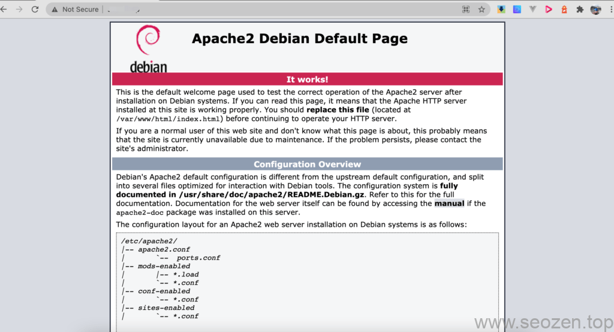
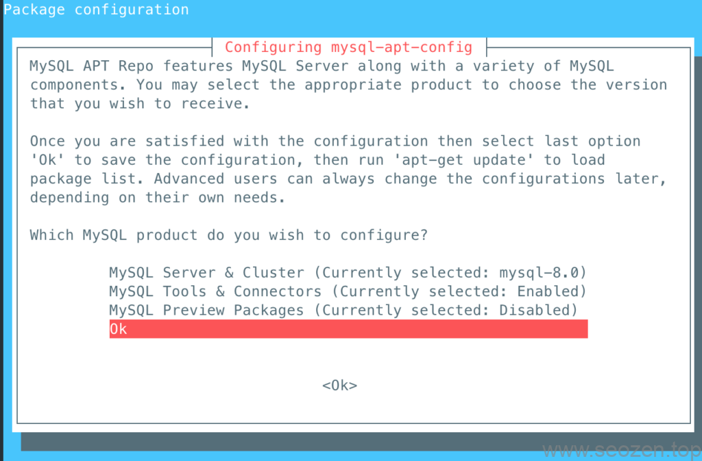
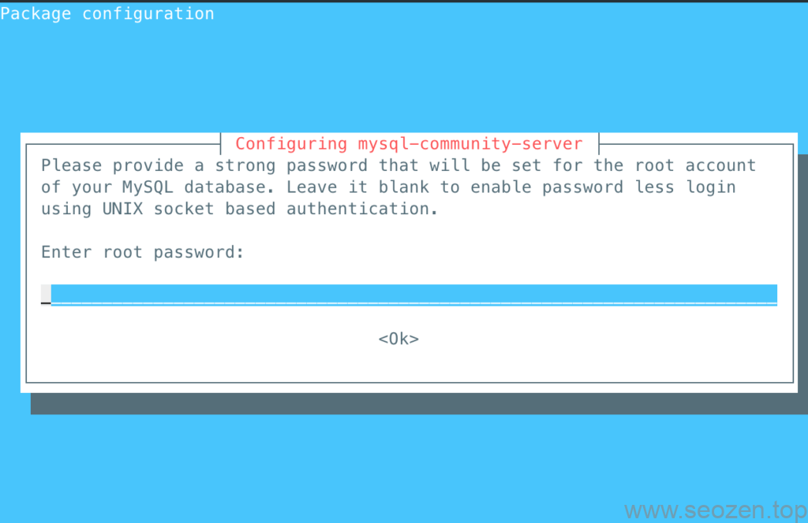
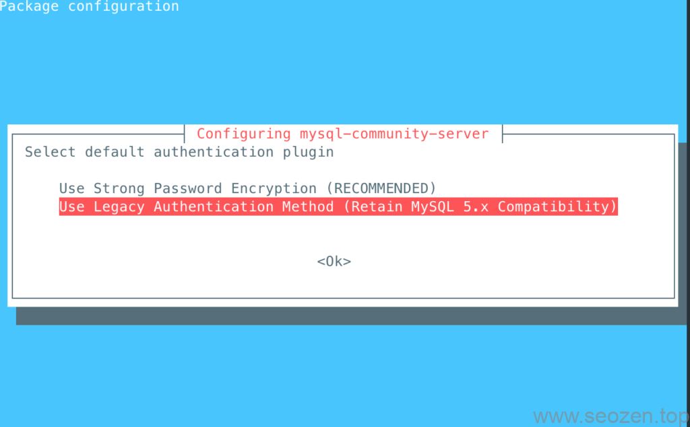
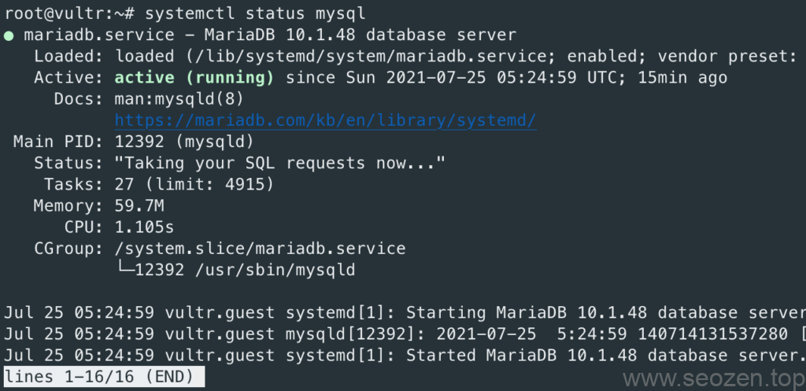

SEO禅准备写一个完整的**Laravel入门系列教程**，从**部署开发环境**到项目**部署生产服务器**，这是这个系列的第二篇，第一篇说的是**如何配置Laravel开发环境**，这篇教大家如何将开发好的项目部署到生产服务器，这里SEO禅选的是Debian9的Linux版本，这两篇之后，就会开始介绍如何使用Laravel进行项目开发，SEO禅将带大家使用Laravel做一个类似进销存系统的项目，下面开始分享今天的内容。

## 安装配置Apache2

首先我们还是先安装Apahce服务器，运行如下命令安装Apache2：

```
apt install ca-certificates apt-transport-https 
apt install apache2
```

查看安装情况：

```
systemctl status apache2
```

在浏览器上输入服务器IP地址，就能看到如下页面：



Debian9安装apache2成功

能看到上面图片的样子说明Apache2服务安装正确，我们在服务器目录先创建一个站点目录：

```
mkdir /var/www/html/seozen.top
```

把seozen.top改成你们自己的域名，或者目录名称都可以，这里我们在继续创建一个配置文件：

```
vim /etc/apache2/sites-available/seozen.top.conf
```

然后把下面的代码拷贝到文件中：

```
<VirtualHost *:80>

ServerAdmin mr.yu1991@gmail.com
ServerName seozen.top
ServerAlias www.seozen.top
DocumentRoot /var/www/html/seozen.top/public

<Directory /var/www/html/seozen.top>
    AllowOverride all
    Require all granted
</Directory>

ErrorLog ${APACHE_LOG_DIR}/seozen.top_error.log
CustomLog ${APACHE_LOG_DIR}/seozen.top_access.log combined

</VirtualHost>
```

这里的public指向的就是Laravel目录的public，保存后运行如下命令让配置生效：

```
a2ensite seozen.top

service apache2 restart
```

## 安装PHP

再安装PHP之前我们先安装下Apache支持PHP的模块，运行如下命令：

```
apt install libapache2-mod-php
```

之后运行如下命令，安装下PHP7.4的仓库：

```
wget -q https://packages.sury.org/php/apt.gpg -O- |  apt-key add -
echo "deb https://packages.sury.org/php/ stretch main" | tee /etc/apt/sources.list.d/php.list
```

再升级下`apt`之后安装PHP和Laravel所需要的PHP扩展模块：

```
apt update
apt install php php-cli php-fpm php-json php-common php-mysql php-zip php-gd php-mbstring php-curl php-xml php-bcmath
```

安装完成之后，输入下面命令查看版本：

```
root@vultr:~# php -v
PHP 8.0.8 (cli) (built: Jul  1 2021 16:10:07) ( NTS )
Copyright (c) The PHP Group
Zend Engine v4.0.8, Copyright (c) Zend Technologies
    with Zend OPcache v8.0.8, Copyright (c), by Zend Technologies
```

## 安装MySQL

可以到这个链接找MySQL[最新的deb库](https://dev.mysql.com/downloads/repo/apt/)，之后运行如下命令，添加MySQL 8 apt 库支持：

```
apt -y  install wget
wget http://repo.mysql.com/mysql-apt-config_0.8.15-1_all.deb
apt install ./mysql-apt-config_0.8.15-1_all.deb 
```



apt库mysql配置

运行上面命令后会跳出这个界面，使用下方向键选择Ok确认就行，之后再运行如下命令，**安装MySQL 8** ：

```
apt update
apt -y install mysql-server
```

之后会跳出设置**root密码**的界面，确认设置下就好：



mysql8安装输入root密码

输入完密码后，会跳出一个类似协议说明的界面，使用方向键右键去高亮选中Ok回车，进入下一个界面，选中加密模式，这里我们选择经典兼容5.x的模式：



MySQL8经典认证模式

注意这里如果用SSH登录安装的可能会遇到错误提示：

> [Problem of Can't set locale; make sure $LC\_\* and $LANG are correct!](https://unix.stackexchange.com/questions/269159/problem-of-cant-set-locale-make-sure-lc-and-lang-are-correct)

因为本地的`locale`没有设置，如果是使用iterm2+zsh，可以把下面的代码加入`~/.zshrc`中：

```
if [[ -z "$LC_ALL" ]]; then
  export LC_ALL='en_US.UTF-8'
fi
```

之后再`source ~/.zshrc`让代码生效，在iterm2中再输入locale命令查看是否如下输出：

```
LANG=""
LC_COLLATE="en_US.UTF-8"
LC_CTYPE="en_US.UTF-8"
LC_MESSAGES="en_US.UTF-8"
LC_MONETARY="en_US.UTF-8"
LC_NUMERIC="en_US.UTF-8"
LC_TIME="en_US.UTF-8"
LC_ALL="en_US.UTF-8"
```

安装完毕之后，输入如下代码看看MySQL运行状态：

```
systemctl status mysql
```



Debian9安装MySQL运行成功

可以看到状态已经是Active，你们按照教程安装的是MySQL8，SEO禅用得这个是MariabDB，[MariaDB](https://zh.wikipedia.org/zh-hans/MariaDB)是MySQL的开源版本，语法都是一样的，可以直接使用，这里就不再去安装MySQL8版本。

到这里三个关键的基础环境：Apache，PHP，MySQL(MariaDB)已经安装完成，都是用得apt进行安装，如果安装过程中安装出错运行不起来，可以通过如下命令卸载：

```
apt-get remove --purge 'mysql-.*'
```

上面这条命令是卸载所有MySQL包，包括配置文件，下面正式开始部署Laravel项目。

## Laravel项目

在配置项目之前，我们要让Apache2开启下重写规则，让所有的请求都通过index.php进入，让Laravel的路由托管，运行如下命令：

```
a2enmod rewrite
systemctl restart apache2
```

### 安装Git

SEO禅部署项目现在都是先上传到Github，之后用git命令去同步下载部署，这样在后期项目更新修改bug，就能很高效的更新服务器代码，这里我们先使用apt命令安装下Git：

```
apt install git
```

安装完成，需要配置SSH秘钥信息，参考SEO禅写的[2021使用SSH连接Github详细教程](https://www.seozen.top/ssh-github-keygen-2021.html)，怎么从github拉取项目SEO禅在这里就不说了，这个自己不会的先到其他地方看看，拉去完自己的项目之后，需要修改下目录权限：

```
chown -R 你的账号:www-data /var/www/html/seozen.top/
find /var/www/html/seozen.top/ -type f -exec chmod 664 {} \;
find /var/www/html/seozen.top/ -type d -exec chmod 775 {} \;
chgrp -R www-data storage bootstrap/cache
chmod -R ug+rwx storage bootstrap/cache
```

上面改下自己的账号和相应的目录地址，有什么不懂得可以留言评论。

### 安装Composer

安装compoesr包管理器：

```
php -r "copy('https://getcomposer.org/installer', 'composer-setup.php');"
php -r "if (hash_file('sha384', 'composer-setup.php') === '756890a4488ce9024fc62c56153228907f1545c228516cbf63f885e036d37e9a59d27d63f46af1d4d07ee0f76181c7d3') { echo 'Installer verified'; } else { echo 'Installer corrupt'; unlink('composer-setup.php'); } echo PHP_EOL;"
php composer-setup.php
php -r "unlink('composer-setup.php');"
```

之后设置成全局命令：

```
mv composer.phar /usr/local/bin/composer
```

到Laravel项目根目录，运行如下命令安装Laravel所需要的依赖包：

```
composer install
```

### 配置MySQL链接

哇，已经到这一步了真的不容易，休息下配置下数据库链接，再修改几个参数，我们的Laravel项目就能跑起来了，首先我们需要为Laravel项目创建一个数据库和数据库用户，这里参考《[2021最新WordPress安装教程（三）：安装WordPress详细步骤](https://www.seozen.top/wordpress-setup-steps-2021.html)》文章中MySQL创建WordPress数据库的内容。

### 修改Laravel配置文件

正常来说从github拉下来的Laravel项目源代码，只有**.env.example**文件，我们需要手动设置下**.env**文件，首先我们拷贝一份：

```
cp .env.example .env
vim .env
```

把下面几个配置项改下：

```
APP_NAME=项目名称
APP_ENV=production
APP_KEY=
APP_DEBUG=false
APP_URL=http://www.seozen.top

LOG_CHANNEL=stack
LOG_LEVEL=debug

DB_CONNECTION=mysql
DB_HOST=127.0.0.1
DB_PORT=3306
DB_DATABASE=数据库
DB_USERNAME=数据库用户
DB_PASSWORD=数据库密码
```

保存后退出，再运行如下命令生成新的key就可以：

```
php artisan key:generate 
```

迁移数据文件：

```
php artisan migrate
```

一些优化Laravel项目命令：

```
composer install --optimize-autoloader --no-dev
composer dump-autoload
php artisan route:cache
php artisan route:clear
php artisan config:cache
php artisan config:clear
php artisan view:cache
php artisan view:clear
php artisan optimize
```

到这里Laravel项目应该就能跑起来，如果其中有什么问题跑步起来，可以给SEO禅留言评论。
