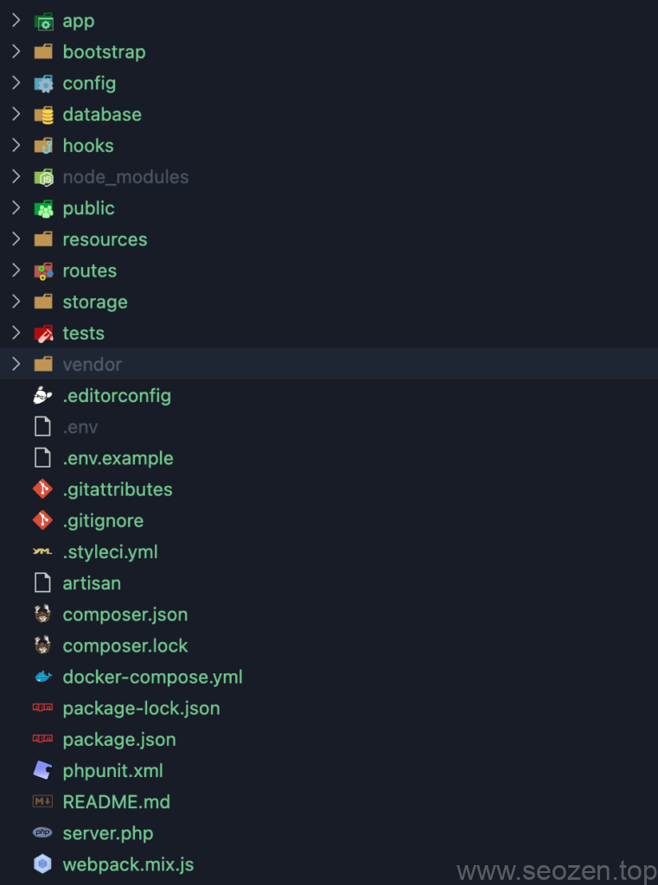
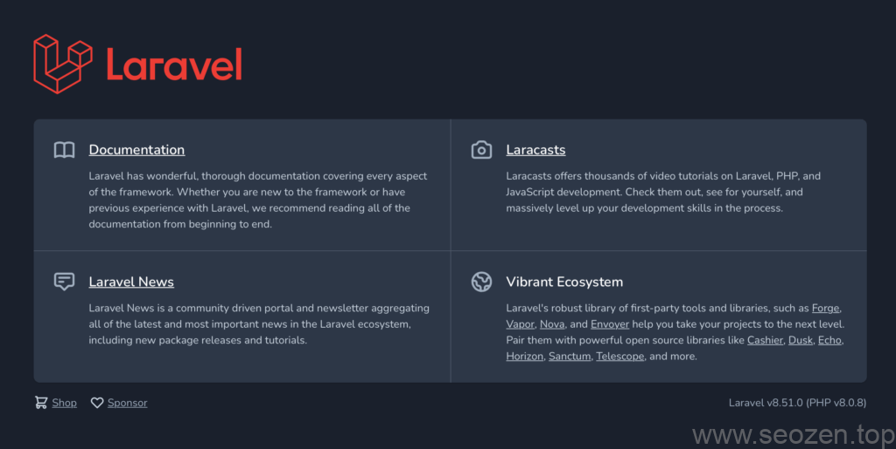

我最近都在用Laravel进行项目开发，现在Laravel最新的版本已经是[Laravel 8.x](https://laravel.com/docs/8.x/)，但是感觉国内的资料都比较旧，刚好最近要开始一个新的项目，正好把**Laravel入门开发**的教程写一写，分享给有需要的朋友，因为我基本是单兵作战，没有人带，也没有人教，在分享中写的东西可能并不是很好，如果大家有更好的方法和想法，可以留言分享给我，也可以指出有什么不对的地方，首先从**[安装Laravel](https://laravel.com/docs/8.x/installation)**开始。

## 准备Laravel开发环境（MacOS）

现在我都是使用[Laravel Sail](https://laravel.com/docs/8.x/sail)作为Laravel开发环境，Laravel Sail 是使用**Docker技术**，把需要的配置已经都准备好了，只要一个`sail up`指令就可以**运行Laravel**，这里我们需要先**[安装Docker Desktop](https://laravel.com/docs/8.x/sail)**，之后还需要安装**NodeJS**和**NPM**，还有**Composer**，这三个安装方法这里就不说了，各自谷歌搜索下，安装好之后，我们就可以**下载Laravel**的代码，使用如下指令：

```
curl -s "https://laravel.build/example-app" | bash
```

这个是**MacOS**的安装方法，其中**example-app**改成自己的项目名称，其余安装方式可以参考[Laravel官网的安装方法](https://laravel.com/docs/8.x/installation#your-first-laravel-project)，等待下载完成，输入自己**电脑账号的密码**完成下载安装。

## 配置Laravel开发环境

下载安装完成后，在**Laravel项目目录**，可以看到大概如下的目录结构：



Laravel目录结构

刚开始**学习开发Laravel**的朋友一定会一头雾水，这么多目录和文件，没关系，先跟我把项目跑起来，那些我都会慢慢介绍以后，这里我们先打开**.env**这个文件，这个文件里面是配置信息，如果是使用Sail配置的Docker开发环境，不需要任何修改，可能最多的就是改下URL地址：

```
APP_URL=http://seozen-laravel.test
```

比如我就把**APP\_URL**改成了自己自定义的地址，注意自定义地址要在`/etc/hosts`文件中添加相对应的映射关系：

```
127.0.0.1 seozen-laravel.test
```

这样在浏览器上输入seozen-laravel.test才会正确的映射到本机，这里新人开发朋友要注意下，具体如何映射自行百度下。

这个文件其他内容就暂时不介绍了，如果不是使用Sail搭建开发的，改下MySQL配置信息就可以：

```
DB_CONNECTION=mysql
DB_HOST=mysql
DB_PORT=3306
DB_DATABASE=seozen_db
DB_USERNAME=seozen
DB_PASSWORD=seozen
```

Host改成本机地址一般情况下，如`localhost`，其他的就按要求填写，如果有什么不懂可以给我留言。

## 运行Laravel 8.x

在运行Laravel之前，我们可以先配置下Alias，如果不配置那需要运行`./vendor/bin/sail up`，我不喜欢输入太多命令，所以要把映射一个快捷键，只要通过`sail up`就能运行，我的终端环境是[iterm2+Zsh](https://www.helloyu.top/iterm2-zsh-oh-my-zsh.html)，所以用如下命令写入配置文件：

```
echo 'alias sail="./vendor/bin/sail"' >> ~/.zshrc
source ~/.zshrc
```

如果是使用其他终端，自己配置下，不配置也可以运行的命令长点就是，执行**sail up**命令在项目根目录，会去下载Docker环境，下载完成之后就会自动运行，之后在浏览器输入前面配置的APP\_URL，应该能看如下界面：



Laravel 8.x 界面

这篇安装Laravel开发环境的文章就分享到这，下一篇文章跟着我认识Laravel的一些基础知识，有什么不懂得或者有疑问的留言评论吧。
