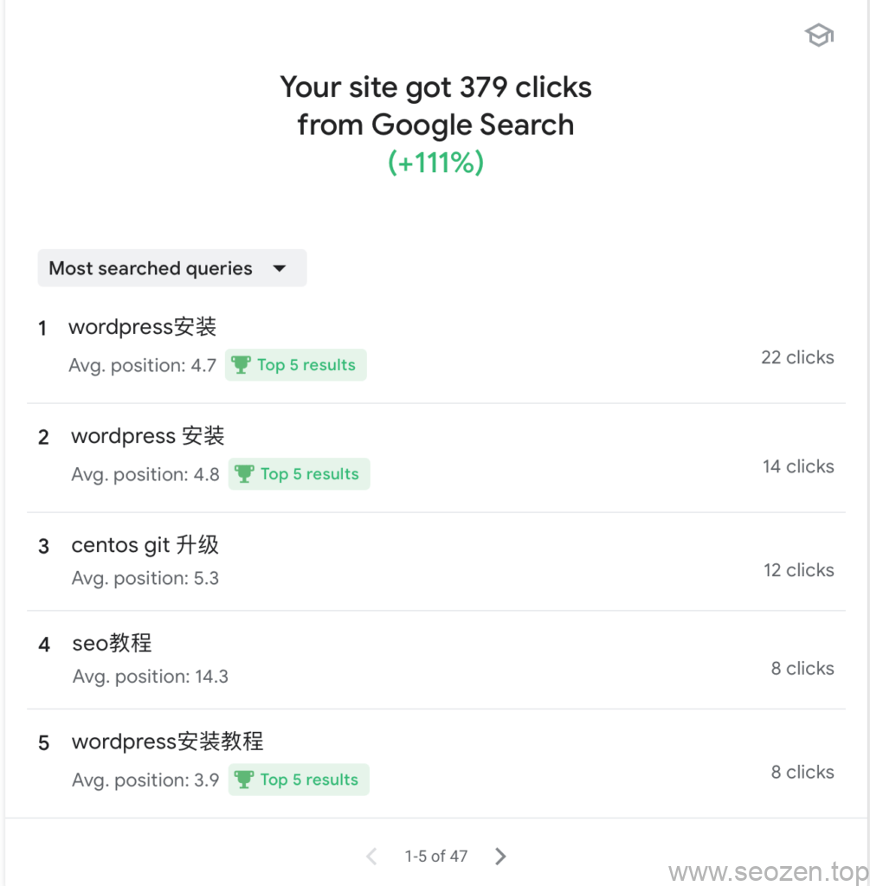

SEO禅其实并不是专业做SEO优化的，但是看到网上很多做SEO优化的并没有用心的去分享知识，很多都是有自己的小算盘，所以SEO禅创建了这个网站，分享自己学到的东西，不局限于SEO的知识，因为SEO的本质是为了更好的提供给用户有价值的内容，其他都是锦上添花的手段。

[SEO禅2.0版本](https://www.seozen.top/seozen-new-version-v2.html)上线了，最大的改进是在：访问速度，代码结构，内容结构；这三个方面，百度已经开始在慢慢增加收录，蜘蛛的访问也在不断开始增加，SEO禅是**分享SEO技术**，**SEO技巧**，**SEO经验**的博客，百度的观察期长也很正常，毕竟有那么多**黑帽SEO**把百度搞得烦的不行，那[百度不收录](https://www.seozen.top/baidu-index-seo-bad.html)，有没有办法？当然有，但是需要比谷歌长的多的时间去操作，谷歌的数据已经能够证明自己所用得**SEO方法**是没有问题的，下面就看看谷歌28天点击的数据，有图有真相：

SEO禅谷歌Search Console Insights排名

这是过去28天SEO禅在[Google Search Console](https://www.seozen.top/google-search-console-seo.html)的**关键词点击排名**情况，下面记录了几个关键词在谷歌（中文搜索）排名情况：

- SEO优化 46（刚最近开始优化）
- SEO优化入门 1
- SEO基础入门 6
- SEO基础 13
- SEO教程 10
- SEO技术 30-31
- SEO基础教程13
- SEO优化教程 35
- SEO入门教程 7
- wordpress安装 4
- wordpress安装教程 4

后面的**数字**代表当前谷歌**排名位置**，SEO优化是一个难度比较大的词，一开始并没有打算做，可以看到在SEO禅网站第一版**SEO优化**这词都不在目录上：

SEO禅v1.0主页

但是客户这么一说，还是做一下给客户看看，前期目标进不了首页至少也要到第二页，可以看到[WordPress安装](https://www.seozen.top/wordpress-install-2021.html)这个关键词已经排名在谷歌前5左右了，我们看看这个关键词的**谷歌收录**情况：

有1800万的收录，排在第四的位置，第一和第二个位置常年被知乎和**WordPress官网**占据，第三个位置是**奶爸建站**的博客，他网站做的确实不错，分享的内容有很多干货，SEO禅以前是经常看他的文章，现在能排在他后面真的心里已经觉得挺满足，这是关于**WordPress的关键词**，再看看**SEO入门**这个关键词：

SEO禅SEO入门谷歌排名

大概排在第五的位置，你们查询可能会不一样，有时候靠前有时候靠后，但是基本是在首页的，**SEO优化**这个词SEO禅刚开始做，现在才排在50名左右，上来的话应该需要一段时间，到时候再记录，虽然**SEO优化关键词**排比较后面，但是**SEO优化入门**这个关键词排在谷歌第一位：

SEO禅SEO优化入门谷歌排名

既然排的比谷歌自己的还高，有点受宠若惊的感觉，当然不排除谷歌『千人千面』的可能，但是据SEO禅观察，谷歌在这方面比百度做的好得多，排名只要上去，使用的是**白帽SEO**的手法，基本上是稳定的，变化也最多就在首页里面调整，除非有更多高质量的内容把你替换，但是这时候我们就需要观察，作出相应调整，让文章不会被其他网站给顶掉。当然还有许多其他有排名的关键词：

SEO禅谷歌GSC关键词排名

下面这张流量变化的曲线图，可以看到所有曲线在前几个月都是七上八下的，现在已经慢慢趋于平稳，稳固的在上升，偶有下落，但是也是在合理的回调范围内：

SEO禅谷歌访问量最新曲线图

接下去要做的基本就是规律的更新内容，有空做做外链，SEO禅这个网站自然就会自己成长，这个网站主要是做**SEO知识分享**，如果有需要SEO禅提供**SEO服务**，可以留言，但是需要你们自己实施内容填充，最好要有技术团队，SEO禅用得不是**黑帽SEO**的手法，不能给你每天9块钱一个关键词，7天包上首页的承诺，SEO禅提供的是具有**复利效应**的服务，不需要担心被搜索引擎处罚，只要关键词上了排名，流量就会很稳定。这篇记录就到这，下一篇记录再看看SEO禅能有多少流量，有什么不懂得，可以留言评论。

**SEO优化**这个词SEO禅最新排名情况记录，从半个月前的46位，已经上升到26位左右：

SEO优化关键词排名情况

距离上一次记录大概已经过去半个月了，这半个月SEO禅在**谷歌关键词排名**情况基本上是稳步上升，SEO优化这词已经上升到10名左右，比SEO禅自己预想的速度还要快，差不多一个月的时间，这个词从没有排名到谷歌首页，下面是2021年8月30日的排名截图：

SEO禅8月30日谷歌关键词排名情况

现在是2021年9月11号，SEO禅会停更一段时间，因为大部分基础的文章也写的差不多，这段时间自己的项目也需要花时间去处理，SEO优化这个关键词现在已经排进谷歌前10名了，其他几个主要的关键词也基本在谷歌首页，每天流量稳定在60-90左右现在，整个网站的权重比较平均，要提高特定关键词也比较容易，有什么问题可以给SEO禅留言。
