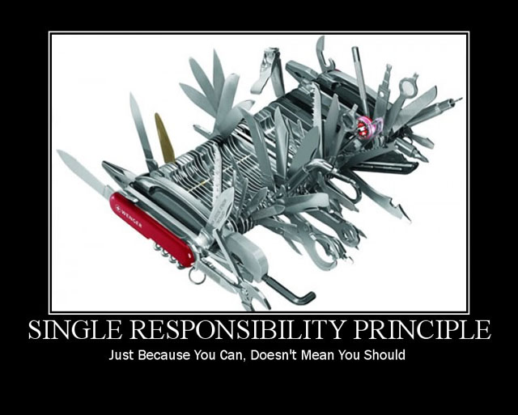
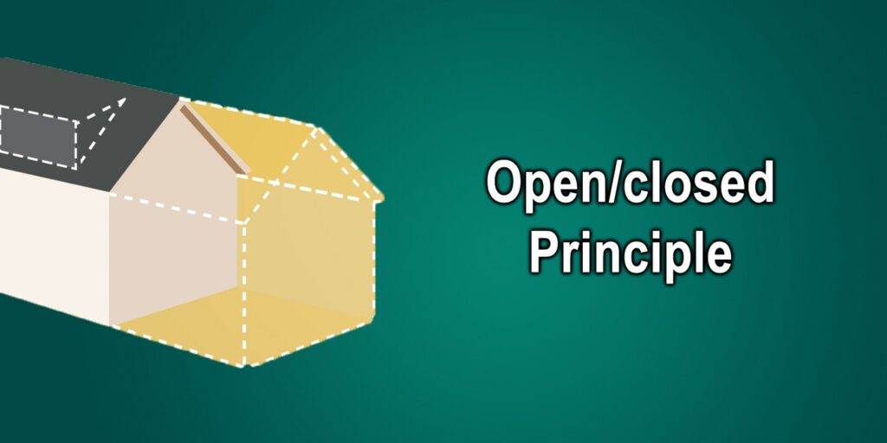
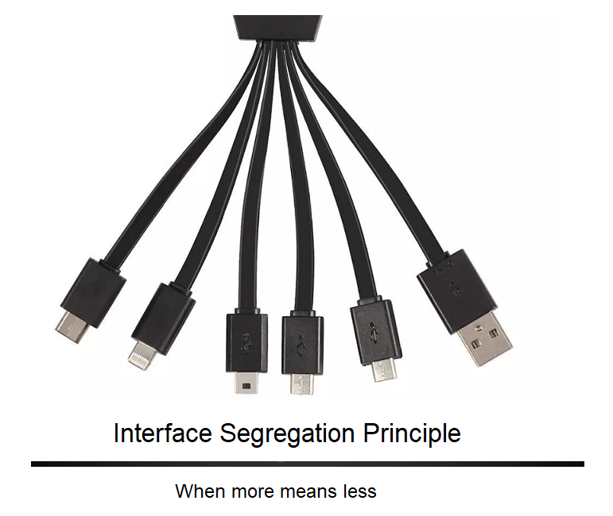
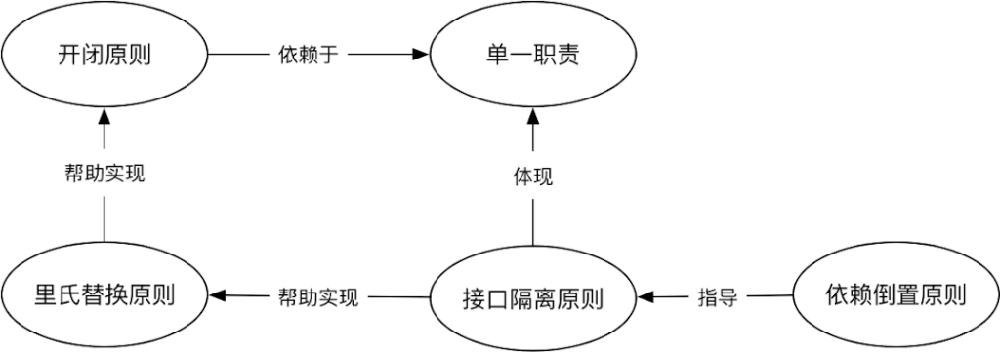

我不是一个正经的SEO优化人员，今天要分享的是**SOLID原则**，如果有了解过软件设计模式和面向对象编程（OOP）的同学应该不会陌生，当我们编写软件，需求和功能在不断变化增加的时候，就会发现原来[面向过程](https://baike.baidu.com/item/面向过程/9957246?fr=aladdin)的编码方式是多么难扩展和维护，有想法的开发人员就会寻求更好的开发模式和方法，这时候**S.O.L.I.D**就会向我们伸出双臂，首先来了解下，**SOLID的缩写**(acronym)都代表什么意思：

- **S** - Single Responsibility Principle **单一职责原则**
- **O** - Open Closed Principle **开闭原则**
- **L** - Liskov Substitution Principle **里氏替换原则**
- **I** - Interface Segregation Principle **接口隔离原则**
- **D** - Dependency Inversion Principle **依赖倒置原则**

我会用相应的**PHP示例代码**讲解这五个原则，希望看完这篇文章，能把这5种设计理念运用到平时的工作生活中，学以致用才有价值，其中最好理解的应该是**单一职责原则**其他从字面意思，可能不太好理解，没有关系，跟着我一起学习，也可以收藏页面，偶尔回来看看，加深下印象。

## 单一职责原则



单一职责原则SRP

单一职责原则(SRP)的核心内涵就是：一个类只负责处理好一件事。比如我是一名厨师，我就管煮菜，上菜这事就不归我管，也就是现代社会的工作细分。假设我们有一个User类，这是管理系统中很常见的类：

```
class User {
  
    private $username;
    
    // 其他属性方法...
    
    public function save() {
        // 把User存入数据库
    }
}
```

可以看到这个save方法就不满足User类的**SPR原则**，这个功能应该由数据库操作的类来承担，所以我们把他们分离：

```
class User {
  
    private $username;
    
    // 其他属性方法...
    
}

class UserDB {

    public function save(User $user) {
        // 把User存入数据库
    }
}
```

## 开闭原则



软件架构开闭原则

开闭原则(OCP)的核心内涵是：对扩展开放，对修改封闭。比如说我们有如下类：

```
<?php

class Rectangle {
  
    public $width;
    public $height;
    
    public function __construct($width, $height) {
        $this->width = $width;
        $this->height = $height;
    }
}

class Square {
  
    public $length;
    
    public function __construct($length) {
        $this->length = $length;
    }
}


class AreaCalculator {
  
    protected $shapes;
    
    public function __construct($shapes = array()) {
        $this->shapes = $shapes;
    }
    
    public function sum() {
        $area = [];
        
        foreach($this->shapes as $shape) {
            if($shape instanceof Square) {
                $area[] = pow($shape->length, 2);
            } else if($shape instanceof Rectangle) {
                $area[] = $shape->width * $shape->height;
            }
        }
    
        return array_sum($area);
    }
}
```

`AreaCalculator`类是用来计算不同形状的面积，现在只有正方形和矩形，那如果我们要加一个圆形怎么办？一般的方法肯定是添加一个圆形类，然后再去修改`sum`方法，但是如果我再添加一个梯形呢？三角形呢？这样加下去是不是每次都要改**sum代码**，这就违反了**开闭原则**中对修改封闭的意思，那如何解决？也很简单，就是对扩展开放，代码作如下修改：

```
interface Shape {
    public function area();
}

class Rectangle implements Shape {
  
    private $width;
    private $height;
    
    public function __construct($width, $height) {
        $this->width = $width;
        $this->height = $height;
    }
    
    public function area() {
        return $this->width * $this->height;
    }
}

class Square implements Shape {
  
    private $length;
    
    public function __construct($length) {
        $this->length = $length;
    }
    
    public function area() {
        return pow($this->length, 2);
    }
}


class AreaCalculator {
  
    protected $shapes;
    
    public function __construct($shapes = array()) {
        $this->shapes = $shapes;
    }
    
    public function sum() {
        $area = [];
        
        foreach($this->shapes as $shape) {
            $area[] = $shape->area();
        }
    
        return array_sum($area);
    }
}
```

可以看到，sum方法内部已经不去判断是哪个形状，而是直接调用各自形状的area方法，这个方法是各种形状继承和实现Shape接口的，这样无论以后添加多少种形状，sum内部代码是不会改变的，只要添加新的形状类和实现各自的area方法就可以。

## 里氏替换原则


里氏替换原则LSP

里氏替换原则(LSP)的核心内容：子类可以替换父类的位置，系统一样可以正常运行。我们再拿前面的例子举例，我们发现正方形其实是矩形的一个子类，只是4条边都相等而已，那我们把代码改成如下：

```
interface Shape
{
    public function area();
}

class Rectangle implements Shape
{

    protected $width;
    protected $height;

    public function __construct($width, $height)
    {
        $this->width = $width;
        $this->height = $height;
    }

    public function area()
    {
        return $this->width * $this->height;
    }
}

class Square extends Rectangle
{

    public function __construct($length)
    {
        $this->width = $length;
        $this->height = $length;
    }
}

class AreaCalculator
{

    protected $shape;

    public function __construct(Rectangle $shape)
    {
        $this->shape = $shape;
    }

    public function getArea()
    {
        return  $this->shape->area();
    }
}
```

之后我们可以使用AreaCalculator这个类去计算他们的面积，代码如下：

```
square =   new Square(2);
$rectangle =   new Rectangle(2, 4);

$areaSquare = new AreaCalculator($square);
$areaRectangle = new AreaCalculator($rectangle);

echo $areaSquare->getArea() ; // 4
echo $areaRectangle->getArea() ;  // 8
```

这里虽然参数是Rectangle类型，但是我们使用Square类也是可以，因为它是Rectangle的子类，里氏替换有几个注意的关键点：

- 子类的参数可以扩展
- 子类的返回参数可以比父类严格
- 不能改变父类的属性

**子类参数可扩展**，比如我们使用PHP8.0 新的特性 Union Types，如下代码：

```
class Foo {
    public function process(int|float $value);
}

class Bar extends Foo {
    public function process(int|float|string $value);
}
```

这里我们必须继承所有父类的参数，之后扩展子类自己的参数。

**返回参数可缩小**，还是用Union Types特性来举例：

```
class Foo {
    public function process(): string|int;
}

class Bar extends Foo {
    public function process(): int;
}
```

可以看到Bar::process方法的返回类型变成了int类型，比父类更为严格了，但是如果扩展返回类型是被允许的，所有以上三点都是为了保证在子类替换父类后，程序能够继续正常运行。

## 接口隔离原则



接口隔离原则

接口隔离原则(ISP)的核心思想是：不要继承和实现不需要的接口。再使用前面图形的例子来说明下，如果这时候我们要加入三维图形，三维的图形肯定也是有面积的，但是三维的图形还有容积，这时候我们就可能把接口修改如下：

```
interface Shape
{
    public function area();
    public function volume();
}
```

但是这样就会有个问题，一维的图形可没有容积，却要实现容积的计算接口，那这就违反了接口隔离的原则了，这时候我们就要把这个接口分离成两个接口：

```
interface Shape
{
    public function area();
}

interface ThreeDimension
{
    public function volume();
}
```

之后让不同的图形分别去实现这两个接口就好。

## 依赖倒转原则

依赖倒置原则(DIP)的核心内容是：对抽象编程，而不是对具体实现。意思就是外层模块不应该依赖内层模块，下面我用代码举例：

```
interface Payment
{
    function pay($amount);
}

class CashPayment implements Payment
{
    public function pay($amount)
    {
        // handle cash payment logic
    }
}

function makePayment($amount, Payment $paymentMethod)
{
    if ($paymentMethod->pay($amount)) {
        return true;
    }
    return false;
}
```

可以看到我们这里只有现金支付这么一个方法，如果再加一个信用卡支付，只要继承支付接口，然后调用的时候传入信用卡支付类，和前面说到得开闭原则很类似吧？没错，其实这些原则的关系都是相辅相成的：



SOLID原则关系

依赖倒转原则这种思想被用的具体实现就是依赖注入，依赖注入降低了模块之间的耦合关系，我们软件设计的目标就是高内聚，低耦合，今天的分享就到这，有什么不懂得可以评论留言，其实每一个原则要是细讲还有很多东西可以说，以后我会分篇来分享。
