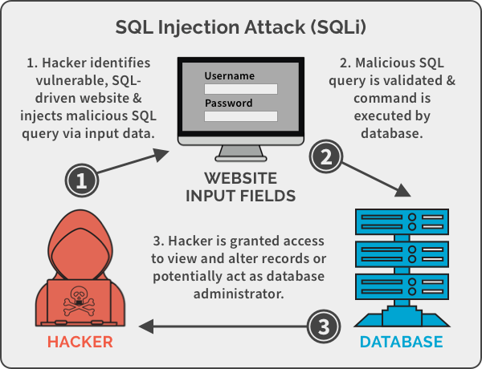

为什么SEO禅的博客不像其他**SEO同行**，**SEO公司**一样都是说SEO的内容呢？因为想做好SEO优化可以很简单，也可以不简单，很简单的方法大家应该都知道，那就是用一些手段让排名暂时靠前，不简单是因为，真要把SEO做好，做稳定，是需要自底向上的优化，底层的**服务器安全**，稳定，快速，再到顶层的用户体验，转换率，跳出率等，所需要的综合知识和能力，并不是一般的人能够做到的，为什么大多数公司招的SEO优化人员做不好SEO，他们多数只做了顶层或底层的内容，想要做好网站优化，需要全局性思维，也需要有这个能力，SEO禅分享的内容不能说最好，但是都是自己用心总结出来的，也欢迎各位朋友一起交流学习探讨。

又巴拉了一段，下面开始今天的主题，服务器安全优化**SQL注入攻击**，如果是老站长SQL注入攻击应该是非常熟悉的，新站长可能对这个不了解，这是互联网中，最常见，也是最容易被大家忽视的一个网站漏洞和攻击方法，很多网站在运营一段时间后，会发现网站莫名其妙多了一些恶意代码，或者服务器日志上有一些不正常的记录信息，很有可能是被人拿了网站WebShell，入侵了服务器，这些人最常用的手段就是**SQL注入**，那**什么是SQL注入**呢？

## SQL注入是什么？

看到SQL肯定是和数据库有关系，[SQL](https://www.google.com/url?sa=t&rct=j&q=&esrc=s&source=web&cd=&cad=rja&uact=8&ved=2ahUKEwjf44fl4LTyAhWjMVkFHVPcBkYQFnoECAQQAQ&url=https%3A%2F%2Fwww.w3schools.com%2Fsql%2F&usg=AOvVaw24mWvVbYVpPbWdQxsg7WD_)是我们在数据查询的时候所用到的语言，也就是说SQL注入，就是从SQL语言下手，把一些正常的SQL语句，改造成能获取额外信息的SQL语句，别小看这个手段，直接获取用户信息都是可以的，以前很多公司网站，用户密码还是用明文存放的，下面举个例子。



SQL注入示例

## SQL注入示例

假设一个商城的网站，要获取产品信息，一般的URL如下：

```
https://insecure-website.com/products?category=产品分类
```

这个URL最终会被转换成如下的SQL语句：

```
SELECT * FROM products WHERE category = '产品分类' AND 我是权限属性 = guest
```

这个时候，作为一般客户，看到的可能是一些普通的商品信息价格，如果这个网站是没有过滤SQL语句，我们就可以通过SQL注入，获取所有的产品信息，包括那些通过权限控制过滤的信息，我们可以向服务器发送自定义的url地址：

```
https://insecure-website.com/products?category=产品分类'+OR+1=1--
```

这段url最终会被解释成如下的SQL语句：

```
SELECT * FROM products WHERE category = '产品分类' OR 1=1 -- 'AND 我是权限属性 = guest
```

其中`--`是SQL语句中的注释符号，也就是说会忽略符号后面的所有信息，这时候我们的权限控制就不起作用了，前面的`1=1`永远都是true，就突破了分类的限制，这样所有产品分类和权限的限制都不起作用了，服务器会返回所有的商品信息，这只是简单的举例，举一反三，把这个方法用到获取用户敏感信息上？那可想而知结果会如何？

SQL注入的危害当然不止在获取信息方面，还可以绕过登录验证，修改数据库等等，这里SEO禅就不多介绍了，下面讲讲，怎么防止被SQL注入？

## 防止SQL注入的方法

从前面我们知道，大部分SQL注入基本都是在有WHERE语句的地方，所有我们在建设网站的时候，要特别留意一些查询语句的过滤，这也是最容易忽视的地方，还有就是增删改查的操作，对用户输入的内容需要进行过滤，这里过滤最基础方法就是**字符串转义**，多数情况下不需要我们自己写，都有现成的库可以使用，不要像下面一样直接把用户信息插入组成SQL语句：

```
String sql = "select username,phone from user where id=" + id;
```

需要使用预编译和参数绑定的形式：

```
   String sql = "select username,phone from user where id=?";
        PreparedStatement ps = conn.prepareStatement(sql);
        ps.setInt(1, id);
        ps.executeQuery();
```

使用预编译和参数绑定是最简单，也是最高效的一种防止SQL注入的办法，基本上90%的注入方式都可以被过滤，具体的实现，还需要根据不同的环境来决定，详细的介绍的话不是一两篇能解决的事，对于网站安全优化的思考，SEO禅就分享到这里，可以留言评论说说你的看法。
