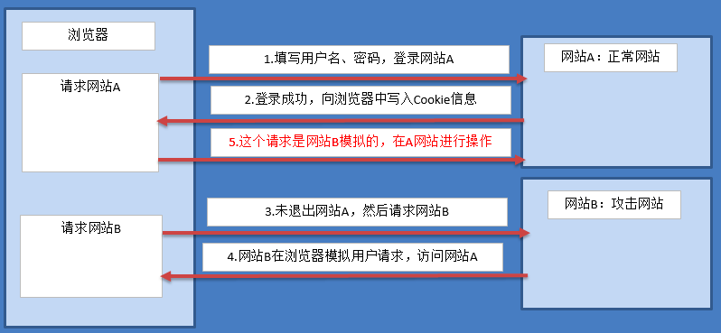

我在上一篇文章**[跨站脚本攻击XSS](https://www.helloyu.top/web-seo-security-xss-2021.html)**中介绍了客户端最常见的**安全攻击漏洞**，今天再来介绍一个同样很热门的一种攻击方法**[CSRF跨站请求伪造攻击](https://baike.baidu.com/item/跨站请求伪造/13777878?fromtitle=CSRF&fromid=2735433&fr=aladdin)**，CSRF英文全称：**cross-site request forgery**，和XSS都有**Cross-Site**，但是他们的概念并不相同，XSS主要是通过获取受害者的Cookie，之后通过使用Cookie来完成攻击操作，而CSRF是直接伪造受害者身份，来达到攻击目的，这篇文章我来说说**什么是CSRF跨站请求伪造**和**怎么防范CSRF攻击**。

## 什么是跨站请求伪造CSRF？



跨站请求伪造示例

首先我们先了解下什么是跨站请求伪造？简单的说是一种利用Cookie的攻击手段，攻击者利用受害者的Cookie，在CSRF漏洞网站，窃取，修改，删除受害者信息等操作，这种行为一般非常隐秘，攻击者所使用的诱饵网站一般都伪造的非常好，受害者通常是不会有被攻击的感觉，以为就是访问了一个正常网站，从上图可以看出来图B就是攻击者使用的伪造诱饵网站，hacker可能在论坛放了一个链接来引诱受害者访问这个诱饵网站，受害者以为访问的是网站B，其实请求是发往网站A的，请求中含有受害者的个人Cookie信息。

## CSRF前提条件

要完成一次跨站请求伪造攻击，必须满足三个条件：

- 受害者登录正常网站，并且访问伪造网站时候没有退出登录状态（Session和Cookies没有被清除）

- 正常网站有相应的请求方法，比如说Get，POST等

- 请求方法中除了使用Cookies之外，没有多余的验证参数

其实只要站长留点心，要满足这三个条件还真是不容易，下面看一个简单的可以满足**CSRF攻击**的POST示例：

```
POST /password/change HTTP/1.1
Host: seozen.top
Content-Type: application/x-www-form-urlencoded
Content-Length: 30
Cookie: session=我是session，服务器只要认证我就能授权你操作POST

email=hacker@email.com
```

## CSRF举例

可以看到这个POST请求只需要提供Cookie就可以，这时候我们就可以在其他的网站伪造这个请求，然后利用一点**[社会工程学](https://www.baidu.com/link?url=a52djr89Yr5HFpzvBgfvTxRneo3D2uesONTI1TDjaS2h6KO2grfhXLeYXhXGSzWwrOXsJF_0QNIgE__iK0NwStAMIjPOa8GTckwnBVbBDKAXRnSfLywmKOsWIKD3swcL_qtbHgIk75nVR8eVebs5Eq&wd=&eqid=913e54440000eb2e00000006610cd16d)**的方法，让受害者访问我们伪造的网站就行，下面使用HTML代码简单演示：

```
<html>
  <body>
    <form action="https://www.helloyu.top/password/change" method="POST">
      <input type="hidden" name="password" value="我是攻击者设置的密码" />
    </form>
    <script>
      document.forms[0].submit();
    </script>
  </body>
</html>
```

这时候只要受害者访问了这个网页，JS代码自动提交表单，完成跨站请求伪造攻击操作，这就是**CSRF的基本原理**，具体的实施肯定要比这复杂的多，比如要做诱饵网站，要分析受害者行为特征，或者收集受害者信息等前期攻击准备。

## 跨站请求伪造防范

我们知道了CSRF的攻击原理和需要满足的条件，那我们就应该能很容易的想到如何去防范CSRF攻击，方法有很多，这里我只说一个比较简单，也比较流行的方法：客户端添加随机码让攻击者无法获取，这个就破坏了其中三个条件中的一个，增加了验证码，比如[Laravel框架提供的CSRF防护](https://laravel.com/docs/8.x/csrf)：

```
<form method="POST" action="/profile">
    @csrf

    <!-- Equivalent to... -->
    <input type="hidden" name="_token" value="{{ csrf_token() }}" />
</form>
```

就是在表单中插入一段随机码，之后同表单一起传回服务器进行认证，服务器事先会存储这个随机码，如果这个表单是第三方攻击者伪造的，这个随机码肯定是验证不通过的，具体在每个框架和语言都有不同的实现，但是原理都差不多，我这篇CSRF跨站请求伪造的文章就分享到这，有什么不懂得可以留言。
