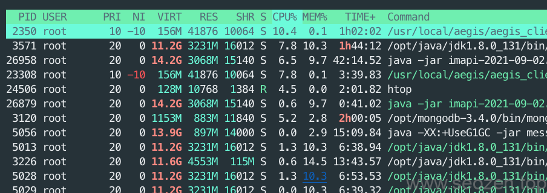

我前面介绍过一个系统自带的[进程管理程序top](https://www.helloyu.top/linux-learning-top-command.html)，今天再介绍一个我经常使用的进程管理程序htop，htop可以算是top的扩展升级版本，其实top有很多隐藏功能，htop把这些隐藏功能变成默认配置，还配上了舒服的颜色，而且可以鼠标去操作，使用htop去查看系统运行状态，就像一个将军坐在作战指挥室，盯着屏幕上的战争数据，十分的给力。

## 安装htop

在Linux系统下安装htop很方便，只要用相应的包管理器就好：

- Linux 类系统：`sudo apt-get install htop`
- MacOS 系统：`brew install htop`

Centos上也可以使Yum来安装： `**sudo yum install htop**`

之后在终端输入`htop`，最会出现一个很酷炫实时更新的系统进程信息列表：

htop运行界面

## htop系统概览

可以看到头部有很明显的进度条，这些是表示CPU和内存使用情况：

htop内存CPU使用情况

前面的数字代表的是各个核心，说明我这个服务器有8核心，那为什么里面的进度条有红有绿呢？下面来解释下：

- 红色 - 代表系统内核进程
- 绿色 - 代表用户进程
- 蓝色 - 代表低优先级的进程

在下面是Mem进度条和Swp进度条，看名字就知道是内存和交换内存，他们的颜色分别代表：

- 绿色 - 已经使用的内存
- 蓝色 - 块缓存
- 黄色 - 页缓存

这里简单解释下什么是块缓存，块缓存是对硬盘中其中一块区域的预缓存，这块区域应该是程序需要经常访问的，有了块缓存机制，可以减少磁盘的访问时间和次数。如果黄色的页缓存越多，说明在内存中的缓存命中率越高，磁盘访问次数越少，这样就提升了性能。从上图可以看到，我的这个服务器，有32G的内存，其中已经有17G左右在使用，大概1/4是页缓存容量。

CPU和内存信息旁边有一栏系统信息：

htop系统信息

**Tasks** - 代表当前系统的总任务数，进程数，逗号后面是当前总的线程数，也就是说48个进程一共开启了2631条线程，5个线程正在运行中。

**Load average** - 表示系统平均负载情况，如果是单核心，100%负载就表示为1，如果是4核心就表示为4，如果8核心都100%负载就表示为8，以此类推，后面三个数字分别表示一分钟，五分钟，十五分钟之前的系统负载情况。

**Uptime** - 表示系统持续运行时间，自上一次重启算起。

## htop进程信息

htop进程信息栏

这里的PID，USER，PRI信息和TOP的基本差不多，下面就简单罗列下，不做细讲：

- PID - 进程ID
- USER - 启动进程的用户
- PRI - 进程优先级
- NI - 用户调整的优先级
- VIRT - 虚拟内存
- RES - 物理内存
- SHR - 共享内存
- S - 进程状态
- CPU% - CPU使用百分比
- MEM% - 内存使用百分比
- TIME+ - 进程运行时长
- Command - 启动进程的命令

上面的信息和Top中的信息基本是一致的，其中我解释下，VIRT，RES，SHR的区别是什么？

- VIRT - Virtual Memory Size (KiB) 虚拟内存大小，KB单位，表示一个进程所有使用的内存空间大小，包括数据，代码，共享的库等，也包括内存换出的页，还有已经映射但是还没有使用的页。
- RES - Resident Memory Size (KiB) 驻留内存大小，KB单位，表示一个进程实际使用的内存大小。
- SHR - Shared Memory Size (KiB) 共享内存大小，KB单位，表示一个进程能够共享给别的程序的内存大小。

## htop菜单

在进程信息最底部是菜单栏：

htop菜单

- F1 - 帮助
- F2 - 设置
- F3 - 搜索
- F4 - 过滤
- F5 - 切换树形结构
- F6 - 排序
- F7 - F8 减加NI值
- F9 - 杀死进程
- F10 - 退出

菜单的使用内容要细说比较多，我打算放在其他文章来解释，这篇文章就对htop作个简单基础的解释。

## htop快捷键

我分享几个常用的htop快捷键，让管理进程更加高效：

- u - 选择指定用户进程
- p - 切换进程路径显示
- M - 按内存大小排序，大写的M
- P - 按CPU大小排序，大写P
- T - 按运行时间排序，大写T
- t - 树形显示
- space - 标记一个进程

还有一些快捷键可以使用F1查看，各位就自己去摸索下，这篇文章就分享到这，有什么不清楚的，或者文章中有错误的可以留言评论。
